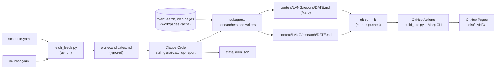

# GenAI Catch-up 

A personal routine for staying current with generative AI: LLM application engineering and AI coding tools.

On the days set in [schedule.yaml](./schedule.yaml), a scheduled Claude Code task fetches a curated set of feeds, keeps the topics worth catching up on for an engineer who leads generative-AI work (events and technical write-ups), deepens each one with several sources, and writes two files per language:

- `content/<lang>/research/YYYY-MM-DD.md` — the source of truth: a dossier per topic (every source read, with its numbers and wording), notes, and ideas for hands-on practice.
- `content/<lang>/reports/YYYY-MM-DD.md` — a Marp slide deck: summary slides, one slide per topic (key points, perspectives and debates, technical details, a diagram when it helps), and Other topics slides that gather the thinner topics as cards; practice ideas stay in the note.

English (`content/en/`) is always written; other editions such as `content/ja/` are written when a run asks for them.
GitHub Actions turns the decks and notes into HTML and publishes them on GitHub Pages, one tree per language under `/<lang>/`.
Only Markdown is committed; the site is a build artifact.

## Pipeline



- Feeds are the discovery layer: deterministic, deduplicated, capped per source, and windowed from the previous scheduled run (or from the newest note under `content/*/research/` when a scheduled run left none).
- Web search is the deepening layer: used only for the selected topics, to add independent perspectives.
- The skill orchestrates and subagents with fresh contexts do the work ([.claude/agents/](./.claude/agents/)): researchers deepen groups of topics in parallel and write their sections to `work/sections/`, and writers produce the report and the extra editions from those files.
    - Every page is read once into the page cache `work/pages/`, so all agents quote the same exact text.
- The human reads the report, decides whether to publish (`git push`), and picks up the ideas in their own notes.

## Layout

```text
.
├── AGENTS.md                 # rules for agents (scope, languages, sections, ranking, citations, density)
├── README.md
├── mise.toml                 # tool versions and tasks
├── package.json              # @marp-team/marp-cli, @marp-team/marp-core 5, beautiful-mermaid (pnpm)
├── marp.config.mjs           # Marp Core 5 engine + Mermaid plugin, html on, themeSet ./themes
├── sources.yaml              # curated feeds with tier / reliability / track
├── schedule.yaml             # canonical schedule (cron): the scheduled task and the fetch window follow it
├── scripts/
│   ├── fetch_feeds.py        # feeds -> work/candidates.{json,md}; mark-seen -> state/seen.json
│   ├── fetch_page.py         # web pages -> work/pages/ as text, the cache a run's agents share
│   ├── lint_md.py            # semantic line break and slide density rules
│   ├── build_site.py         # Marp decks + research pages + indexes -> dist/<lang>/
│   └── source_stats.py       # which sources actually get cited
├── state/seen.json           # already-offered URLs (committed)
├── content/
│   ├── en/                   # primary edition, always written
│   │   ├── research/         # research notes (agent-written, committed)
│   │   └── reports/          # Marp decks (agent-written, committed)
│   └── ja/                   # extra edition, written on request (same layout)
├── templates/<lang>/         # everything language-specific: skeletons and site strings (see templates/README.md)
├── themes/genai-catchup.css  # Marp theme (white, quiet)
├── docs/
│   ├── scheduled-task.md     # how to register the routine and the prompt it runs
│   └── sources-notes.md      # feeds that moved, died or do not exist
├── .claude/
│   ├── settings.json         # pre-approved tools for unattended runs
│   ├── agents/               # subagents of a run: catchup-researcher, catchup-writer
│   └── skills/genai-catchup-report/SKILL.md
└── .github/workflows/pages.yml
```

## Setup

1. Tools: `mise trust` (once per checkout location), `mise install`, then `pnpm install`.
   `uv` installs the Python dependencies declared inline in each script on first run.
2. Repository: create a public GitHub repository and push `main`.
   The site URL will be `https://<user>.github.io/<repo>/`: the English index at the root, each edition under `/<lang>/`.
3. Pages: in the repository settings, set **Pages → Build and deployment → Source** to **GitHub Actions**.
   The first push that touches `content/` or the build files deploys the site.
4. Routine: register the local scheduled task as described in [docs/scheduled-task.md](./docs/scheduled-task.md).
5. First run: press **Run now**, watch for permission prompts, and choose "always allow" for each.
   `.claude/settings.json` already pre-approves the commands the skill uses.

## Running by hand

```bash
mise run fetch       # feeds published since the previous run -> work/candidates.md (`--since YYYY-MM-DD` or `--days N` to override)
mise run page -- URL # save a page's text in work/pages/ (`-- --list` shows the cache)
mise run lint        # writing rules for content/ and templates/
mise run build       # dist/ (decks, notes and an index per language)
mise run serve       # http://localhost:8000
mise run mark-seen   # after the research note is written
mise run stats       # source usage table for the monthly review
mise run publish     # git push origin main -> GitHub Actions deploys
```

To run the whole cycle interactively, open the folder in Claude Code and ask for "Make today's GenAI catch-up report"; the `genai-catchup-report` skill drives the run.
Add `languages: en, ja` to the request for an extra edition in that language.

## Writing rules

- Generated content is English by default.
  Extra editions are written natively in their language from the same facts, never translated sentence by sentence (see AGENTS.md).
  Identifiers, code, comments and repository docs are English.
- GitHub Flavored Markdown with semantic line breaks: one sentence per line, break right after `.` or `。`.
  Multi-sentence bullets keep the first sentence on the item line and nest the rest.
  `mise run lint` enforces this.
- Every claim has a source that was actually opened during the run.
  Reliability grades: A primary, B reputable independent analysis, C community or opinion (supplement only).

## Sources

`sources.yaml` is curated by hand.
Tier 1 and 2 are fetched on every run; tier 3 ships disabled and can be switched on per source.
Once a month run `mise run stats`: enabled sources that never get cited are demotion candidates, and sources that keep appearing in web research but are not listed are promotion candidates.
Known gaps (no feed, moved, dead) are tracked in [docs/sources-notes.md](./docs/sources-notes.md).

## Design decisions

- No RSS reader app.
  The fetcher is the reader; it is deterministic, deduplicates, and caps volume so the agent starts from a bounded list.
- Feeds for discovery, web search for depth.
  Searching for "what happened" is noisy and non-reproducible; searching for "other perspectives on X" is precise.
- The agent commits but never pushes.
  Reading the report is the review; pushing is the publish button.
- Separate, public repository.
  The routine browses the web unattended, so it must not sit next to confidential material, and GitHub Pages needs a public repository anyway.
- Only Markdown is committed.
  HTML is rebuilt from source on every deploy, so the history stays readable and the theme can change retroactively.
- Language-first content directories.
  `content/<lang>/` keeps every edition self-contained with identical relative links, the site mirrors it as `/<lang>/`, and adding a language is a template directory rather than a code change.
- Diagrams are ```mermaid fences.
  Marp Core 5's Mermaid plugin renders them to inline SVG at build time through beautiful-mermaid (flowchart, sequence, state, class, ER, xychart), so GitHub previews and the site show the same diagram and no browser or CDN is involved.
- Local scheduled task rather than a cloud routine.
  Cloud routines clone from GitHub, run at most hourly and sit behind a network allowlist; a local task reads this folder directly and has a track record on this machine.
