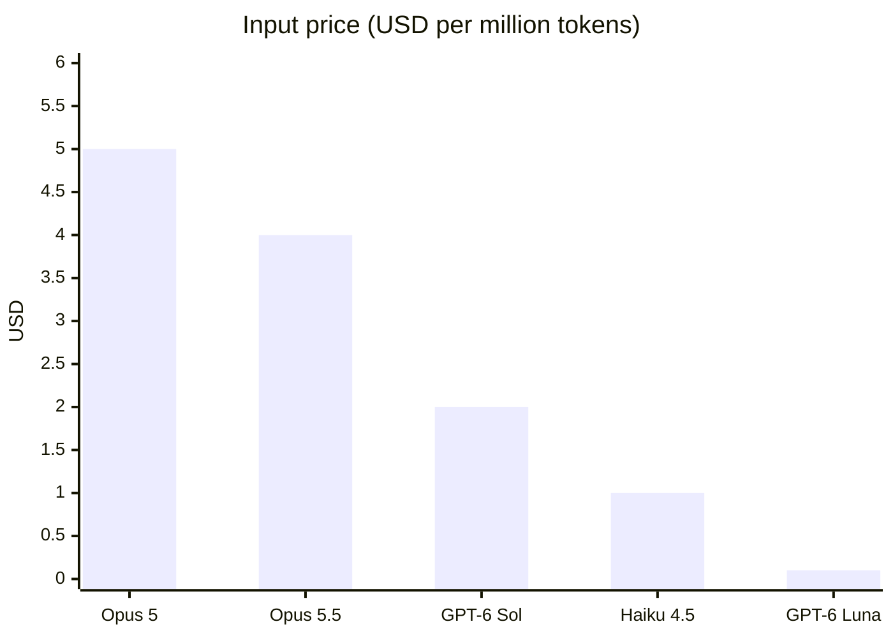
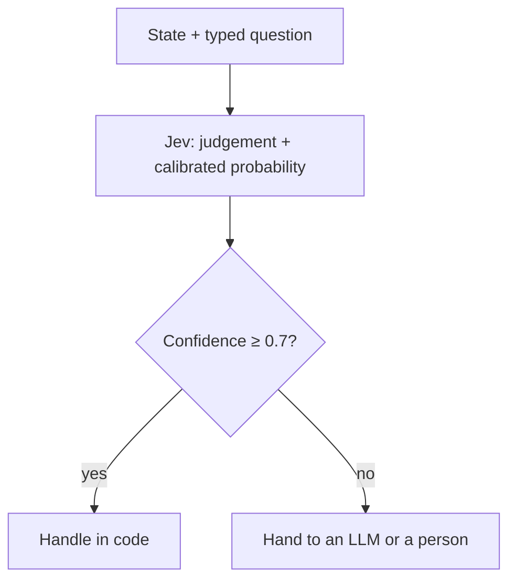
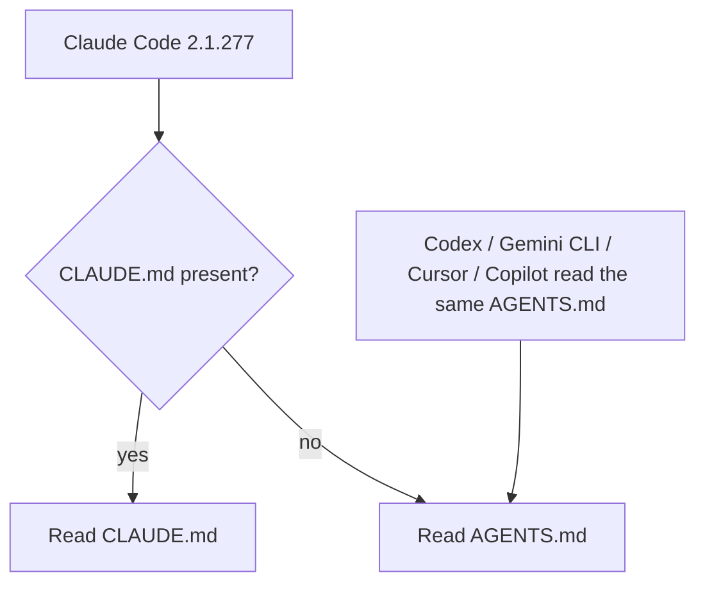
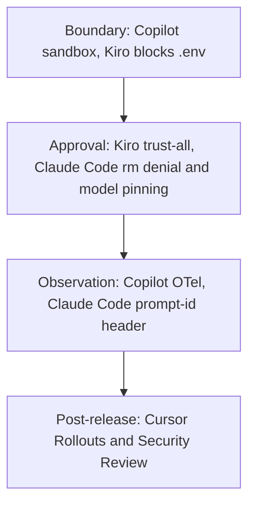
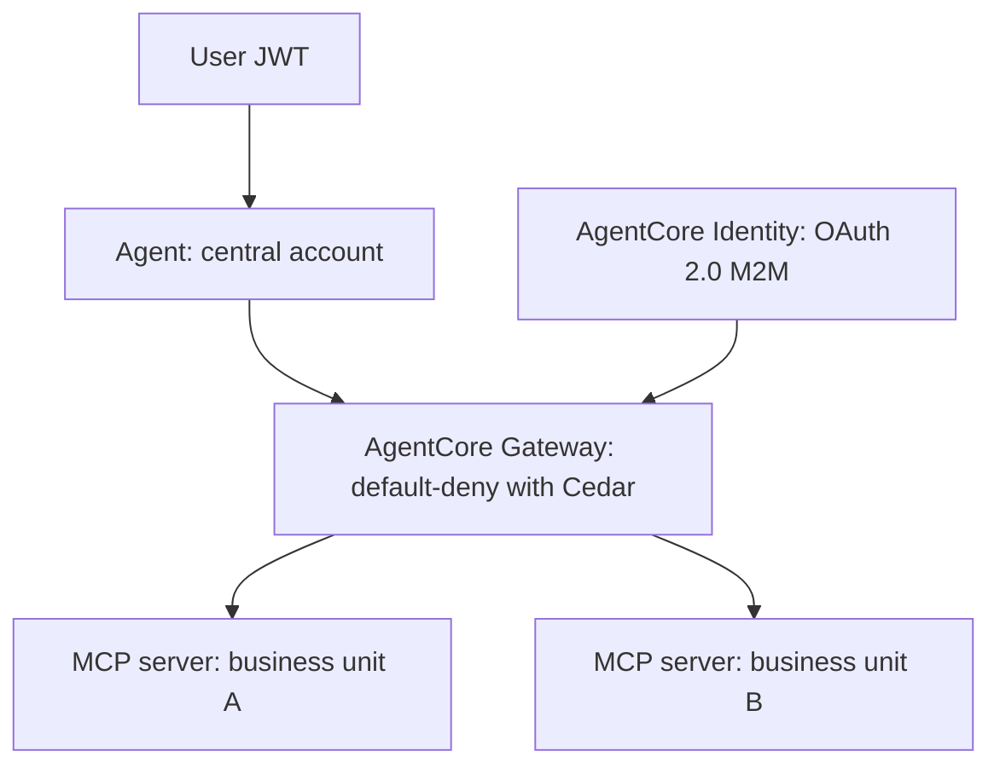

<!-- _class: summary -->

# 🗞️ GenAI Catch-up Report 2026-09-27

5 themes from 2026-09-12 to 09-27, the first run's two weeks (selected from 221 candidates). Details: <a href="../research/2026-09-27.md">research note</a>.

<article class="card">
<h3>1️⃣ 🚀 Opus 5.5 and GPT-6 Sol/Luna ship on the same day, starting a price war</h3>

Opus 5.5 at $4/$20 is 20% below Opus 5; Sol/Luna drop 50%. Reactions: "Anthropic led on capability surprise, OpenAI on price".

Impact highPotential highBoth tracks

</article>
<article class="card">
<h3>2️⃣ 🎯 Jev: a decision model that returns "typed probabilistic decisions", not text</h3>

Released by TypeSafe on 09-15: 70–500 ms, $0.042/M input. Vercel and LangChain integrated it, six clones in two days, sign-ups paused.

Impact highPotential highGenAI engineering

</article>
<article class="card">
<h3>3️⃣ 📄 Claude Code reads AGENTS.md, and instruction files get audited</h3>

Reads AGENTS.md when there is no CLAUDE.md (2.1.277), 740 points on HN. A telemetry-dependent bug, fixed in 2.1.281, and /doctor prompt-audit.

Impact highPotential highCoding AI

</article>
<article class="card">
<h3>4️⃣ 🛡️ Copilot, Kiro, Claude Code and Cursor ship controls for unattended runs at once</h3>

Sandboxes, OTel, .env blocking, refusing risky rm, model pinning, deploy monitoring. Boundaries and observation move into settings.

Impact highPotential highCoding AI

</article>
<article class="card">
<h3>5️⃣ 🏗️ Azure, Google and AWS ship platform controls for always-on agents</h3>

Foundry Routines GA and egress control, Google's anomaly detection, AgentCore's multi-account setup and a new runtime (Tokyo included).

Impact highPotential highGenAI engineering

</article>

---

<!-- _class: theme -->

# 1️⃣ 🚀 Opus 5.5 and GPT-6 Sol/Luna ship on the same day, starting a price war

On 2026-09-22 OpenAI announced about an hour after Anthropic, moving default models, prices and availability on three clouds at once.

## Key points

- Opus 5.5: $4 / $20, cache reads $0.20 (Opus 5: $5 / $25 / $0.50), 1M context, 128k max output.
- Claimed: 40% cheaper and 30% faster than Opus 5, Terminal-Bench 4.0 at 66.4% (52.3%), OSWorld 2.0 at 81.8%.
- GPT-6 Sol costs $2 / $10 and Luna $0.10 / $0.50, 50% below GPT-5.6's promotional prices.
- Claude Code 2.1.280 makes Opus 5.5 the default, and Pro / Team Standard move from Sonnet to Opus.
- Same-day availability on Bedrock (with a JP profile), Google Cloud's Model Garden, and Codex / ChatGPT Work.

## Perspectives and debates

- OpenAI: on AutomationBench, Sol (xhigh) beats Opus 5 (max) at one eleventh of the cost.
- Willison / AINews: Luna is "one tenth" of Haiku 4.5; max "over-thinks"; "40% cheaper" is at default (medium) effort.
- Addy Osmani / uhyo: turns drive cost; high is fine day to day, and max is an option for extra points.

## Technical details

- IDs: `claude-opus-5-5`, `gpt-6-sol`, `gpt-6-luna`; on Bedrock `global.anthropic.claude-opus-5-5`.
- Opus 5.5 keeps adaptive thinking always on, Fast mode costs $8 / $40, and a classifier checks actions before they run.
- OpenAI keeps the cache across effort and tool changes, with explicit breakpoints and a dashboard.

Sources: <a href="https://www.anthropic.com/news/claude-opus-5-5">Anthropic</a> · <a href="https://openai.com/index/introducing-gpt-6-sol-and-luna">OpenAI</a> · <a href="https://simonwillison.net/2026/Sep/22/opus-and-sol-and-luna/">Simon Willison</a> · <a href="https://claude.dev/blog/what-a-task-costs-on-opus-5-5/">Addy Osmani</a>

---

<!-- _class: theme -->

# 2️⃣ 🎯 Jev: a decision model that returns "typed probabilistic decisions", not text

TypeSafe AI released it on 09-15, and within two weeks Vercel and LangChain integrated it, six clones appeared and field tests began in Japan.

## Key points

- Takes a state and returns Choice / Score / Noul (yes or no) judgements with calibrated probabilities via parallel sampling.
- Trained with RLCD (Reinforcement Learning for Calibrated Decisions) so that "higher confidence means higher accuracy".
- Claimed: 70–500 ms, 40–200× faster than LLMs, $0.042 / M input, free output (about 1/48 of GPT-5.6 Terra).
- Vercel AI Gateway (09-16, `typesafe-ai/jev`) and `langchain-typesafe` (09-17) added support; sign-ups paused by 09-22.
- AINews: six clones within two days of launch (Laya, OpenJev, Kev-0.5B and more), and 36 million video views in two days.

## Perspectives and debates

- LangChain: "use an LLM for open-ended reasoning and generation, and Jev for fast, structured decisions along the way".
- Copes: read headline multiples "as a ceiling"; 0% type errors cover "the shape of an answer, not whether it's correct".
- In Japan (YESOD): 8 cases for $0.0004, no parse failures, Japanese trails English, and 49% confidence needs a plan.

## Technical details

- API: `POST /v1/systemone` (TypeSafe); Vercel offers `experimental_evaluate` in AI SDK 7 and `/v1/evaluate`.
- SDKs: `TypeSafeClassifier` (LangChain) and `llm-typesafe` (Simon Willison's CLI plugin).
- Not suited to numeric and date arithmetic, generation or summaries, images or audio, or explaining its decisions.

Sources: <a href="https://typesafe.ai/blog/introducing-system-one-models-and-jev">TypeSafe AI</a> · <a href="https://www.langchain.com/blog/building-prod-with-jev-and-langgraph">LangChain</a> · <a href="https://simonwillison.net/2026/Sep/21/jev/">Simon Willison</a> · <a href="https://zenn.dev/yesodco/articles/yesod-jev-typesafe-inquiry-triage">YESOD</a>

---

<!-- _class: theme -->

# 3️⃣ 📄 Claude Code reads AGENTS.md, and instruction files get audited

2.1.277 (09-18) reads AGENTS.md when there is no CLAUDE.md: 740 points on HN, plus a 484-point bug report on telemetry.

## Key points

- Projects without CLAUDE.md now get AGENTS.md read, switchable under "Project instructions" in `/config`.
- Codex, Gemini CLI, Devin, Cursor and Copilot already read AGENTS.md; Claude Code is the last to follow.
- 2.1.281 (09-23) extends it to Bedrock / Vertex / Foundry and LLM gateways; `.agents/skills` is still unsupported.
- With telemetry off (`DISABLE_TELEMETRY=1` etc.) it was not read, since loading depended on a remote flag; fixed in 2.1.281.
- `/doctor prompt-audit` in 2.1.283 (09-25) flags instructions written for older models and drift from reality.

## Perspectives and debates

- HN: calls for full parity over a CLAUDE.md-first rule, `ln -s AGENTS.md CLAUDE.md` long predates it, lock-in criticism.
- AAIF (Linux Foundation) stewards MCP, AGENTS.md and A2A, and Agent Router 1.1 unifies APIs and MCP (Publickey).
- Classmethod / Zenn: prompt-audit finds many gaps between the text and reality; compare behaviour before deleting.

## Technical details

- 2.1.277 also adds `CLAUDE_GATEWAY_PROXY_IS_EGRESS_BOUNDARY=1`.
- Bug cause: `agents-md` loading depended on the feature flag `tengu_agents_md_mod` (default false), issue #95690.
- 2.1.283: `/doctor prompt-audit`, `availableModelsMatch`, `deniedModels`.

Sources: <a href="https://code.claude.com/docs/en/changelog#2-1-277">Claude Code changelog</a> · <a href="https://blog.szypowi.cz/p/claude-code-reads-agents.md-only-when-telemetry-is-on/">szypowi.cz</a> · <a href="https://www.publickey1.jp/blog/26/claude_codeagentsmdclaudemd.html">Publickey</a> · <a href="https://dev.classmethod.jp/articles/20260924-cc-updates-v2-1-283/">Classmethod</a>

---

<!-- _class: theme -->

# 4️⃣ 🛡️ Copilot, Kiro, Claude Code and Cursor ship controls for unattended runs at once

From 09-19 to 09-25, four independent vendors shipped controls that assume nobody is watching, in four layers.

## Key points

- Copilot app: local sandboxing (files, network and credentials; preview) and OTel traces.
- Kiro CLI 2.24: bulk approval with `/tools trust-all`, and `.env` is no longer passed to MCP servers and tools automatically.
- Claude Code 2.1.278–283: server-side classifier as auto-mode default, risky `rm` denied after 2 min, managed model pinning.
- Cursor: Rollouts (deploy monitoring that proposes revert PRs) and Security Review (vulnerability reports on every PR).

## Perspectives and debates

- All four moved boundaries and observation out of code and into settings.
- The product answer to "Putting coding agents on a leash", a theme of Thoughtworks Radar volume 34 (April).
- Classmethod: layered defence with hooks, permissions and sandboxes; dynamic shell expansion is a limit of static checks.

## Technical details

- Copilot: the "Sandbox" setting, `/sandbox on`, and the export endpoint under `telemetry` in `managed-settings.json`.
- Claude Code: `availableModelsMatch`, `deniedModels`, `CLAUDE_CODE_AUTO_MODE_SERVER`, gateway `assume_role` and `guardrail`.
- Cursor: no auto-merge or auto-rollback; Teams / Enterprise only.

Sources: <a href="https://github.blog/changelog/2026-09-23-local-sandboxing-in-the-github-copilot-app">GitHub</a> · <a href="https://kiro.dev/changelog/cli/2-24">Kiro</a> · <a href="https://code.claude.com/docs/en/changelog#2-1-283">Claude Code</a> · <a href="https://cursor.com/changelog/rollouts-and-security-reviewer">Cursor</a>

---

<!-- _class: theme -->

# 5️⃣ 🏗️ Azure, Google and AWS ship platform controls for always-on agents

Three vendors shipped, at different layers, features that treat an agent as an always-on actor rather than a chat partner.

## Key points

- Foundry Routines GA (09-24): agents run on timer, CRON or event triggers (GitHub issue, Teams), with an audit trail.
- Foundry egress control (09-24, preview): FQDN allow rules applied in Audit / Enforced mode, Deny by default.
- Google (09-15 to 09-16): Model Armor, Semantic Governance Policies, Agent Anomaly Detection (off-path OTel trace analysis).
- AWS (09-24): an AgentCore Gateway in a central account fronts business-unit MCP servers, default-deny with Cedar.
- New AgentCore Runtime (09-18): microVMs, usage-based billing, cold start P75 1.9–2.0 s, available in Tokyo.

## Perspectives and debates

- Foundry: "The first generation of agents waited for a person to send a message"; now they respond to business events.
- Egress rules live outside code, tool access is default-deny at the gateway, and anomaly detection reads traces.
- No independent analysis covering all three vendors was found in the window (unverified).

## Technical details

- Foundry: `azure-ai-projects`; egress policies are ARM JSON (`mode`, `defaultAction: Deny`) attached through `RaiConfig`.
- Google: ADK 1.2+, Security Command Center, business rules in plain language, closed-loop remediation.
- AWS: Runtime / Gateway / Identity, Strands, Okta OIDC, `platformVersion: V2`.

Sources: <a href="https://devblogs.microsoft.com/foundry/from-chatbots-to-automated-assistants-routines-in-microsoft-foundry-are-now-generally-available/">Foundry</a> · <a href="https://developers.googleblog.com/build-zero-trust-ai-agents-that-judge-intent-not-just-syntax/">Google</a> · <a href="https://aws.amazon.com/blogs/machine-learning/build-a-multi-account-ai-agent-with-agentcore-gateway-and-mcp/">AWS</a> · <a href="https://aws.amazon.com/about-aws/whats-new/2026/09/new-agentcore-runtime-generally-available">AgentCore Runtime</a>

