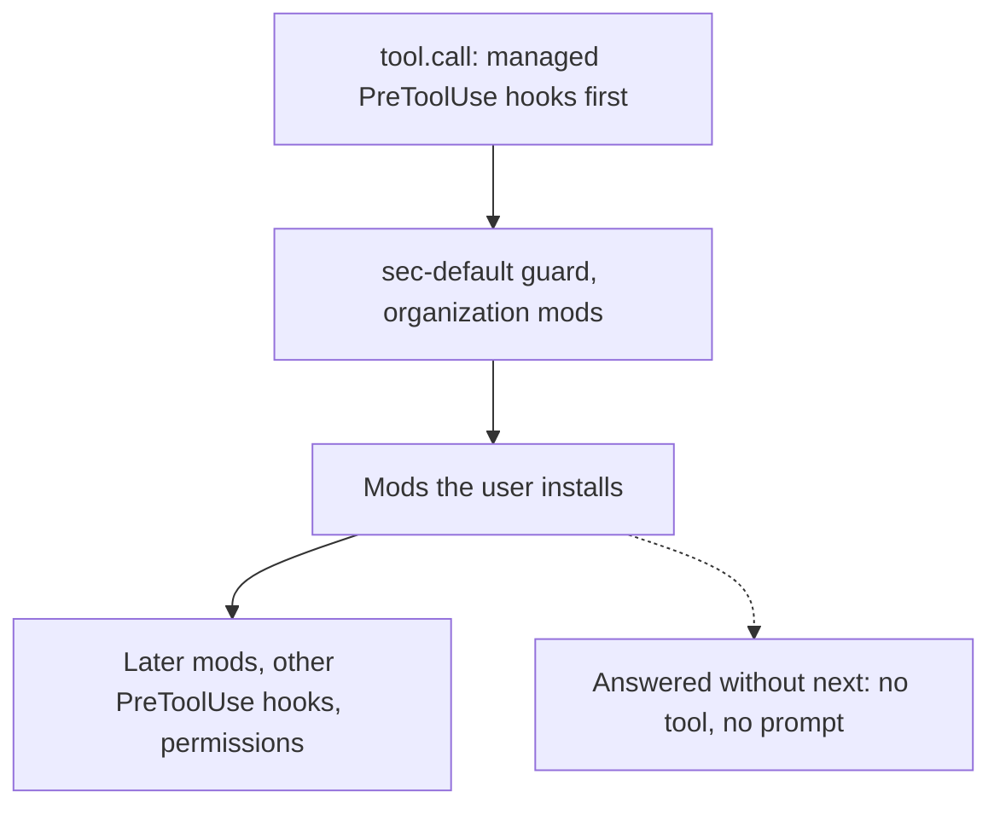
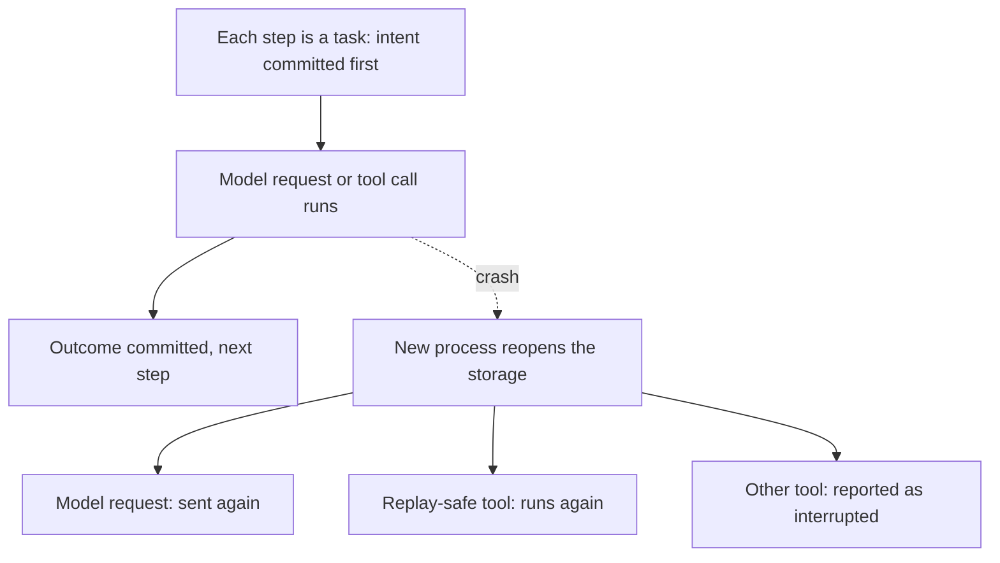
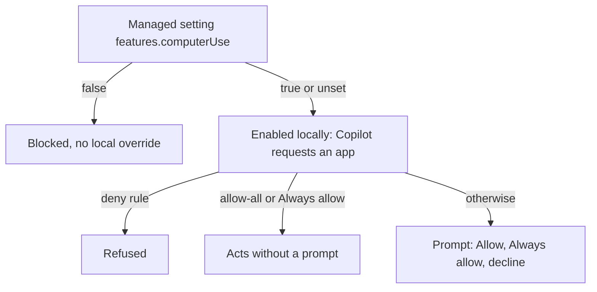
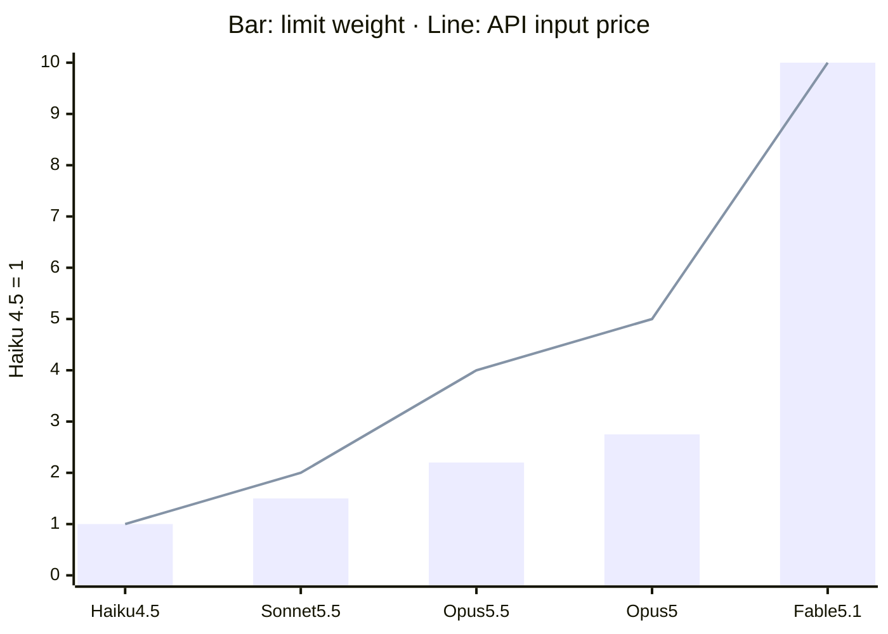
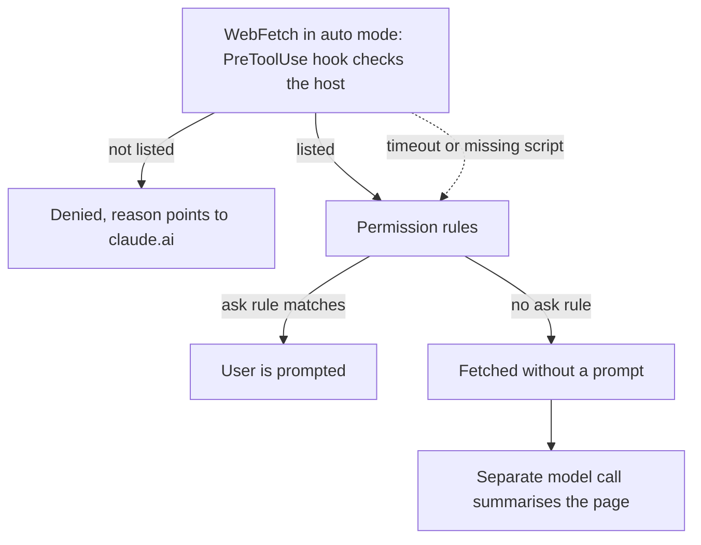
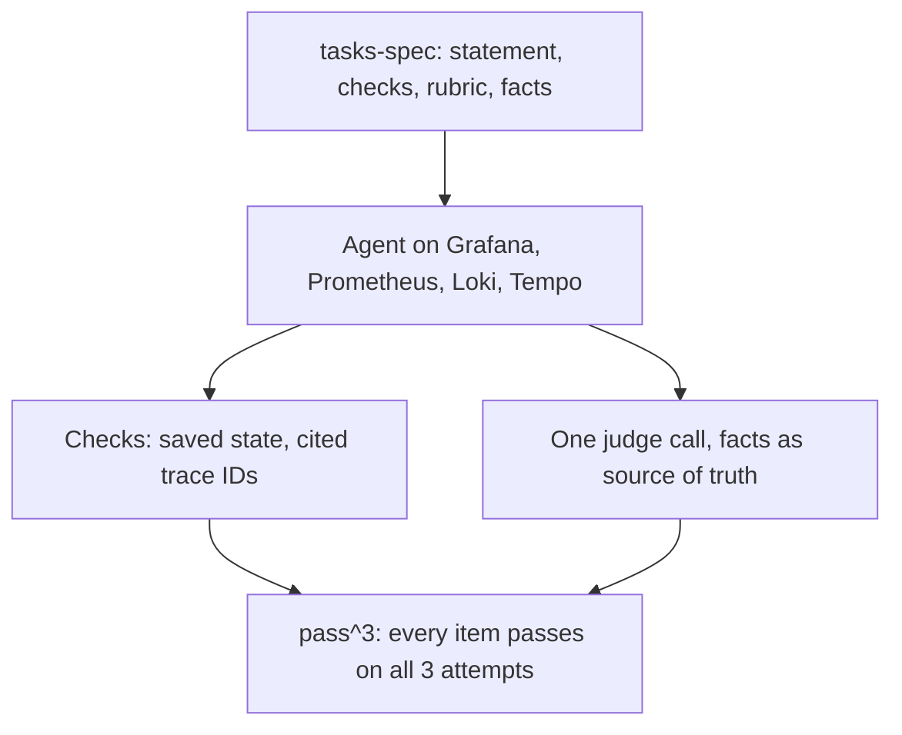

<!-- _class: summary -->

# 🗞️ GenAI Catch-up Report 2026-10-03

8 topics from 2026-10-01 to 10-03 (selected from 46 candidates). Details: <a href="../research/2026-10-03.md">research note</a>.

<article class="card">
<h3>1️⃣ 🧩 Claude Mods: in-process hooks that rewrite and redraw Claude Code</h3>

Plugins can now rewrite tool calls and prompts, draw panes and replace built-ins. Mods are on by default and unsandboxed, and their guard loads only for Team and Enterprise or under managed settings.

Impact highPotential highImportance highReleaseCoding agentsSecurity and safety

</article>
<article class="card">
<h3>2️⃣ 🥧 Pi 1.0 goes stable, and Pi Durable checkpoints every agent step</h3>

Pi 1.0 trims Codemode prompts by about 40%. Pi Durable, a separate experimental package, resumes agents after a crash, and Cloudflare's Agents SDK supported it a day later.

Impact highPotential highImportance highReleaseAgent buildingCoding agents

</article>
<article class="card">
<h3>3️⃣ 🖱️ Computer use in Copilot CLI and the Copilot app, in public preview</h3>

Copilot operates desktop apps through the accessibility tree and screenshots. Approval follows the permission mode, so allow-all sessions skip it; admins can turn the feature off.

Impact highPotential midImportance highReleaseCoding agentsSecurity and safety

</article>
<article class="card">
<h3>4️⃣ ⚙️ Copilot dynamic workflows: multi-agent processes defined in code</h3>

Workflows in Copilot extensions fix the steps, fan out to subagents and pause at checkpoints, with soft AI credit limits. No managed-settings key turns them off.

Impact highPotential midImportance highReleaseCoding agentsAgent building

</article>

---

<!-- _class: summary -->

# 🗞️ GenAI Catch-up Report 2026-10-03

<article class="card">
<h3>5️⃣ 🚦 LangChain's in-harness router cut Open SWE's median cost by 64%</h3>

A classifier picks one of three model tiers per thread. In an A/B test of 973 threads against always using GPT-6 Astra, median cost fell from $2.61 to $0.94 with merged PRs flat (p = 0.49).

Impact highPotential midImportance highHands-onAgent buildingEvals and operations

</article>
<article class="card">
<h3>6️⃣ 🧮 Claude Code's usage-limit formula, measured on a Max 20x plan</h3>

Cache reads count 1/40 of an input token, headless runs drain the 5-hour window twice as fast, and model weights differ from API prices. The announced 20% increase measured 1.11x.

Impact midPotential midImportance highHands-onCoding agentsEvals and operations

</article>
<article class="card">
<h3>7️⃣ 🛡️ A WebFetch domain allowlist for Claude Code in auto mode</h3>

Auto mode fetches pages without asking unless an ask rule matches. Classmethod lets a PreToolUse hook allow only trusted hosts and moves other web research to claude.ai.

Impact midPotential midImportance highHands-onCoding agentsSecurity and safety

</article>
<article class="card">
<h3>8️⃣ 🔭 Grafana's agent evals: scenarios, graders and the open o11y-bench</h3>

Graders check saved state and facts queried from the environment, not just the answer's wording. o11y-bench opens 63 tasks and the grading code, with a leaderboard ranked by pass^3.

Impact midPotential midImportance highHands-onEvals and operationsAgent building

</article>

---

<!-- _class: topic -->

# 1️⃣ 🧩 Claude Mods: in-process hooks that rewrite and redraw Claude Code

Claude Code 2.1.287 shipped mods on 10-01, on by default and running with the same access to the machine as Claude Code itself.

## Key points

- A mod is JavaScript or TypeScript in a plugin whose hooks see every session event and can observe, rewrite or answer it.
- Mods draw panes, add `/commands` and call models; built-in You should know runs a side agent that flags what you might miss.
- Not sandboxed: a mod can read secrets, spend usage, and approve calls that an `ask` rule or your `PreToolUse` hook would stop.
- Only Team and Enterprise users or managed machines get the `sec-default` guard, and deny rules miss a mod's own `$.fs` calls.
- Same release: three shell-write safeguards, and Opus 4.7+ and Fable default to 1M context on Bedrock, Vertex and Foundry.

## Perspectives and debates

- Anthropic: hooks could not rewrite events, draw UI or replace features; it plans to turn more built-ins into mods.
- Pluto, on pre-release v2.1.274: a mod sent credentials and prompt history out unprompted; `plugin details` showed Hooks (0).
- Field reports: mods already ran on 2.1.286, a cached rollout flag kept some gateway users off, and npm `stable` was 2.1.285.

## Technical details

- A plugin's hooks module exports `register(on, options)`, and each hook is `($, e, next)`.
- Admins: `allowManagedModsOnly` and `disableSideloadFlags`; a custom `prependPlugins` must list `sec-default`.
- A hook that throws or passes 10 s is skipped, so a guard fails open without a `.catch` deny.

Sources: <a href="https://claude.com/blog/claude-code-mods">Anthropic</a> · <a href="https://dev.classmethod.jp/articles/20261002-cc-updates-v2-1-287/">Classmethod</a> · <a href="https://mixed-news.com/en/claude-code-2-1-287-mods-not-sandboxed-api-key/">MIXED</a> · <a href="https://pluto.security/blog/claude-code-function-hooks-security/">Pluto Security</a>

---

<!-- _class: topic -->

# 2️⃣ 🥧 Pi 1.0 goes stable, and Pi Durable checkpoints every agent step

Earendil shipped both on 10-01, two days after Pi added MCP, and Cloudflare's Agents SDK supported Pi Durable the next day.

## Key points

- Pi 1.0 defaults to fullscreen and trims Codemode by about 40%: a GPT-5.6 request drops from about 5,300 to 3,300 tokens.
- Codemode scripts can now generate images, and MCP OAuth gained RFC 9207 `iss` checks and step-up sign-in.
- Pi Durable (MIT, experimental) is a separate package of about 15,000 lines in which every step is a task that checkpoints.
- One harness runs many conversations that fork and take several clients, and swaps extension code while they run.
- Cloudflare's `PiHarness` runs it in a Durable Object and restarts an evicted object with a 30-second heartbeat alarm.

## Perspectives and debates

- Earendil: the coding agent stays a one-person terminal tool; long-running, multi-surface work moves to Pi Durable.
- Hacker News (1,641 points): one critic counted about 450,000 lines; Mario Zechner replied that the additions stay optional.
- Constraints: no built-in approval step or sandbox, and exactly-once covers submissions, not external effects.

## Technical details

- Storage: memory, SQLite or JSONL, owned by one process; a crash loses at most 100 ms of streamed output.
- npm `@earendil-works/pi-durable` 1.0.0 needs Node 22.19+; Bun and Durable Objects need an adapter.
- Cloudflare: one Durable Object per conversation; a model stream longer than 15 minutes can be cut off.

Sources: <a href="https://earendil.com/posts/pi-1-0/">Earendil (Pi 1.0)</a> · <a href="https://earendil.com/posts/pi-durable/">Earendil (Pi Durable)</a> · <a href="https://developers.cloudflare.com/changelog/post/2026-10-02-pi-harness/">Cloudflare</a> · Previous: <a href="./2026-10-01.md#20">10-01 #16</a>

---

<!-- _class: topic -->

# 3️⃣ 🖱️ Computer use in Copilot CLI and the Copilot app, in public preview

GitHub opened the preview on 10-01 for local sessions on macOS and Windows; the bundled plugin stays off until a user turns it on.

## Key points

- Copilot reads apps through the accessibility tree, or screenshots for visual context, then clicks, types and scrolls.
- It targets legacy and GUI-only software without an API, CLI or MCP route, and acts outside the CLI's directory scope.
- `/computer on`, `show` and `off` in the CLI, or Settings > Computer Use in the app, toggle a plugin with its own MCP server.
- An approval covers this session or, with Always allow, later ones in both CLI and app; deny rules beat saved approvals.
- Prompts follow the permission mode: since CLI 1.0.64, full allow-all sessions skip computer-use consent.

## Perspectives and debates

- GitHub: an API, MCP, CLI or browser tool is more predictable; computer use can pick the wrong control or repeat steps.
- The New Stack: GitHub's framing is narrower than OpenAI's case for agents on human interfaces, and GitHub is catching up.
- Constraints: no price, GA date or Linux support stated; managed keys can switch it off but not allow or deny single apps.

## Technical details

- `permissions.disableBypassPermissionsMode: "disable"` blocks `--allow-all`, `/yolo` and the app's Allow all.
- macOS: the helper needs Accessibility and Screen Recording; check `computer-use` in `/plugin` and `/mcp list`.
- Removing a saved app approval doesn't revoke a running session; preview features stay opt-in after 10-22.

Sources: <a href="https://github.blog/changelog/2026-10-01-github-copilot-can-now-interact-with-desktop-apps">GitHub Changelog</a> · <a href="https://docs.github.com/en/copilot/concepts/agents/computer-use">GitHub Docs</a> · <a href="https://github.com/github/copilot-cli/blob/main/changelog.md">Copilot CLI changelog</a> · <a href="https://thenewstack.io/github-copilot-computer-use-desktop/">The New Stack</a>

---

<!-- _class: topic -->

# 4️⃣ ⚙️ Copilot dynamic workflows: multi-agent processes defined in code

In public preview since 10-01 on all plans: built into the Copilot app, behind experimental features in Copilot CLI, and in the SDK.

## Key points

- A workflow is a program in a Copilot extension that fixes steps, conditions and hand-offs; agents make the judgment calls.
- It runs steps in sequence or parallel, passes structured results, has subagents check each other and pauses at checkpoints.
- Unlike `/fleet` or autopilot, where Copilot decides how to split the work, a workflow reuses the same steps on every run.
- `copilot workflow run` runs one headless for scripts and CI, shows no prompts and denies what was not allowed up front.
- Four limits: concurrent and total subagents, active time, and AI credits, a soft post-paid ceiling that work can overshoot.

## Perspectives and debates

- GitHub: reliability and observability for multi-agent work; a normal prompt suits quick answers and small changes.
- Oren Melamed (X): Claude Code composes agents in scripts; Copilot defines workflows in extensions with lifecycle controls.
- Governance: unlike Claude Code's `disableWorkflows`, no managed key turns them off; extensions run with your privileges.

## Technical details

- `defineWorkflow` (`@github/copilot-sdk/extension`) is registered via `joinSession({ workflows })`; the API is experimental.
- `ctx.agent(prompt, { schema, model, label })` gives text, JSON or `null`; identical calls share one subagent.
- `ctx.parallel` waits at a barrier, `ctx.pipeline` streams items through stages; both take up to 4,096 items.
- `ctx.step(key, fn)` journals results, `ctx.pause(key)` checkpoints, and a resume replays the journal from the top.
- CLI: `--args`, `--allow-tool`, `--result-file`, `--output-format json`; defaults in `workflows.defaultLimits.*`.
- Shared as `extension.mjs` in `.github/extensions/` or `~/.copilot/extensions/`; formerly Agent Factories.

Sources: <a href="https://github.blog/changelog/2026-10-01-dynamic-workflows-in-copilot-cli-and-the-copilot-app">GitHub Changelog</a> · <a href="https://docs.github.com/en/copilot/concepts/agents/dynamic-workflows">GitHub Docs</a> · <a href="https://github.com/github/copilot-sdk/blob/main/nodejs/docs/workflows.md">Copilot SDK reference</a> · <a href="https://x.com/OrenMe/status/2105902729323327607">Oren Melamed</a>

---

<!-- _class: topic -->

# 5️⃣ 🚦 LangChain's in-harness router cut Open SWE's median cost by 64%

LangChain's write-up of 10-01 sends each Open SWE thread to one of three model tiers and tests the router on live traffic.

## Key points

- A week of traces: new features 22%, bug fixes 17%, test or no-op runs 16% of threads, all served by a top-tier model.
- Tiers on Artificial Analysis's cost-intelligence frontier: GLM-5.3-Flash (xhigh), GPT-5.6 Sol (medium), GPT-6 Astra (low).
- A classifier reads the first human message against a base prompt and per-tier criteria; the thread keeps the chosen model.
- A/B over 973 threads against always-Astra: median cost $0.94 vs $2.61, mean −42%, p90 −37%; merged PRs 29.2% vs 27.3%.
- Routed threads went 56% balanced, 34% fast, 10% performance; a test against always-fast was stopped within a day.

## Perspectives and debates

- LangChain: the router belongs in the harness, which holds the task context a gateway lacks, and rests on evals and tracing.
- The tested router used an LLM with structured output; Jev, about 50x faster, replaced it on 09-27, after the test.
- Limits: no always-balanced arm, and at this size a drop of a few points in merged PRs can't be ruled out (p = 0.49).

## Technical details

- `ModelSelectionMiddleware`: `abefore_model` stores `model_route` in state, and `awrap_model_call` swaps the model.
- Route order: a model the user named, routing off, a stored route, fast mode, then Jev (`jev-1.13.0`, 3 s timeout).
- Jev's answer counts at confidence 0.6 or more; otherwise the default model runs, the fast tier while Auto is on.
- Median tier costs: $0.097 fast, $1.50 balanced, $2.88 performance, a 30x spread.
- Released: `ModelRouterMiddleware` in `langchain-typesafe[experimental]` 0.0.1a3, where classifier failures end the run.
- `main` still sends half of Auto threads to a fast-only arm (`_MODEL_ROUTING_SPLIT = 0.5`); PR #3271 would remove it.

Sources: <a href="https://www.langchain.com/blog/how-to-build-a-model-router-in-the-harness">LangChain</a> · <a href="https://github.com/langchain-ai/open-swe/blob/main/agent/middleware/model_selection.py">Open SWE router code</a> · <a href="https://github.com/langchain-ai/open-swe/pull/3036">Open SWE PR #3036</a> · <a href="https://docs.langchain.com/oss/python/integrations/providers/typesafe">TypeSafe docs</a>

---

<!-- _class: topic -->

# 6️⃣ 🧮 Claude Code's usage-limit formula, measured on a Max 20x plan

A Zenn write-up of 10-01 logged requests through a forwarding proxy from 09-18 to 09-29 and derived what moves each window.

## Key points

- Usage per request = model weight × (input + 1.25 × cache write + 5 × output + 0.025 × cache read), in tokens.
- Cache reads weigh 1/40 of input; before a silent mid-September change they counted 0 and output weighed 8.
- Headless runs (`claude -p`, Agent SDK) drain the 5-hour window 2x as fast, 2.86x on weekdays 21:00–03:00 JST; weekly 1.25x.
- Fable 5.1 costs 2x Opus 5 on the API but drains limits 3.64x as fast; Opus 5.5 uses 0.8x of Opus 5, as announced.
- The 5-hour increase announced as 20% on 09-23 measured 1.11x, and requests still pass while `/usage` shows 100%.

## Perspectives and debates

- Anthropic publishes no weights, window sizes or headless factor; #97074 measured headless at 1.8–2.0x, unanswered by staff.
- Earlier measurements also found cache reads free or nearly so: shellac (January) and Classmethod (August).
- Limits: one account on one plan, a dated snapshot, and #97398 reports faster weekly drains than Opus 5.5's weights explain.

## Technical details

- Max 20x windows: 300M (5-hour) and 1.13B (weekly) Haiku 4.5 input tokens.
- Headless requests carry `cc_entrypoint=sdk-cli`.
- Server-side auto mode checks aren't counted; `CLAUDE_CODE_AUTO_MODE_SERVER=0` makes them count.

Sources: <a href="https://zenn.dev/tksfjt1024/articles/25c0ab111c277c">Zenn (tksfjt1024)</a> · <a href="https://github.com/anthropics/claude-code/issues/97074">claude-code #97074</a> · <a href="https://claude.dev/blog/what-a-task-costs-on-opus-5-5/">claude.dev</a> · <a href="https://dev.classmethod.jp/articles/claude-max-20x-weekly-limit-not-4x/">Classmethod</a>

---

<!-- _class: topic -->

# 7️⃣ 🛡️ A WebFetch domain allowlist for Claude Code in auto mode

Classmethod's write-up of 10-02 narrowed the web entry point for indirect prompt injection without giving up auto mode.

## Key points

- In `auto` and `bypassPermissions` modes WebFetch skips its prompt unless an explicit `ask` rule matches, as the docs confirm.
- Harm needs an entry for untrusted text, assets such as `.env` and credentials, and an exit; four defences were rated.
- Narrowing the entry won: a `PreToolUse` hook lets WebFetch reach only internal sources and official vendor docs.
- The earlier sandbox limited network access for Bash only, so WebFetch sat outside it as both an entry and an exit.
- Six URL tests pass, from suffix spoofs and an `@` trick to plain http and IP literals; other research moves to claude.ai.

## Perspectives and debates

- Classmethod: Claude Code reads only what colleagues or official sources wrote, a test that also vets new MCP servers.
- The url-allowlist plugin trusts URLs from WebSearch results for 30 minutes, matched exactly to stop appended parameters.
- Gaps: a hook that times out or cannot start fails open, and WebSearch titles and queries remain a small entry and exit.

## Technical details

- Hook: matcher `WebFetch`, a Python script with `"timeout": 5`, exact host or `host.endswith("." + d)`.
- Any exception still prints a `deny` decision and exits 0; the article does not publish the script.
- Rules run deny, ask, allow, and an allow can't carve out a deny, so default-deny needs the hook.

Sources: <a href="https://dev.classmethod.jp/articles/claude-code-prompt-injection-webfetch-domain-allowlist/">Classmethod</a> · <a href="https://code.claude.com/docs/en/tools-reference">WebFetch docs</a> · <a href="https://code.claude.com/docs/en/hooks">Hooks reference</a> · <a href="https://github.com/danielbodart/claude-code-plugins">url-allowlist</a>

---

<!-- _class: topic -->

# 8️⃣ 🔭 Grafana's agent evals: scenarios, graders and the open o11y-bench

A Zenn write-up of 10-01 by a Grafana developer advocate reads Grafana's April post and the benchmark's grading code.

## Key points

- A fluent answer can rest on the wrong query, so graders check saved state, query shape and facts from the environment.
- Structured outputs get deterministic checks, conclusions an LLM judge with a rubric, and each scenario runs several times.
- Grafana's prompt refactor over 175 scenarios: discover and safety up, observe 93.6% → 79.5%, dashboard 100% → 83.3%.
- o11y-bench (AGPL-3.0, on Harbor) runs 63 tasks on Prometheus, Loki and Tempo: 39 checks, 247 criteria, 63 with a fact.
- Leaderboard by pass^3 (all three attempts pass): claude-opus-4-8 (high) and claude-opus-4-7 (off) lead at 79.4%.

## Perspectives and debates

- Grafana: AI proposes, benchmarks verify, humans decide; a three-point drop against a baseline says more than a 78% score.
- Dumont's incident arena at Grafana scores quality only, and found tools and prompts mattered more than the model.
- Limits: the author is Grafana staff, Claude Haiku 4.5 judges a board Claude leads, and the top five's intervals overlap.

## Technical details

- Runs with `mise run bench:job`; needs Docker, Python 3.14+ and an Anthropic key for the judge.
- Facts are Prometheus, Loki or Tempo queries run at grading time; `regrade` re-scores saved transcripts.
- `tool_trace_id` passes only if the answer cites a trace ID seen in Tempo tool results.

Sources: <a href="https://zenn.dev/ymotongpoo/articles/20261001-agent-eval-loop">Zenn (ymotongpoo)</a> · <a href="https://medium.com/grafana-labs/building-an-evaluation-loop-for-grafana-assistant-9a8690d8662d">Grafana Labs</a> · <a href="https://github.com/grafana/o11y-bench">o11y-bench</a> · <a href="https://ganhua.wang/grafana-o11y-bench-ai-on-call">MicroFIRE</a>

