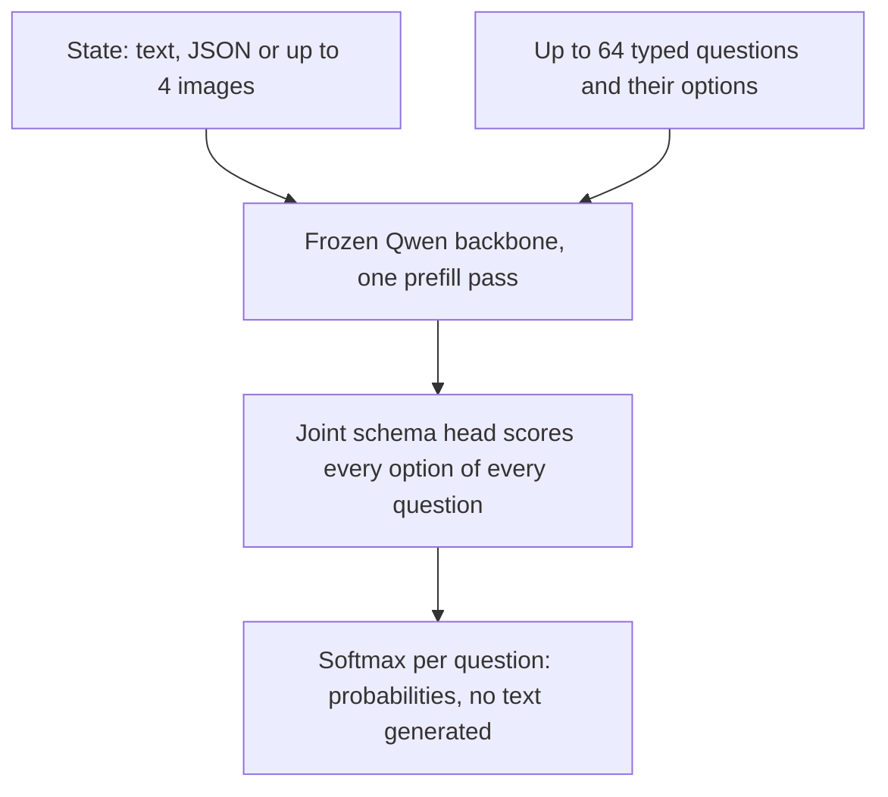
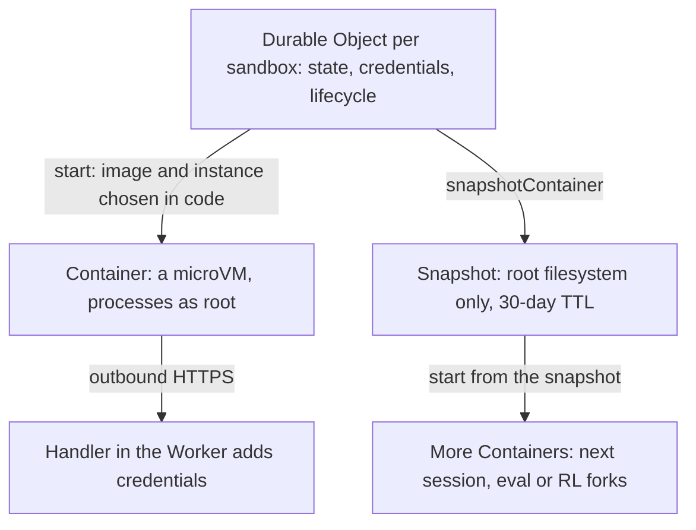
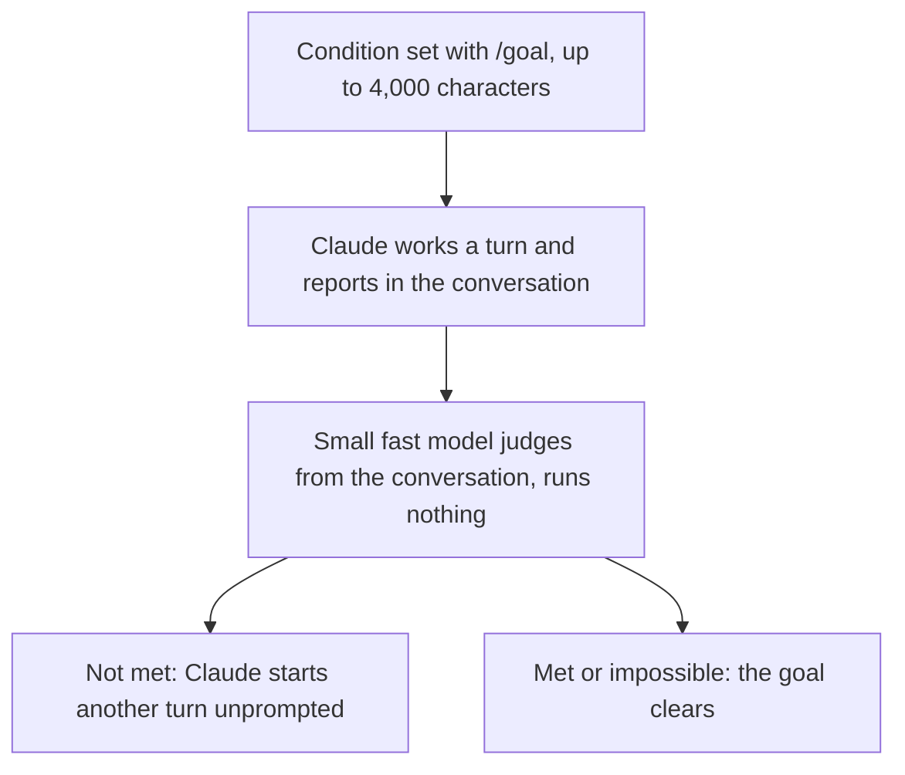
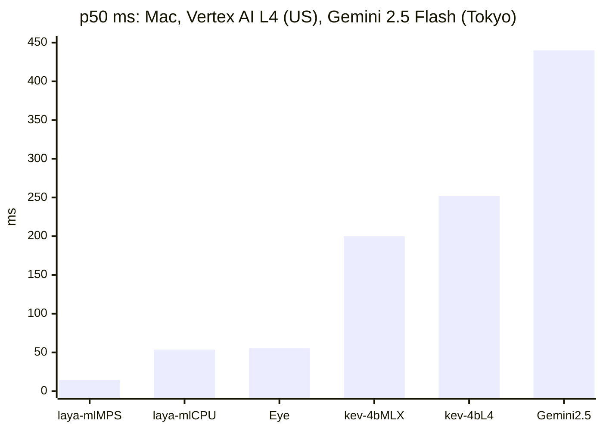

<!-- _class: summary -->

# 🗞️ GenAI Catch-up Report 2026-10-06

6 topics from 2026-10-03 to 10-06 (selected from 47 candidates). Details: <a href="../research/2026-10-06.md">research note</a>.

<article class="card">
<h3>1️⃣ 💧 OpenAI's text watermark: an API opt-in, EU-only in ChatGPT and Codex</h3>

API customers anywhere can turn it on per model since 10-05, and EU text in ChatGPT and Codex follows within weeks. Only approved researchers get the detector, and swapping 25% of words for synonyms cut detection to 17%.

Impact highPotential highImportance highChangeAPI and cloudSecurity and safety

</article>
<article class="card">
<h3>2️⃣ 🎼 Cloudflare's Clef: open decision models with image input on Workers AI</h3>

Two Apache 2.0 models (27B and 9B) answer Jev's API with a probability per option and also read images. Cloudflare's own run tops the Decision Index, while Jev stays cheaper per token.

Impact highPotential highImportance highReleaseModelsAgent building

</article>
<article class="card">
<h3>3️⃣ 📦 Cloudflare Containers rebuilt for agent sandboxes run from Durable Objects</h3>

Each sandbox's Durable Object now picks its image and size at start, and filesystem snapshots are in beta. One benchmark run put median start at 648 ms, down from about 4 s.

Impact highPotential highImportance highReleaseAgent buildingSecurity and safety

</article>

---

<!-- _class: summary -->

# 🗞️ GenAI Catch-up Report 2026-10-06

<article class="card">
<h3>4️⃣ 🔒 Claude Code 2.1.289 and 2.1.290 close gaps in deny rules and the read block</h3>

Environment-variable prefixes, hook-rewritten inputs, links swapped mid-read and users' mods could get commands or reads past the rules. npm's <code>stable</code> tag still pointed at 2.1.285, without the fixes.

Impact midPotential midImportance highChangeCoding agentsSecurity and safety

</article>
<article class="card">
<h3>5️⃣ 🔁 mizchi's AI coding method: metric loops, explainer skills, formal oracles</h3>

<code>/goal</code> loops chase deterministic numbers such as memory use, lint warnings and mutation kill rates. Skills explain code he has no time to read, and TLA+, Z3 or Alloy serve as test oracles.

Impact midPotential midImportance highHands-onCoding agentsEvals and operations

</article>
<article class="card">
<h3>6️⃣ 🎮 kev-4b and laya-ml in a real-time game: fast answers, no pit cleared</h3>

Answers took 15 to 252 ms, yet none of 600 runs crossed the first pit of the game. A one-line prefer-right rule beat kev-4b until it was given kev-4b's 144 ms delay.

Impact midPotential midImportance highHands-onModelsEvals and operations

</article>

---

<!-- _class: topic -->

# 1️⃣ 💧 OpenAI's text watermark: an API opt-in, EU-only in ChatGPT and Codex

OpenAI's post of 10-05 answers Article 50(2) of the EU AI Act, which also binds providers outside the EU whose output is used there.

## Key points

- API: since 10-05, customers worldwide can opt in per project or organization and per model; it stays off by default.
- ChatGPT and Codex: eligible text of EU users on all plans gets the watermark in the coming weeks, not as a global default.
- Detector: only approved researchers and expert organizations, by application; opting in to watermarks does not grant it.
- Detection at 1% false positives: about 80% of 200-token and 95% of 400-token psychology passages, far lower in math.
- Synonyms for 10% of words cut detection from about 92% to 66%, for 25% to 17%; scores on 8 Astra benchmarks held.

## Perspectives and debates

- OpenAI limits the detector over missed marks and false positives, a restriction the EU code allows for a limited time.
- The New Stack: OpenAI hasn't said if Codex code is marked; an arXiv test found SynthID-Text near chance on code.
- Gizmodo Japan: users in Japan get no mark and cannot test text, and a text's field moves detection more than its length.

## Technical details

- Switch: Text provenance in organization (Data controls) or project settings; Allow text watermarking, then pick models.
- textGrain reweights word choices with a secret key; detection needs only the text and the key; parameters are unpublished.
- Content Provenance API (`POST /v1/content_provenance_checks`) checks only images and audio; text checks need approval.
- Article 50(2) applies from 2 Aug 2026, or 2 Dec 2026 for systems placed earlier; fines up to €15M or 3% of turnover.
- Guidelines: marking without available detection fails (point 70), yet API opt-ins get no detector; code is exempt (68).
- Anthropic marks supported Claude models' text worldwide at the model level, Claude Code and cloud partners included.

Sources: <a href="https://openai.com/index/eu-text-provenance/">OpenAI</a> · <a href="https://thenewstack.io/openai-api-text-watermarking/">The New Stack</a> · <a href="https://www.gizmodo.jp/article/2610-openai-textgrain-watermark/">Gizmodo Japan</a> · <a href="https://digital-strategy.ec.europa.eu/en/faqs/transparency-obligations-under-article-50-ai-act">European Commission</a>

---

<!-- _class: topic -->

# 2️⃣ 🎼 Cloudflare's Clef: open decision models with image input on Workers AI

Released on 10-01 in Birthday Week, before the window, with Apache 2.0 weights and an offer of RL fine-tuning.

## Key points

- Clef (27B, on Qwen3.8-27B) and Clef-flash (9B, on Qwen3.5-9B) score all options of all questions in one pass, 0 tokens out.
- Jev-compatible: switch by changing endpoint and model; up to 64 questions and, unlike Jev, up to 4 images per request.
- Cloudflare's own run tops Decision Index 0.2.1 (Clef 61.21, Jev 57.91); Jev still leads GPQA Diamond, 78.3 to 48.0.
- Cloudflare's medians: 209.3 and 38.8 ms against Jev's 524.1 ms over HTTPS; from Japan, a Zenn test saw 406 and 166 ms.
- $0.24 and $0.09 per million input tokens, 5.7x and 2.1x Jev's rate; RL fine-tuning starts with design partners, no price.

## Perspectives and debates

- Cloudflare: a fast, specific classifier is its niche for RL environments, placed in agents' hot path beside an acting LLM.
- Skeptics: Jev's creator warns about benchmaxxed models; @mervenoyann and Armin Ronacher see relabelled classifiers.
- Field tests: image calls took 13–30 s on launch day (Flavio Copes), and Japanese routing hit 30 of 30 (Zenn).

## Technical details

- `@cf/cloudflare/clef` and `clef-flash` on Workers AI or AI Gateway; locally via Ollama 0.35.1+ or llama.cpp.
- Routing head and rank-256 LoRA on the frozen backbone, trained with a Brier loss and RLCD; no ECE is reported for Clef.
- Questions in a request are scored jointly, unlike Kev; without an `other` option, off-topic input is forced into a team.

Sources: <a href="https://blog.cloudflare.com/clef-decision-models/">Cloudflare</a> · <a href="https://flaviocopes.com/clef/">Flavio Copes</a> · <a href="https://zenn.dev/akari1106/articles/b6d3180cc50dfe">Zenn (akari1106)</a> · <a href="https://gigazine.net/news/20261005-clef-cloudflare-decision-model/">GIGAZINE</a>

---

<!-- _class: topic -->

# 3️⃣ 📦 Cloudflare Containers rebuilt for agent sandboxes run from Durable Objects

Announced on 09-30 in Birthday Week with Sandbox SDK 1.0; the new scheduling policy and the snapshots are in public beta.

## Key points

- A sandbox's own Durable Object now picks image and instance type at `start()`; each pair used to be a separate application.
- No rollout settings: a running Container keeps its image until code stops it, so canaries, pins and rollbacks are code.
- ComputeSDK's burst test of 100 sandboxes: median start fell from 4.049 s to 648 ms, and p99 from 6.717 s to 1.129 s.
- Snapshots save the root filesystem, not memory or processes, and can start other Containers; 20 GB max, 30-day TTL.
- Sandbox SDK 1.0 shrinks to file and bucket helpers; `Container` and 0.x `Sandbox` classes get updates until 2026-12-31.

## Perspectives and debates

- Cloudflare: agents create sandboxes per task and expect them at once; Publickey sees a platform reshaped for agents.
- The 6x compares single runs 11 weeks apart; July–September medians ran 3.5–5.7 s (about 7x), spring's about 2 s (3x).
- Constraints: migration is one-way to a new namespace; processes run with root, and snapshots keep tokens left on disk.

## Technical details

- Opt in per app with the `durable_object` scheduling policy and an `images` map of up to 100 digest-pinned images.
- `cloudflare/debian-trixie` (Node.js 24.20.0) lacks Git, Python and curl, and its default command exits at once.
- Billed per 10 ms running; work inside is not activity, so an instance stops at the idle timeout (6 h at most) mid-task.

Sources: <a href="https://blog.cloudflare.com/faster-agent-sandboxes/">Cloudflare</a> · <a href="https://developers.cloudflare.com/containers/api/durable-object-container/">Cloudflare Docs</a> · <a href="https://github.com/computesdk/benchmarks/tree/master/results/burst_tti">ComputeSDK results</a> · <a href="https://www.publickey1.jp/blog/26/cloudflare_containersai6.html">Publickey</a>

---

<!-- _class: topic -->

# 4️⃣ 🔒 Claude Code 2.1.289 and 2.1.290 close gaps in deny rules and the read block

Released on 10-03 and 10-05, after the mods release of the last report; npm's <code>stable</code> tag still pointed at 2.1.285 on 10-06.

## Key points

- Under sandbox auto-allow, deny and ask rules missed commands behind an env-var prefix such as `TZ="$HOME"`; fixed in 2.1.289.
- 2.1.290 covers `declare` and `export` prefixes, applies rules after a PreToolUse hook rewrites input, and prompts on `rg` globs.
- The read block and Read deny rules now hold for symlinked `CLAUDE.md` or `AGENTS.md`, links swapped mid-read and pasted images.
- User mods can no longer make org guards skip checks or unload org plugins; plugins can't rewrite org MCP sign-in tools.
- 2.1.289 lists 27 items, 5 of them security fixes; 2.1.290 lists 190, about 56 security-relevant by the note's count.

## Perspectives and debates

- MIXED calls it a second route past the rm guard; Anthropic calls neither sandbox fix a vulnerability, and no CVE exists.
- Classmethod reproduced the prefix fix with a control; in its read-block test only user settings reliably added directories.
- The docs call a Bash rule no security boundary and leave enforcement to the sandbox; these fixes narrow the text matching.

## Technical details

- npm on 10-06: `latest` and `next` 2.1.290, `stable` 2.1.285 of 09-29, which the Homebrew `claude-code` cask follows.
- Managed `requiredMinimumVersion` makes older versions exit at startup; `autoUpdatesChannel` chooses `stable` or `latest`.
- `blockReadsOutsideWorkingDirectories` (2.1.257+) refuses file-tool reads outside in any mode; unsandboxed Bash reads prompt.
- `autoAllowBashIfSandboxed` defaults to true; deny rules and content-scoped ask rules like `Bash(git push *)` still apply.
- `claude plugin validate` lists gating hooks with or without `.catch`; mods gain `ceiling` and `agentId` in `tool.check`.
- Repository settings can no longer turn on Claude in Chrome or set `CLAUDE_CODE_DISABLE_ATTACHMENTS`.

Sources: <a href="https://code.claude.com/docs/en/changelog">Claude Code changelog</a> · <a href="https://mixed-news.com/en/claude-code-2-1-289-second-route-past-rm-guard-stable-four-builds-behind/">MIXED</a> · <a href="https://dev.classmethod.jp/articles/20261005-cc-updates-v2-1-289/">Classmethod</a> · Previous: <a href="./2026-10-03.md#3">10-03 #1</a>

---

<!-- _class: topic -->

# 5️⃣ 🔁 mizchi's AI coding method: metric loops, explainer skills, formal oracles

A stock-taking Zenn post of 10-05 that drew 379 likes and 425 Hatena bookmarks within a day; he expects it to change again soon.

## Key points

- Five human roles: judge what models can do, build loops, set metrics and trade-offs, audit loop logs, order tests and CI.
- A failed first try gets a diagnosis: add context or tests, grant permissions, or wait about half a year for capability.
- `/goal` loops chase deterministic numbers: RSS, strict-lint warnings (cccc, similarity), mutation kill rate, VRT match.
- He reads E2E case names, tests and signatures, and has skills (mizchi/explainer, DreambigOu/ELI5) explain the rest.
- Formal oracles: TLA+ or Quint for services and caches, Z3 for predicates, Alloy for permissions, Lean for algorithms.

## Perspectives and debates

- Hatena: kiririmode sees the job as designing evaluation; pochi-taro00: `/goal` takes one condition, its judge sometimes lies.
- Huntley: code must be explainable, not readable; Litt, and Joshi via Fowler, want understanding to take part beyond review.
- Caution: LLM-written TLA+ averaged about 46% on conformance to real systems (SIGOPS); the article's prompts don't check it.

## Technical details

- One goal per session; the evaluator runs on the small fast model and is unavailable under `disableAllHooks`.
- formal-methods-reconciler: the LLM drafts the model, the solver decides, and each counterexample becomes a test.
- `similarity-ts` flags duplicate code by tree edit distance; `cccc --max-cognitive 15` fails CI over the limit.

Sources: <a href="https://zenn.dev/mizchi/articles/ai-coding-loop-formal">Zenn (mizchi)</a> · <a href="https://code.claude.com/docs/en/goal">Claude Code docs</a> · <a href="https://sigops.org/2026/can-llms-model-real-world-systems-in-tla">ACM SIGOPS</a> · <a href="https://b.hatena.ne.jp/entry/s/zenn.dev/mizchi/articles/ai-coding-loop-formal">Hatena Bookmark</a>

---

<!-- _class: topic -->

# 6️⃣ 🎮 kev-4b and laya-ml in a real-time game: fast answers, no pit cleared

Shinya Koike, an Accenture Japan engineer, published this personal test on Zenn on 10-05, with code and run logs on GitHub.

## Key points

- With a 55 ms screen-reading eye before each answer, laya-ml acted 6 frames late at 60 fps and kev-4b 16–17 frames late.
- Preregistered final test, 100 runs × 3 per model in English: none of 600 crossed the first pit, and neither model won.
- Alone, kev-4b died in all 30 runs and laya-ml only attacked; with memory, the model's top choice ran in 43–64% of moves.
- Part 3 put physics and search in code; kev-4b then always picked options labelled SAFE, yet crossed in 0 of 20 runs.
- A prefer-right rule crossed in 12 of 20 runs, and in 0 of 20 once delayed by kev-4b's 144 ms median response.

## Perspectives and debates

- Author: System-1 speed pays only for ambiguity rules can't capture, with tens to hundreds of ms to spare and cheap errors.
- kanta13jp1's Mario test agrees: search changed 187 of cloud Jev's 210 answers, and every model alone failed.
- Limits: one author, one pit, three runs per model, a local-only preregistration, Jev untested, kev-4b English-only.

## Technical details

- kev-4b: Qwen3.5-4B-Base with LoRA and a scoring head (MLX); laya-ml: a ~300M mmBERT-base encoder (MPS).
- laya-ml cuts option text at 48 tokens and input at 512 (per the author), which at first dropped the labels.
- Vertex AI g2-standard-8 with one L4: about $0.98 an hour, $720 a month always on; health route `/v1/models`.

Sources: <a href="https://zenn.dev/acntechjp/articles/zenn-system1-owata2-realtime">Zenn (Shinya Koike)</a> · <a href="https://github.com/ccie26302/zenn-code/tree/main/owata2-system1-realtime">zenn-code repository</a> · <a href="https://huggingface.co/jaredpalmer/kev-4b">Kev-4B card</a> · <a href="https://zenn.dev/kanta13jp1/articles/jev-realtime-use-cases-deep-dive">Zenn (kanta13jp1)</a>

