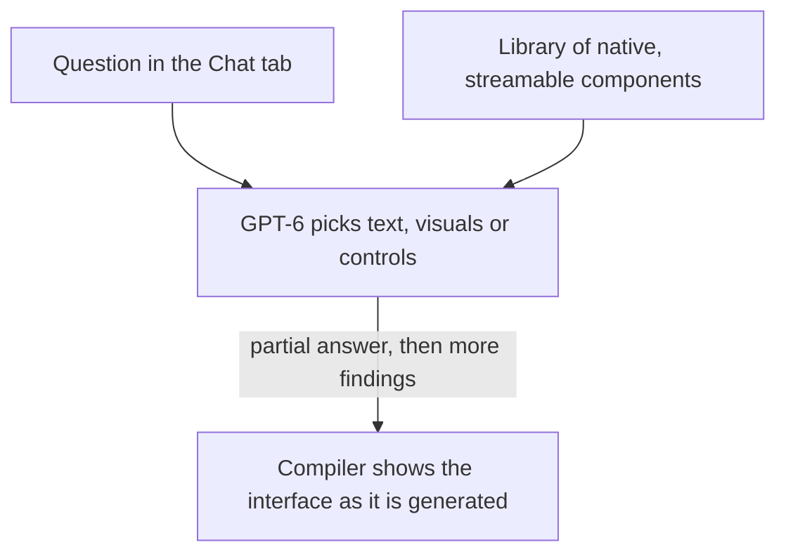
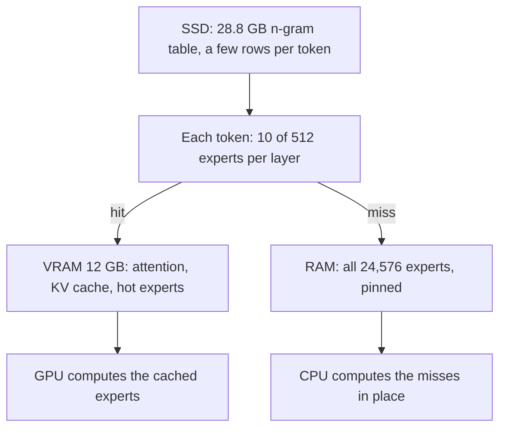
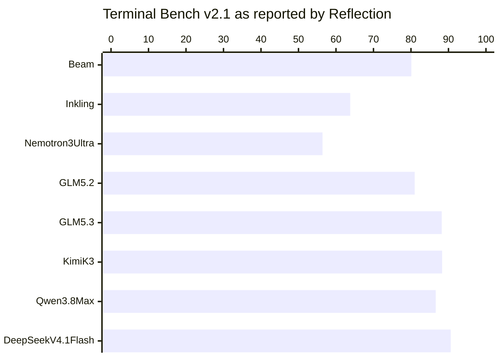
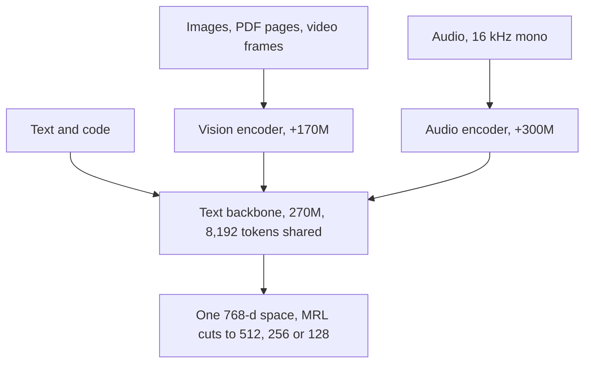
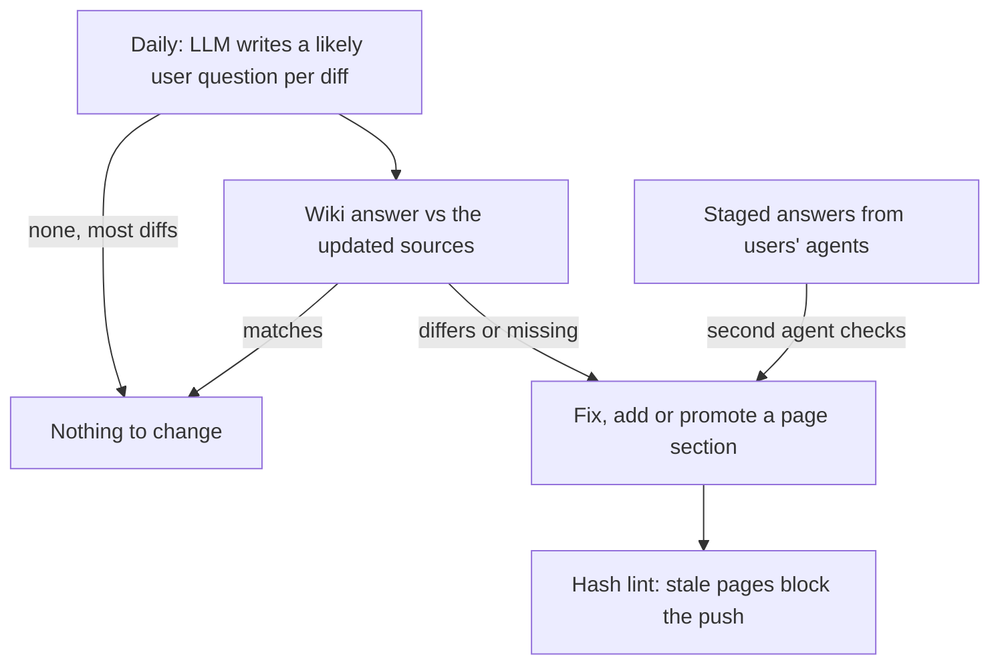

<!-- _class: summary -->

# 🗞️ GenAI Catch-up Report 2026-10-08

6 topics from 2026-10-06 to 10-08 (selected from 80 candidates). Details: <a href="../research/2026-10-08.md">research note</a>.

<article class="card">
<h3>1️⃣ 🪶 Claude Haiku 5.5 at a tenth of Haiku 4.5's price up to 100K tokens</h3>

$0.10/$0.50 per million tokens matches GPT-6 Luna up to 100K, with a 1M window, effort levels and breaking API changes. Sonnet 5.5 cache reads drop to $0.10, and Max plans get $100 or $200 a month in API credits, Team up to $500.

Impact highPotential highAttention highReleaseModelsAPI and cloud

</article>
<article class="card">
<h3>2️⃣ 🧩 GPT-6 in ChatGPT: Intelligent UI composes answers from streamed components</h3>

The Chat tab's GPT-6 builds answers from a library of streamable components and starts answering while it still thinks. Work and Codex keep September's models, and in the API only <code>chat-latest</code> changed.

Impact midPotential midAttention highReleaseModels

</article>
<article class="card">
<h3>3️⃣ 🪨 Strata runs 125B Qwen3.8-Flash-Next on 12 GB GPUs with RAM and SSD</h3>

The MIT-licensed engine keeps hot experts in VRAM, all experts in RAM and a 28.8 GB table on SSD, and speaks the OpenAI, Anthropic and Responses APIs. PC Watch saw 34 to 44 tok/s on an RTX 3060, with slow prompt reading and open quality questions.

Impact midPotential midAttention highReleaseModelsCoding agents

</article>

---

<!-- _class: summary -->

# 🗞️ GenAI Catch-up Report 2026-10-08

<article class="card">
<h3>4️⃣ 🔦 Reflection's Beam: a 501B-A23B open model, weights due in October</h3>

Reflection claims GLM 5.2-level scores at a third to a quarter of the compute for its text-only coding model, yet it trails GLM 5.3, Kimi K3 and DeepSeek V4.1 Flash on most rows of its own table. The Apache 2.0 weights are not out yet.

Impact midPotential midAttention highReleaseModels

</article>
<article class="card">
<h3>5️⃣ 🔎 EmbeddingGemma 2: a 740M open multimodal embedder that runs on device</h3>

A 270M text core plus optional vision and audio encoders maps every input into one 768-d space, in about 191 MB of RAM for text on a Pixel 11 Pro. MTEB Code gains 9.92 points over the first version, while multilingual text barely moves.

Impact midPotential midAttention highReleaseModelsAgent building

</article>
<article class="card">
<h3>6️⃣ 📚 LayerX's LLM Wiki: question filter, hash lint, staging for answers</h3>

Daily diffs are acted on only when they change the answer to a likely user question, source hashes block pushes of stale pages, and agents' answers wait in staging for a second agent. The post reports no measurements.

Impact midPotential midAttention highHands-onAgent buildingEvals and operations

</article>

---

<!-- _class: topic -->

# 1️⃣ 🪶 Claude Haiku 5.5 at a tenth of Haiku 4.5's price up to 100K tokens

Launched on 10-07 on all platforms, in a post that also cut Sonnet 5.5's cache-read price and added API credits to Max and Team.

## Key points

- Per million tokens: $0.10 in, $0.50 out up to 100K tokens (Haiku 4.5: $1/$5), $0.50/$2.50 beyond; cache reads $0.01.
- Anthropic's ~75% average saving counts the new tokenizer (~30% more tokens) and Haiku 4.5's mix, 90% under 100K.
- 1M context, 128K output (was 200K and 64K), thinking on by default, effort `low` to `max` (default `medium`), text out.
- At max effort: Terminal-Bench 4.0 39.2% (Sonnet 5.5 70.6%, Haiku 4.5 0%), OSWorld 2.1 offline 72.4% (Luna 48.9%).
- It also halves Sonnet 5.5 cache reads to $0.10 (~20% off most agentic tasks) and adds SDK browser and computer use.

## Perspectives and debates

- Simon Willison: Luna's price up to 100K, 5x beyond (Luna rises only at 272K), ~1.25x tokens: a hidden increase.
- Artificial Analysis: index 43 vs Luna's 38 at max for 3x the cost per task; 9.93 s before answering at `low` (Luna 3.05 s).
- System card: prompt-injection success down from 83.2% to 7.1%, but leaked answers used 17% of the time (Haiku 4.5: 2%).

## Technical details

- `claude-haiku-5-5` has no date suffix or alias; Bedrock uses `anthropic.claude-haiku-5-5` and a `jp.` Tokyo-Osaka profile.
- Now errors: `budget_tokens`, `temperature` other than 1, `top_p` other than 0.99, any `top_k`, and assistant prefill.
- Replies may start with `thinking` blocks, counted in `max_tokens` and rejected if resent after earlier turns change.
- New refusals (`stop_reason: "refusal"`) have no fallback; thinking can be disabled at `high` or below, not in Claude Code.
- Claude Code 2.1.293 points `haiku` at Haiku 5.5 on the Anthropic API only; Bedrock, Google Cloud and Foundry stay on 4.5.
- Monthly credits: Max $100 or $200, Team up to $500, Claude Platform only, not interactive Claude Code or other clouds.

Sources: <a href="https://www.anthropic.com/claude-haiku-5-5">Anthropic</a> · <a href="https://platform.claude.com/docs/en/models/haiku-5-5/migration-guide">Migration guide</a> · <a href="https://simonwillison.net/2026/Oct/7/claude-haiku-5-5/">Simon Willison</a> · Previous: <a href="./2026-09-29.md#5">09-29 #2</a>

---

<!-- _class: topic -->

# 2️⃣ 🧩 GPT-6 in ChatGPT: Intelligent UI composes answers from streamed components

Rolling out from 10-07 in ChatGPT's Chat tab only; Work and Codex keep September's models, and no developer access has surfaced.

## Key points

- GPT-6 builds answers from text, visuals and controls such as forms, charts, maps and calculators, or plain text.
- A "library of native, streamable components" and a compiler let the interface appear as the model generates it.
- Answers start while it thinks or uses tools; GPT-6 Instant begins web-search answers 44% sooner than GPT-5.6 Instant.
- Plus and above run GPT-6 Sol from 10-07, Free and Go GPT-6 Luna from 10-08; Pro reasoning stays on Astra with no UI.
- System card: regressions on self-harm for Sol and on self-harm, gore and sexual content for Luna, reviewed as borderline.

## Perspectives and debates

- SiliconANGLE likens it to Google's Generative Interface; Search Engine Journal sees calculator sites losing visits.
- HN spotted a turkey photo for a lamb menu; a MY TECH BLOG subnet tool showed the broadcast address as a raw integer.
- OpenAI's help article names only GPT-5.6 Luna for Free and Go, and the 44% is time to begin, not to finish.

## Technical details

- GPT-6 replaces Latest in the menu; Instant to Extra High run GPT-6 Sol (October), not GPT-6.1 Sol; GPT-5.6 Sol stays.
- Web and updated apps only, no separate quota; turning off Layout and visuals does not give text-only answers.
- API: only `chat-latest` changed on 10-07 ($5/$30 per 1M, text out); GPT-6 Sol and Luna pages list no October snapshot.

Sources: <a href="https://openai.com/index/gpt-6-for-everyone/">OpenAI</a> · <a href="https://help.openai.com/en/articles/20001354-gpt-6-and-other-models-in-chatgpt">OpenAI Help Center</a> · <a href="https://siliconangle.com/2026/10/07/with-gpt-6-chatgpts-responses-are-much-more-visually-appealing-and-interactive/">SiliconANGLE</a> · Previous: <a href="./2026-09-27.md#2">09-27 #1</a>

---

<!-- _class: topic -->

# 3️⃣ 🪨 Strata runs 125B Qwen3.8-Flash-Next on 12 GB GPUs with RAM and SSD

An MIT-licensed engine first released on 09-24 by GitHub user Niko1221, which reached this run's feeds through PC Watch's 10-06 column.

## Key points

- Qwen3.8-Flash-Next has 125B parameters, 6B active; Q2_0 needs 37.6 GB of RAM plus VRAM, IQ3_S 54.8 GB.
- Needs 12 GB+ of VRAM (RTX 20-50 or listed AMD), 32 GB of RAM for the Coder or 64 GB for every size, and ~80 GB of disk.
- Developer's RTX 5070 with 64 GB: Q2_0 writes 94 tok/s and reads a 32K prompt at 2,650 tok/s; IQ3_S 53 and 1,620 tok/s.
- PC Watch, RTX 3060 and DDR4: IQ2_XS at 34-44 tok/s, ~25 s for a 23K prompt; a 48 GB-modded RTX 4090 ran IQ3_S at 87-129.
- 44 releases since 09-24 added Claude Code (0.1.17), DNS-rebinding defence (0.1.38) and Codex's Responses API (0.1.39).

## Perspectives and debates

- Hackaday: it "treats VRAM as a cache"; PC Watch: decoding is practical, prefill slow for agents that read many files.
- HN doubts sub-4-bit quants and one vision test saw about 3x llama.cpp's error; the Coder is weaker on CJK text (#438).
- License: businesses offering a "Model as a Service" or "AI Work Assistant" need a separate Qwen license for commercial use.

## Technical details

- Serves OpenAI, Anthropic and stateless Responses APIs at 127.0.0.1:8080, one request at a time unless set to parallel.
- Claude Code connects via `ANTHROPIC_BASE_URL`; in a Codex tool loop, each turn reused ~96% of its prompt from cache.
- MTP drafts up to 3 tokens for 1.6-1.8x with output identical to greedy decoding; `/metrics` uses vLLM's metric names.

Sources: <a href="https://github.com/Niko1221/Strata">Strata on GitHub</a> · <a href="https://pc.watch.impress.co.jp/docs/column/nishikawa/2145673.html">PC Watch</a> · <a href="https://hackaday.com/2026/10/04/ai-on-your-gaming-pc/">Hackaday</a> · <a href="https://news.ycombinator.com/item?id=49953495">Hacker News</a>

---

<!-- _class: topic -->

# 4️⃣ 🔦 Reflection's Beam: a 501B-A23B open model, weights due in October

Announced on 10-05 as Reflection's first open-weight model, with early access by waitlist and no weights, model card or report yet.

## Key points

- A text-only sparse MoE with 501B parameters, 23B active, in 52 layers, trained for coding, reasoning and agentic work.
- Pretrained on 23.8T tokens on 6,144 GB300s; RL ran four weeks on 10.5K GB300s with over 100M rollouts in ~1.3B sandboxes.
- Reflection's table: SWE-bench Verified 80.9, SWE Bench Pro v1 65.5, DeepSWE v1.1 44.4 and MCP Atlas 78.7.
- Claimed: GLM-5.2-level reasoning at 3-4x less compute, estimated from generated tokens, excluding prefill and attention.
- Apache 2.0 weights, model card and technical report are due later in October; Hugging Face had none on 10-08.

## Perspectives and debates

- Reflection says it "advances the Western open-weight frontier"; TechCrunch notes the claims are unverified.
- AINews: top Chinese models are "generally ahead"; Artificial Analysis, with early access, expects high token efficiency.
- HN's top comment: bigger than DeepSeek V4.1 Flash and worse on every metric, true on 7 of the 9 rows both report.

## Technical details

- Interleaved local and global attention, fine-grained routed experts, aux-loss-free balancing, 1M effective context.
- A reasoning effort parameter trades length for accuracy; the RL run used rollouts of up to 256K tokens.
- Early access at platform.reflection.ai; price, limits, serving hardware and partners are not known yet.

Sources: <a href="https://reflection.ai/blog/introducing-beam">Reflection</a> · <a href="https://techcrunch.com/2026/10/05/reflection-debuts-beam-a-open-weight-ai-model-to-rival-chinese-models-at-lower-compute-cost/">TechCrunch</a> · <a href="https://www.latent.space/p/ainews-reflection-beam-501b-a23b">AINews</a> · <a href="https://news.ycombinator.com/item?id=49969183">Hacker News</a>

---

<!-- _class: topic -->

# 5️⃣ 🔎 EmbeddingGemma 2: a 740M open multimodal embedder that runs on device

Released by Google DeepMind on 10-06 under Apache 2.0 with day-0 llama.cpp, vLLM and Ollama support; Model Garden and ML Kit follow.

## Key points

- Built on Gemma 4: a 270M text-and-code core with optional vision (170M) and audio (300M) encoders, one 768-d space.
- MTEB Code rises from 68.76 to 78.68 over EmbeddingGemma 1, while MTEB multilingual moves only from 61.15 to 61.36.
- Pixel 11 Pro: ~191 MB of active RAM for text, ~567 MB for all modalities; LiteRT embeds text in 8.3 ms on its TPU.
- An 8,192-token window, 4x the first version's, fits ~29 images, ~58 video frames or ~5.5 minutes of audio per input.
- Qdrant (partner): 1-bit 768-d vectors kept 99% of nDCG@10 with 30x less RAM, and cutting bits beat cutting dimensions.

## Perspectives and debates

- Google: one model instead of captioning, speech-to-text and text embedding chained, plus zero-shot routing on device.
- HN: simonw values open weights in case a hosted model is retired; two users find text retrieval no better than in v1.
- Classmethod: transformers 5.18.0 did not know the model, and Japanese queries ranked three test images correctly.

## Technical details

- `google/embeddinggemma-2` needs sentence-transformers 6.1.0+ with `[image,audio,video]`; text takes task prefixes.
- `float16` yields NaN or silently degraded vectors; truncated vectors need re-normalizing and one size for both sides.
- No safety tuning or alignment; Ollama's tags list a 256K context, and Unsloth's llama.cpp command covers text only.

Sources: <a href="https://blog.google/innovation-and-ai/technology/developers-tools/embeddinggemma-2/">Google DeepMind</a> · <a href="https://ai.google.dev/gemma/docs/embeddinggemma/model_card_2">Model card</a> · <a href="https://qdrant.tech/blog/embeddinggemma-2/">Qdrant</a> · <a href="https://dev.classmethod.jp/articles/embeddinggemma-2-image-embedding/">Classmethod</a>

---

<!-- _class: topic -->

# 6️⃣ 📚 LayerX's LLM Wiki: question filter, hash lint, staging for answers

A Japanese post of 10-05 from LayerX's Bakuraku platform team, on a wiki heading past 1,000 pages; it reports no measurements.

## Key points

- For QA and CS, each feature page sets the Notion spec, the Zendesk help article and the GitHub code side by side.
- Daily, an LLM writes one likely user question per grouped diff; diffs with none, most of them, are dropped.
- The wiki then answers it: a match changes nothing, a mismatch fixes the section, and no answer adds a section or page.
- Pages record each source's hash; a changed one marks the page stale, and a lint fails any push while stale pages remain.
- Agents write answers to staging only; the daily run promotes them by rule, checked by a different agent, or deletes them.

## Perspectives and debates

- Karpathy's pattern files good answers straight back; with immutable sources, Astro-Han's skill skips source hashes.
- Classmethod relays a paper: frontier models corrupted 25% of document content in long delegated edits, like write-backs.
- Open: changes no page cites rely on the question filter alone, and Slack or inquiry data needs per-person permissions.

## Technical details

- Hashes alone decide staleness, with no LLM judgement; fixing page A marks page B, written from A, stale too.
- Code is cited at the production release, which help articles describe; staged answers are never used as grounds.
- Not stated: model, harness, cost, hash function, promotion rules or search; the last release alone had over 2,000 PRs.

Sources: <a href="https://tech.layerx.co.jp/entry/enterprise-llm-wiki-ops">LayerX</a> · <a href="https://gist.github.com/karpathy/442a6bf555914893e9891c11519de94f">Karpathy's gist</a> · <a href="https://dev.classmethod.jp/articles/llm-knowledge-base-document-corruption-revisit/">Classmethod</a> · <a href="https://github.com/Astro-Han/karpathy-llm-wiki">Astro-Han</a>

