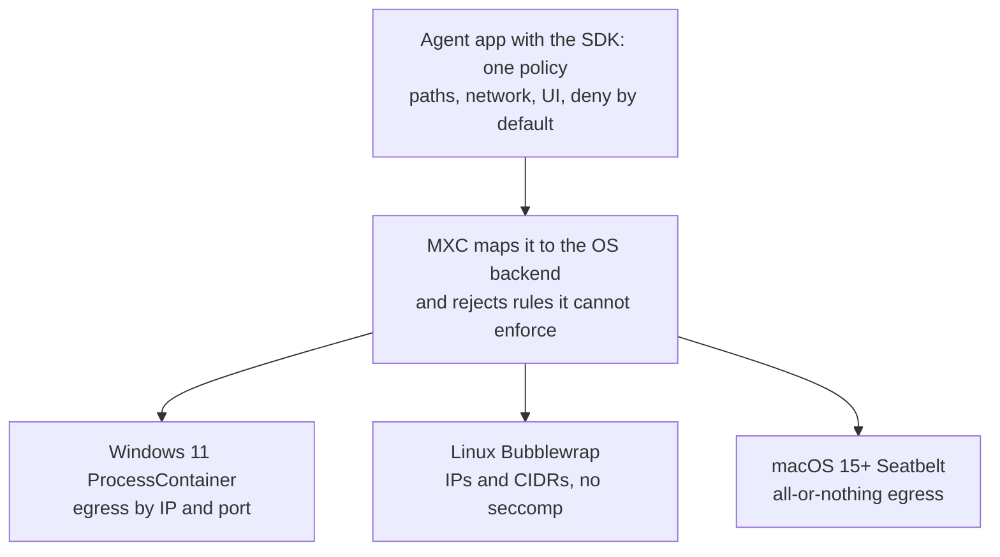
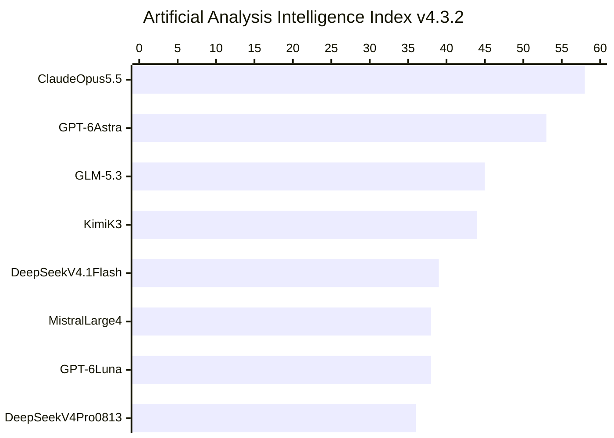

<!-- _class: summary -->

# 🗞️ GenAI Catch-up Report 2026-10-10

4 topics from 2026-10-08 to 10-10 (selected from 56 candidates). Details: <a href="../research/2026-10-10.md">research note</a>.

<article class="card">
<h3>1️⃣ 📦 MXC is GA on Windows 11, with SDK 1.0 for three OSes</h3>

One deny-by-default policy runs on ProcessContainer, Bubblewrap or Seatbelt, and Copilot's local sandboxing, now GA, is built on it. Network rules differ by OS, and Codex, Unsloth and OpenClaw pin pre-1.0 builds.

Impact highPotential highAttention highReleaseSecurity and safetyCoding agents

</article>
<article class="card">
<h3>2️⃣ 🐘 Mistral Large 4: a 1T MoE in API preview, weights due in October</h3>

1.05T total and 52B active parameters at $1.36/$4.18 per million tokens, 50% off for two weeks. Artificial Analysis scores it 38, level with GPT-6 Luna and first on CyberGym-E2E-AA; the licence is unpublished.

Impact midPotential midAttention highReleaseModels

</article>
<article class="card">
<h3>3️⃣ 📜 Anthropic's 2026 Usage Policy takes effect on November 12</h3>

High-risk rules reach beyond consumer-facing uses to 11 areas, with review by a qualified person and disclosure to the person affected. New clauses cover hardware that acts on model output, subscription proxying and abuse of Claude.

Impact midPotential midAttention highChangeSecurity and safetyAPI and cloud

</article>
<article class="card">
<h3>4️⃣ 🌸 Sakura AI Engine Private Edition: your model on dedicated GPUs</h3>

In-house, fine-tuned or open-weight models served from Japanese data centres at a flat monthly fee per GPU. The price, the GPU model and the API format are not published.

Impact midPotential midAttention highReleaseAPI and cloud

</article>

---

<!-- _class: topic -->

# 1️⃣ 📦 MXC is GA on Windows 11, with SDK 1.0 for three OSes

Microsoft declared MXC generally available on 10-07, the day SDK v1.0.0 shipped and GitHub made Copilot's MXC-based local sandboxing GA.

## Key points

- GA on 10-07 on Windows 11, by Windows Update and rolling out (PC Watch: from October 15), and for agents on Windows 365.
- SDK 1.0: `mxc-sdk` for Rust, `Microsoft.Mxc.Sdk` for .NET and `@microsoft/mxc-sdk` for Node 24+, with a V1 API stable for 1.x.
- One policy for paths, egress, ingress and UI, deny by default; a backend rejects rules it cannot enforce before launch.
- Copilot's sandboxing (GA, off by default) runs shell commands and local MCP servers in MXC, not its built-in file tools.
- Named adopters include Copilot, Codex, OpenClaw and Unsloth; Codex pins an 08-31 revision, Unsloth 0.8.0, OpenClaw 0.9.0.

## Perspectives and debates

- Microsoft frames MXC as the containment layer of Windows for agents, with Intune, Entra and Agent 365 controls to come.
- eSecurityPlanet: listed support is not full containment and won't stop leaks to approved hosts; HN: the kernel is shared.
- A day before 1.0 the README dropped "no MXC profiles should be treated as security boundaries"; GitHub's docs: not a VM.

## Technical details

- Process isolation needs build 26100.9278 or 26200.9278, then runs BaseContainer, or AppContainer that may edit host DACLs.
- No backend takes hostname rules; those need a proxy run by the caller, the route Copilot's host rules take.
- Issue #1455 (untriaged) reports that with PowerShell 7 on `PATH` the V1 tools helper grants reads on all of `C:\`, `.ssh` too.

Sources: <a href="https://blogs.windows.com/windowsdeveloper/2026/10/07/microsoft-execution-containers-policy-driven-containment-for-ai-agents/">Microsoft</a> · <a href="https://github.com/microsoft/mxc">microsoft/mxc</a> · <a href="https://docs.github.com/copilot/concepts/security-governance-and-network-settings/about-cloud-and-local-sandboxes">GitHub Docs</a> · <a href="https://news.ycombinator.com/item?id=50016489">Hacker News</a>

---

<!-- _class: topic -->

# 2️⃣ 🐘 Mistral Large 4: a 1T MoE in API preview, weights due in October

Opened on 10-06 as a public API preview served from Mistral's own European data centres; the announcement drew 2,036 points on Hacker News.

## Key points

- 1.05T total and 52B active parameters (49B in every launch-day source), a 1.6B vision encoder, image and text in, text out.
- Trained from scratch on 3,800 Grace Blackwell GPUs in Mistral's own data centres; its RL run continues through the preview.
- $1.36 in, $0.14 cached and $4.18 out per million tokens (GLM 5.3 on Mistral: $1.4/$4.4), 50% off for two weeks.
- Vendor-reported: DeepSWE v1.1 61.7%, Terminal-Bench 4 28.3%, SWE-Atlas-QnA 59.4%, Cybench 93% of 40 challenges.
- AA: first on CyberGym-E2E-AA at 81.7%, Cyber Index 50; Vals: 33rd of 45 on its index, 6th of 76 on Harvey's legal test.

## Perspectives and debates

- Mistral: refusals hinder defenders; red-team partners and states get "reduced moderation and expanded cyber capabilities".
- AA: the most intelligent model from outside the US and China; Simon Willison: "maybe about 6 months behind the frontier".
- XenoSpectrum: DeepSWE rivals ran on different harnesses; AA scores refusals as zero, so CyberGym partly measures refusals.

## Technical details

- `mistral-large-4` (changelog), `mistral-large-4-0` (card, reasoning docs); `reasoning_effort` is `"none"` or `"high"`.
- Context: 1M on the card and OpenRouter, 512k at AA and Vals; structured outputs, function calling, batching.
- Weights due by end of October (October 27 per TNW and VentureBeat); VentureBeat expects a custom Mistral licence.

Sources: <a href="https://mistral.ai/news/mistral-large-4/">Mistral</a> · <a href="https://docs.mistral.ai/models/mistral-large-4-0">Mistral Docs</a> · <a href="https://artificialanalysis.ai/articles/mistral-large-4-france-ai">Artificial Analysis</a> · <a href="https://venturebeat.com/technology/mistral-debuts-large-4-le-chonk-a-1-trillion-parameter-text-output-model-with-high-benchmarks-planned-for-open-weights-release">VentureBeat</a>

---

<!-- _class: topic -->

# 3️⃣ 📜 Anthropic's 2026 Usage Policy takes effect on November 12

Published on 10-08 as the yearly refresh of the text in force since September 15, 2025, for the apps, the API, cloud providers and resellers alike.

## Key points

- High-risk rules drop the consumer-facing limit and cover 11 areas, such as medical, credit, employment and immigration.
- A qualified person must review a recommendation with power to change it, and the person affected is told AI was used.
- Model-driven hardware needs a qualified individual able to stop it, a safe state if disconnected and independent limits.
- New bans: proxying via consumer subscriptions, seeding AI answer sources with disguised content, sustained abuse of models.
- Supported Regions (same 185 countries) bars use from inside an unsupported region and by firms based or controlled in one.

## Perspectives and debates

- Anthropic calls most changes clarifications, and its post omits several clauses, the subscription-routing ban among them.
- The Register: "Claude is software, not a person"; Hatena commenters read the abuse ban as keeping abuse out of training.
- Open: whether B2B screening now qualifies, how the abuse clause applies on the API, and whether the operator must be human.

## Technical details

- Exempt: general info, wellness, drafting, fixed-rule execution; wholly favorable decisions skip review where law allows.
- Hardware covered: moving in shared space, force that can injure, hazards, the body, safety systems, industrial processes.
- Chatbots disclose AI at session start or in the interface; builders answer for what their agents do via tools and browsers.
- API: a safeguard block returns `stop_reason: "refusal"` with `stop_details.category`, and by itself is not a violation.
- The abuse clause spares frustration, dark themes and model testing; ending chats stays "the primary enforcement mechanism".
- Cyber: research and testing on systems you own or may test, or within a bug bounty scope, is stated as not prohibited.

Sources: <a href="https://www.anthropic.com/news/2026-usage-policy-update">Anthropic</a> · <a href="https://www.anthropic.com/legal/aup">Usage Policy</a> · <a href="https://www.theverge.com/ai-artificial-intelligence/1008100/anthropic-new-usage-policy-abuse-claude">The Verge</a> · <a href="https://www.theregister.com/ai-and-ml/2026/10/09/anthropic-asks-users-to-stop-being-mean-to-claude/5302218">The Register</a>

---

<!-- _class: topic -->

# 4️⃣ 🌸 Sakura AI Engine Private Edition: your model on dedicated GPUs

Launched on 10-08 by Sakura Internet; Publickey's report of 10-09 drew 178 Hatena Bookmark users and 39 comments.

## Key points

- Sakura hosts a customer's in-house, fine-tuned or open-weight model (Kimi and Gemma named) on its own GPUs behind an API.
- It reuses the shared Sakura AI Engine's base and operations design: Sakura builds, monitors and repairs the platform.
- Billing is a flat monthly fee per GPU that does not move with tokens, quoted per configuration through an inquiry form.
- Domestic data centres, closed-network connection and zero data retention: inputs and outputs are not stored or trained on.
- Pitched uses: internal-only AI, offering one's own model through an API, predictable cost, and pinning a model version.

## Perspectives and debates

- Sakura: enterprise AI is moving from PoC to production, and high-security fields such as finance want data kept in Japan.
- Hatena: a quote-only price is hard to budget; a dedicated GPU beats cheap APIs only if busy or if data must stay in Japan.
- Five outlets restate the release, none with a test; three Hatena users doubt Sakura after its August rental-server breach.

## Technical details

- Not published: GPU model, GPUs per unit, minimum term, initial fee, SLA, data-centre location, closed-network method.
- The private pages promise an API without naming its format; complex API specifications are by consultation.
- Shared API: OpenAI-style Chat Completions and Responses, and Anthropic-style Messages for `preview/Kimi-K2.6` only.
- Shared prices: gpt-oss-120b at ¥15 in and ¥75 out per million tokens, with 3,000 free chat requests a month.
- The shared sample response carries vLLM-specific fields such as `kv_transfer_params`, a hint of vLLM; Sakura names no engine.
- The shared catalogue retired Qwen3-Coder on 07-21 and retires `plamo-2.0-31b` on 10-12; pinned-version support is unstated.

Sources: <a href="https://www.sakura.ad.jp/corporate/information/newsreleases/2026/10/08/1968225874/">Sakura Internet</a> · <a href="https://ai.sakura.ad.jp/sakura-ai/ai-engine-private/">Private Edition page</a> · <a href="https://ai.sakura.ad.jp/sakura-ai/ai-engine/">Sakura AI Engine</a> · <a href="https://b.hatena.ne.jp/entry/s/www.publickey1.jp/blog/26/gpuai_engine.html">Hatena Bookmark</a>

