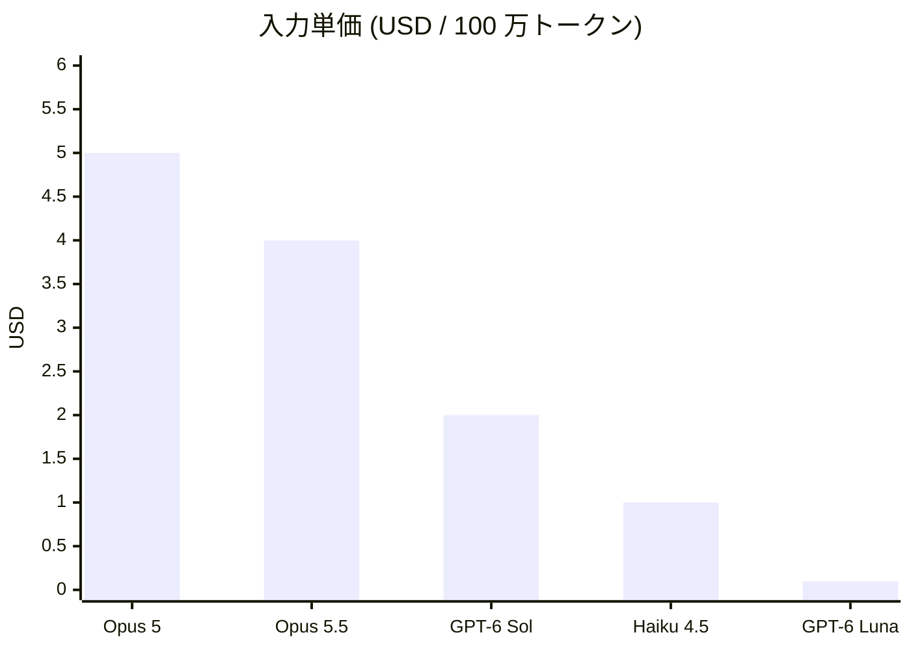
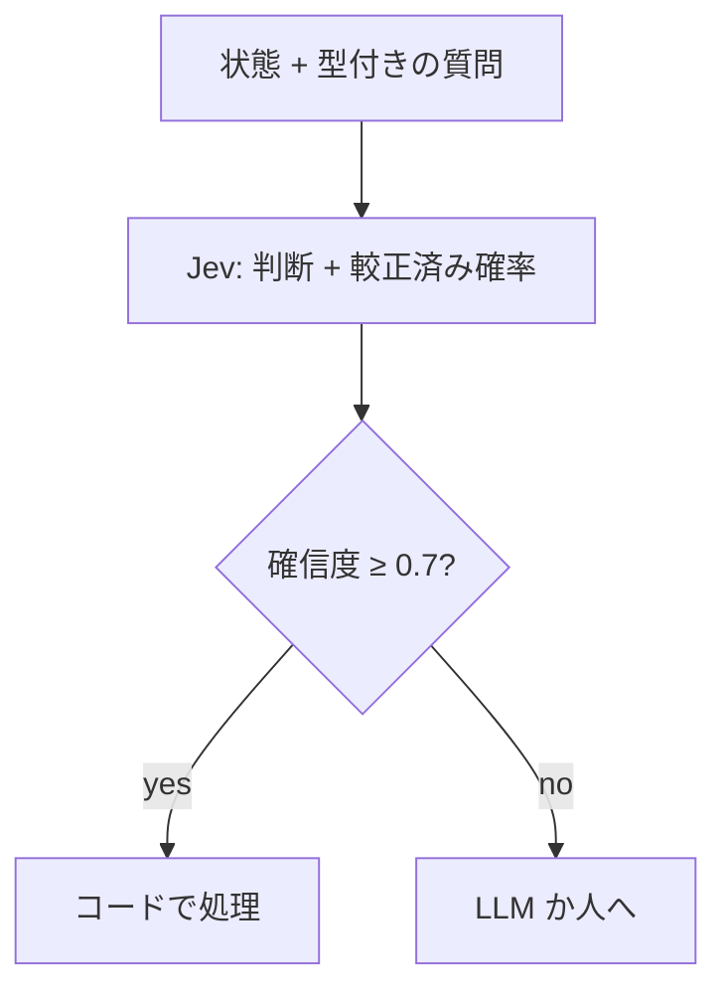
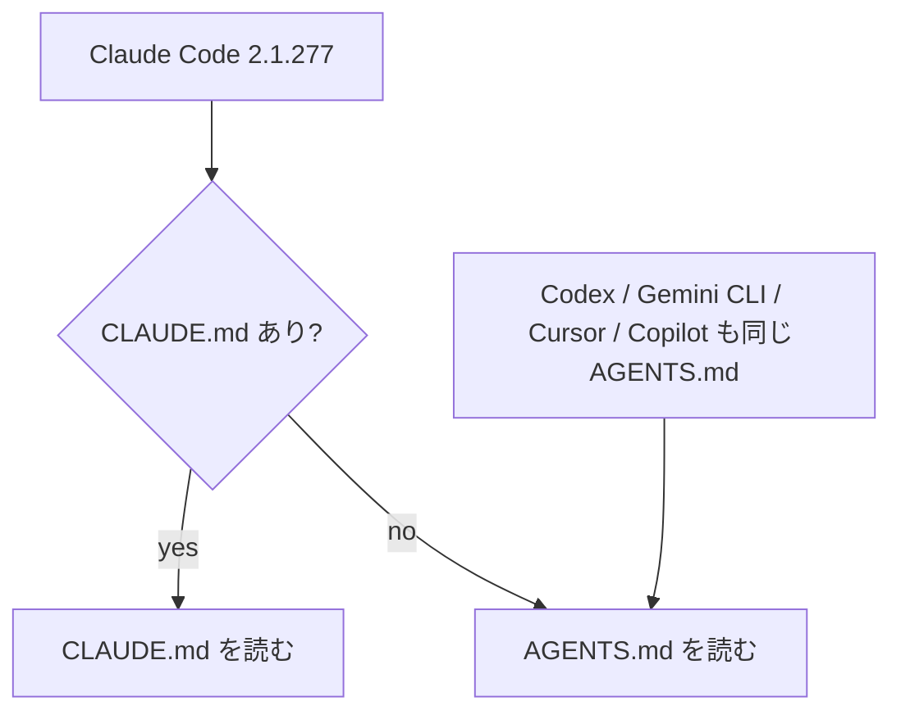
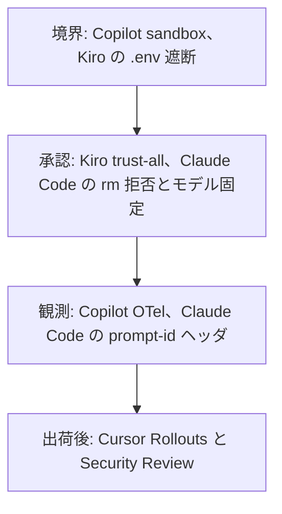
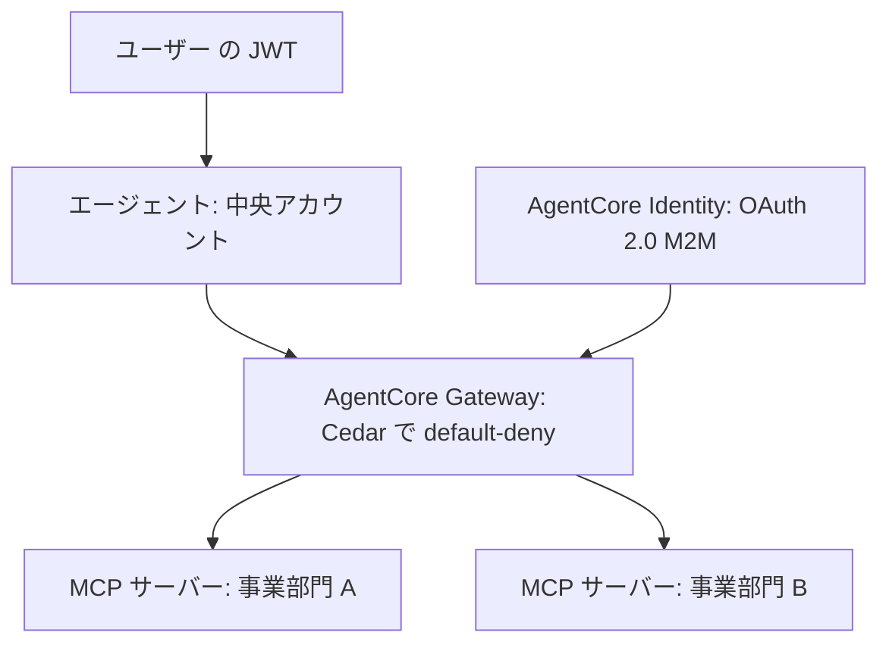

<!-- _class: summary -->

# 🗞️ GenAI Catch-up Report 2026-09-27

2026-09-12 〜 09-27 (初回の 2 週間) の 5 テーマ (候補 221 件から選定)。詳細は <a href="../research/2026-09-27.md">調査ノート</a>。

<article class="card">
<h3>1️⃣ 🚀 Opus 5.5 と GPT-6 Sol/Luna が同日リリース、単価の値下げ競争へ</h3>

Opus 5.5 は $4/$20 で Opus 5 比 20% 減、Sol/Luna は 50% 減。反応は「能力の驚きは Anthropic、価格は OpenAI」。

影響 高将来性 高両トラック

</article>
<article class="card">
<h3>2️⃣ 🎯 Jev: 文章を生成せず「型付きの確率的な判断」を返す決定モデル</h3>

TypeSafe が 09-15 に公開。70〜500 ms、入力 $0.042/M。Vercel と LangChain が統合、2 日で 6 つのクローン、登録は停止中。

影響 高将来性 高生成AIエンジニアリング

</article>
<article class="card">
<h3>3️⃣ 📄 Claude Code が AGENTS.md に対応、指示ファイルの標準化と保守が進む</h3>

CLAUDE.md がなければ AGENTS.md を読む (2.1.277)。HN 740 pt。テレメトリ依存の不具合 (2.1.281 で修正) と /doctor prompt-audit も。

影響 高将来性 高コーディングAI

</article>
<article class="card">
<h3>4️⃣ 🛡️ Copilot・Kiro・Claude Code・Cursor が無人実行の統制機能を一斉に出した</h3>

サンドボックス、OTel、.env の遮断、危険な rm の拒否、モデル固定、デプロイ監視。境界と観測を設定に外出し。

影響 高将来性 高コーディングAI

</article>
<article class="card">
<h3>5️⃣ 🏗️ Azure・Google・AWS が常時稼働エージェントの統制基盤を出した</h3>

Foundry の Routines GA と egress 制御、Google の異常検知、AgentCore の多アカウント構成と新ランタイム (東京あり)。

影響 高将来性 高生成AIエンジニアリング

</article>

---

<!-- _class: topic -->

# 1️⃣ 🚀 Opus 5.5 と GPT-6 Sol/Luna が同日リリース、単価の値下げ競争へ

2026-09-22、Anthropic の約 1 時間後に OpenAI が発表。既定モデル・単価・クラウド 3 社の提供が一度に動いた。

## 要点

- Opus 5.5: $4 / $20、キャッシュ読み取り $0.20 (Opus 5 は $5 / $25 / $0.50)、1M コンテキスト、最大出力 128k。
- 公称: Opus 5 比でコスト 40% 減・30% 高速、Terminal-Bench 4.0 は 66.4% (52.3%)、OSWorld 2.0 は 81.8%。
- GPT-6 Sol は $2 / $10、Luna は $0.10 / $0.50 で、GPT-5.6 のプロモーション価格から 50% 減。
- Claude Code 2.1.280 が Opus 5.5 を既定に、Pro / Team Standard の既定も Sonnet → Opus。
- Bedrock (JP プロファイルあり)、Google Cloud の Model Garden、Codex / ChatGPT Work でも同日提供。

## 見方と論点

- OpenAI: AutomationBench で Sol (xhigh) が Opus 5 (max) を 11 分の 1 のコストで上回る。
- Simon Willison / AINews: Luna は Haiku 4.5 の 10 分の 1、Opus 5.5 の max は考えすぎて壊れる、「40% 安い」は既定 effort の話。
- Addy Osmani / uhyo: コストはターン数で決まる、常用は high でよく max は上積みのオプション。

## 技術要素

- ID: `claude-opus-5-5`、`gpt-6-sol`、`gpt-6-luna`、Bedrock は `global.anthropic.claude-opus-5-5`。
- Opus 5.5 は adaptive thinking 常時オン、Fast mode は $8 / $40、実行前に分類器が行動を検査。
- OpenAI は effort やツール構成を変えてもキャッシュを維持し、明示的 breakpoint と診断ダッシュボードを追加。

出典: <a href="https://www.anthropic.com/news/claude-opus-5-5">Anthropic</a> · <a href="https://openai.com/index/introducing-gpt-6-sol-and-luna">OpenAI</a> · <a href="https://simonwillison.net/2026/Sep/22/opus-and-sol-and-luna/">Simon Willison</a> · <a href="https://claude.dev/blog/what-a-task-costs-on-opus-5-5/">Addy Osmani</a>

---

<!-- _class: topic -->

# 2️⃣ 🎯 Jev: 文章を生成せず「型付きの確率的な判断」を返す決定モデル

TypeSafe AI が 09-15 に公開。2 週間で Vercel・LangChain が統合し、クローンが 6 つ出て、国内の実務検証も始まった。

## 要点

- 状態を入力に、Choice / Score / Noul (はい・いいえ) の判断と較正済み確率を並列サンプリングで返す。
- 学習は RLCD (較正された判断のための強化学習) で、「確信度が高いほど精度も高い」較正を目指す。
- 公称: 応答 70〜500 ms、LLM 比 40〜200 倍、入力 $0.042 / M で出力無料 (GPT-5.6 Terra の約 1/48)。
- Vercel AI Gateway (09-16、`typesafe-ai/jev`) と `langchain-typesafe` (09-17) が対応、09-22 までに新規登録を停止。
- AINews: 公開 2 日でクローンが 6 つ (Laya、OpenJev、Kev-0.5B など)、動画は 2 日で 3,600 万回視聴。

## 見方と論点

- LangChain: 「開放的な推論と生成は LLM、途中の構造化された判断は Jev」、確信度 0.7 未満は LLM へ。
- Flavio Copes: 見出しの倍率は「上限」として読む、型エラー 0% は「答えの形」の保証で正しさの保証ではない。
- 国内 (イエソド): 8 件で $0.0004、パース失敗なし、日本語の精度は英語に劣り、確信度 49% の扱いは事前設計が要る。

## 技術要素

- API: `POST /v1/systemone` (TypeSafe)、Vercel は AI SDK 7 の `experimental_evaluate` と `/v1/evaluate`。
- SDK: `TypeSafeClassifier` (LangChain)、`llm-typesafe` (Simon Willison の CLI プラグイン)。
- 向かない: 数値・日付演算、生成・要約、画像・音声、判断理由の説明。

出典: <a href="https://typesafe.ai/blog/introducing-system-one-models-and-jev">TypeSafe AI</a> · <a href="https://www.langchain.com/blog/building-prod-with-jev-and-langgraph">LangChain</a> · <a href="https://simonwillison.net/2026/Sep/21/jev/">Simon Willison</a> · <a href="https://zenn.dev/yesodco/articles/yesod-jev-typesafe-inquiry-triage">イエソド</a>

---

<!-- _class: topic -->

# 3️⃣ 📄 Claude Code が AGENTS.md に対応、指示ファイルの標準化と保守が進む

2.1.277 (09-18) で「CLAUDE.md がなければ AGENTS.md を読む」。HN で 740 pt、テレメトリ依存の不具合報告が 484 pt。

## 要点

- CLAUDE.md のないプロジェクトで AGENTS.md を読み、`/config` の「Project instructions」で変更できる。
- AGENTS.md は Codex・Gemini CLI・Devin・Cursor・Copilot が対応済みで、Claude Code は最後発。
- 2.1.281 (09-23) で Bedrock / Vertex / Foundry と LLM ゲートウェイにも対応、`.agents/skills` は未対応のまま。
- テレメトリ無効 (`DISABLE_TELEMETRY=1` など) だと読まれない不具合: 読み込みがリモートの機能フラグに依存していた (2.1.281 で修正)。
- 2.1.283 (09-25) の `/doctor prompt-audit` が、古いモデル向けの指示や実物とのずれを検出する。

## 見方と論点

- HN: CLAUDE.md 優先の規則より完全な同等を求める声、`ln -s AGENTS.md CLAUDE.md` は以前から、囲い込みへの批判。
- AAIF (Linux Foundation) が MCP・AGENTS.md・A2A を管理し、Agent Router 1.1 が API と MCP を統合 (Publickey)。
- クラスメソッド / Zenn: prompt-audit で「書いてあることと実物のずれ」が多数出る、消す前に挙動を比べる。

## 技術要素

- 2.1.277: AGENTS.md 対応、`CLAUDE_GATEWAY_PROXY_IS_EGRESS_BOUNDARY=1`。
- 不具合の原因: `agents-md` の読み込みが機能フラグ `tengu_agents_md_mod` (既定 false) に依存 (issue #95690)。
- 2.1.283: `/doctor prompt-audit` (`/checkup prompt-audit`)、`availableModelsMatch`、`deniedModels`。

出典: <a href="https://code.claude.com/docs/en/changelog#2-1-277">Claude Code changelog</a> · <a href="https://blog.szypowi.cz/p/claude-code-reads-agents.md-only-when-telemetry-is-on/">szypowi.cz</a> · <a href="https://www.publickey1.jp/blog/26/claude_codeagentsmdclaudemd.html">Publickey</a> · <a href="https://dev.classmethod.jp/articles/20260924-cc-updates-v2-1-283/">クラスメソッド</a>

---

<!-- _class: topic -->

# 4️⃣ 🛡️ Copilot・Kiro・Claude Code・Cursor が無人実行の統制機能を一斉に出した

09-19 〜 09-25 に、独立した 4 社が「人が見ていない状態で動く」前提の機能を、境界・承認・観測・出荷後の 4 層で揃えた。

## 要点

- Copilot アプリ: ローカルサンドボックス (ファイル・ネットワーク・資格情報、preview) と OTel トレース。
- Kiro CLI 2.24: `/tools trust-all` の一括承認、`.env` を MCP・ツールへ自動で渡さない。
- Claude Code 2.1.278〜283: auto モードはサーバー側の分類器が既定、危険な `rm` は 2 分待って拒否、モデル固定の管理設定。
- Cursor: Rollouts (デプロイ監視と revert PR 提案) と Security Review (全 PR の脆弱性報告)。

## 見方と論点

- 境界と観測を、コードではなく設定に外出しする方向で 4 社が揃った。
- Thoughtworks Radar Vol.34 (4 月) のテーマ「Putting coding agents on a leash」への製品側の回答。
- クラスメソッド: hooks・permissions・サンドボックスの多層防御、動的なシェル変数展開は静的検知の限界。

## 技術要素

- Copilot: 「Sandbox」設定、`/sandbox on`、`managed-settings.json` の `telemetry` で送信先を指定。
- Claude Code: `availableModelsMatch`、`deniedModels`、`CLAUDE_CODE_AUTO_MODE_SERVER`、gateway の `assume_role` と `guardrail`。
- Cursor は自動マージも自動ロールバックもせず、Teams / Enterprise 向け。

出典: <a href="https://github.blog/changelog/2026-09-23-local-sandboxing-in-the-github-copilot-app">GitHub</a> · <a href="https://kiro.dev/changelog/cli/2-24">Kiro</a> · <a href="https://code.claude.com/docs/en/changelog#2-1-283">Claude Code</a> · <a href="https://cursor.com/changelog/rollouts-and-security-reviewer">Cursor</a>

---

<!-- _class: topic -->

# 5️⃣ 🏗️ Azure・Google・AWS が常時稼働エージェントの統制基盤を出した

エージェントを「チャットの相手」ではなく「常時稼働する実行主体」として扱う機能が、3 社から別の層で出た。

## 要点

- Foundry Routines GA (09-24): タイマー・CRON・イベント (GitHub issue、Teams) でエージェントを実行、監査証跡つき。
- Foundry egress 制御 (09-24、preview): FQDN の許可ルールを Audit / Enforced で適用、既定は Deny。
- Google (09-15〜16): Model Armor・Semantic Governance Policies・Agent Anomaly Detection (OTel トレースを経路外で解析)。
- AWS (09-24): 中央アカウントの AgentCore Gateway が事業部門アカウントの MCP サーバーを束ね、Cedar で default-deny。
- 新 AgentCore Runtime (09-18): microVM、実使用量課金、コールドスタート P75 1.9〜2.0 秒、東京リージョンあり。

## 見方と論点

- Foundry: 「第一世代のエージェントは人のメッセージを待っていた」からの移行を明示。
- 出口ルールはコードの外、ツールアクセスは gateway で default-deny、異常検知はトレースから。
- 3 社をまとめた独立分析は期間内に見つからず (未確認)。

## 技術要素

- Foundry: `azure-ai-projects`、egress ポリシーは ARM の JSON (`mode`、`defaultAction: Deny`)、`RaiConfig` で添付。
- Google: ADK 1.2+、Security Command Center、平文で書く業務ルール、閉ループの是正。
- AWS: Runtime / Gateway / Identity、Strands、Okta OIDC、`platformVersion: V2`。

出典: <a href="https://devblogs.microsoft.com/foundry/from-chatbots-to-automated-assistants-routines-in-microsoft-foundry-are-now-generally-available/">Foundry</a> · <a href="https://developers.googleblog.com/build-zero-trust-ai-agents-that-judge-intent-not-just-syntax/">Google</a> · <a href="https://aws.amazon.com/blogs/machine-learning/build-a-multi-account-ai-agent-with-agentcore-gateway-and-mcp/">AWS</a> · <a href="https://aws.amazon.com/about-aws/whats-new/2026/09/new-agentcore-runtime-generally-available">AgentCore Runtime</a>

