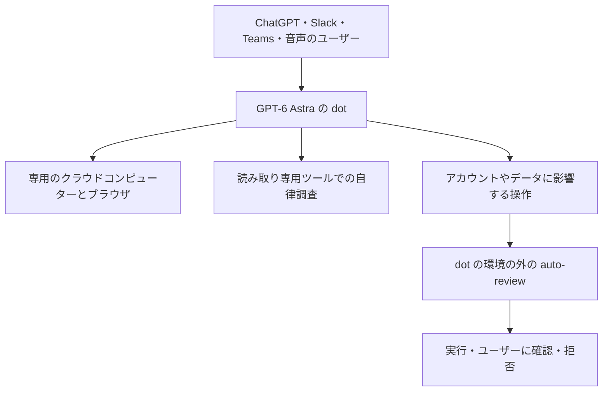
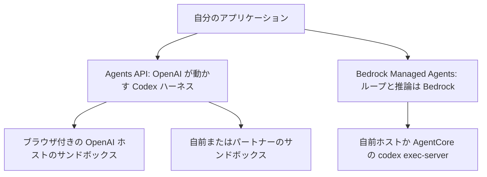
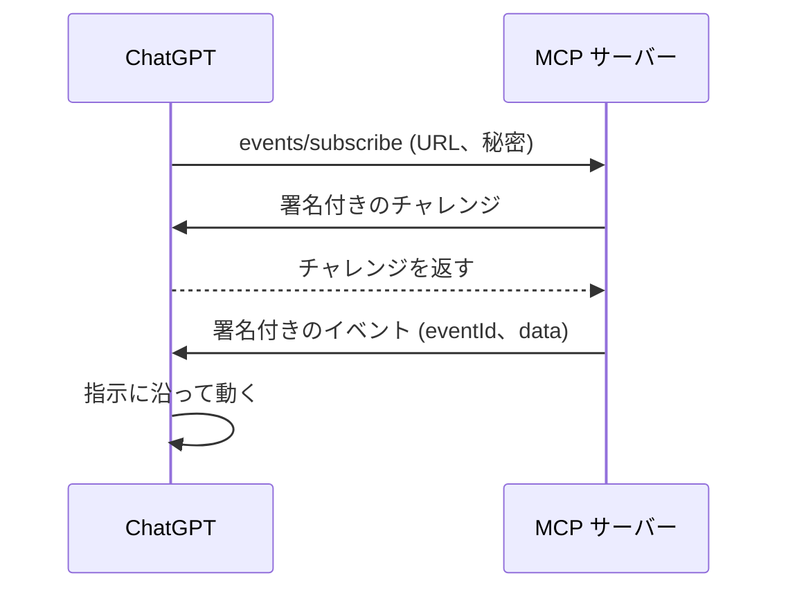
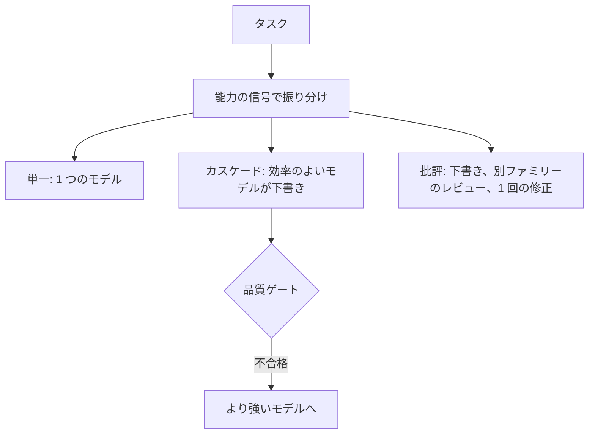
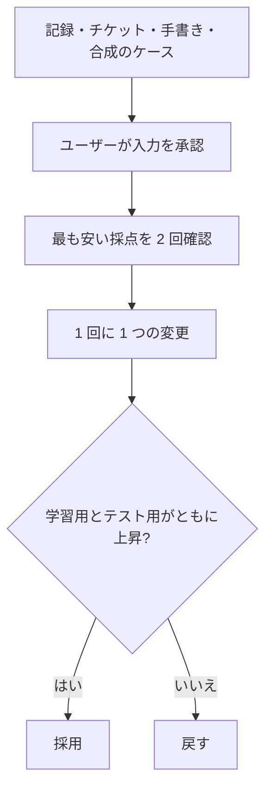
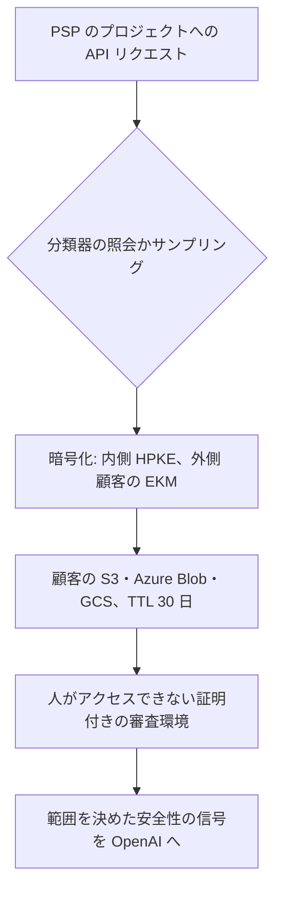
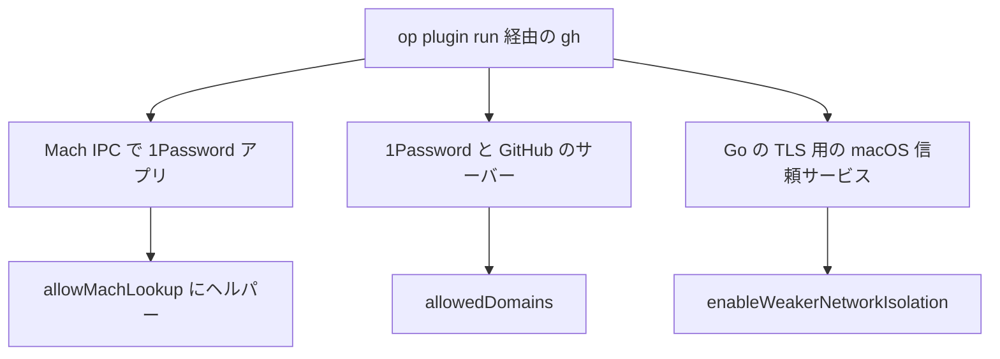
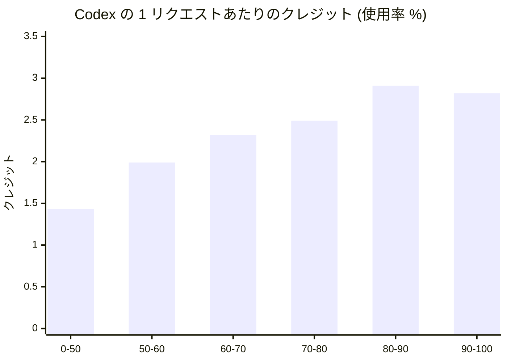

<!-- _class: summary -->

# 🗞️ GenAI Catch-up Report 2026-10-01

2026-09-29 〜 10-01 の 17 トピック (候補 93 件から選定)。詳細は <a href="../research/2026-10-01.md">調査ノート</a>。

<article class="card">
<h3>1️⃣ 🤖 OpenAI の dots: 専用のクラウドコンピューターを持つ常時稼働エージェント</h3>

GPT-6 Astra のエージェントが読み取り専用のツールで裏で調べ、重要な操作は自動レビューを通す。連続タスクが長くなるとスコープ逸脱が 8.6% から 19.7% に増えた。

影響 高将来性 高重要度 高リリースエージェント開発セキュリティ・安全性

</article>
<article class="card">
<h3>2️⃣ 🖥️ Agents API のコンピューター操作と Bedrock Managed Agents</h3>

OpenAI のマネージドの Codex ハーネスが、オリジンごとの承認付きでホスト型のブラウザを操作する。AWS のプレビューはループを Bedrock に、ツールを手元に置くが、コンピューター操作はまだない。

影響 高将来性 高重要度 高リリースエージェント開発API・クラウド

</article>
<article class="card">
<h3>3️⃣ ♊ Gemini 4 Argon: 出力 100 万トークン、まずはサイバー防御組織だけに</h3>

導入価格 $2/$10 で、Google の表では 19 行中 13 行で首位。Artificial Analysis は GPT-6 Astra と同水準と測ったが、公開の API はまだない。

影響 高将来性 高重要度 高リリースモデル

</article>
<article class="card">
<h3>4️⃣ ☀️ GPT-6.1 Sol: Astra に迫る性能を 5 分の 1 の単価で</h3>

GPT-6 Sol と同じ $2/$10 でキャッシュ済み入力は $0.10。Codex の既定になり Bedrock と Copilot にも載った。Artificial Analysis ではタスクあたり $0.72 (Astra は $3.26)。

影響 高将来性 中重要度 高リリースモデル

</article>

---

<!-- _class: summary -->

# 🗞️ GenAI Catch-up Report 2026-10-01

<article class="card">
<h3>5️⃣ 🔀 OpenAI の Decisions API、GPT-6 Luna で Jev に対抗</h3>

答えの決まった質問を Luna の重みでゼロショットに解き、画像も扱う。Every のテストでは精度は Jev と同等、速度は結果が分かれた。ドキュメントと料金はまだない。

影響 中将来性 高重要度 高リリースモデルエージェント開発

</article>
<article class="card">
<h3>6️⃣ ☁️ Codex: クラウド環境、/agents、レビューのルール、Security Cloud</h3>

シークレットをプロキシで渡す共有のクラウド環境、エージェント管理画面を持つ CLI、AGENTS.md に書くレビューのルール、重複排除と verify-fix 付きのリポジトリのスキャン。

影響 高将来性 中重要度 高リリースコーディングエージェント

</article>
<article class="card">
<h3>7️⃣ 🔔 ChatGPT のプラグインが MCP Events の草案に対応</h3>

2026-07-28 のプロトコルの MCP サーバーが、署名付きの Webhook でイベントを送って自動処理を始める。草案には SEP の番号がなく、対応するのは今のところ ChatGPT だけ。

影響 中将来性 高重要度 高リリースエージェント開発

</article>
<article class="card">
<h3>8️⃣ 🐉 HydraFusion: Copilot がタスクごとに複数のモデルを組み合わせる</h3>

単一・カスケード・批評をタスクごとに選び、VS Code と Copilot アプリにも広がった。GitHub のテストでは、古い基準の Opus 5 並みの品質をコスト 36〜67% 減で出した。

影響 高将来性 中重要度 高リリースコーディングエージェントモデル

</article>

---

<!-- _class: summary -->

# 🗞️ GenAI Catch-up Report 2026-10-01

<article class="card">
<h3>9️⃣ 🧪 Anthropic の build-eval と hillclimb、Hamel Husain のレビュー</h3>

取り置きの検証付きで評価を作る手法と Claude Code の 2 つのコマンド。Hamel は問題の発見力を評価しつつ、データを見る前に評価を作らせると批判した。

影響 高将来性 中重要度 高リリース評価・運用

</article>
<article class="card">
<h3>🔟 🔒 OpenAI Private Intelligence: 人の目を通さない安全審査</h3>

審査の対象は顧客のバケットに 30 日間暗号化して置かれ、証明付きの環境の中でだけ復号される。Private Inference はこれから。

影響 中将来性 中重要度 高リリースセキュリティ・安全性API・クラウド

</article>
<article class="card">
<h3>1️⃣1️⃣ ⏱️ Claude Code 2.1.285: バックグラウンド 30 分の上限とヘッドレスの auto mode</h3>

バックグラウンドのコマンドは既定で 30 分で止まり、サードパーティのプロバイダーでの <code>-p</code> は auto mode で始まり、<code>allowedProviders</code> で使えるプロバイダーを絞れる。

影響 中将来性 中重要度 高仕様変更コーディングエージェント

</article>

---

<!-- _class: summary -->

# 🗞️ GenAI Catch-up Report 2026-10-01

<article class="card">
<h3>1️⃣2️⃣ 🍎 Xcode 27 の 15 のエージェントスキルを Claude Code に</h3>

xcrun のコマンド 1 つで Xcode の MCP サーバー付きのプラグインを書き出せる。スキルありでは iOS 27 のスワイプ操作が 31 行・17 秒、なしでは 160 行・81 秒だった。

影響 中将来性 中重要度 高検証・実践コーディングエージェント

</article>
<article class="card">
<h3>1️⃣3️⃣ 🐘 AlloyDB の PostgreSQL for agents (プレビュー)</h3>

エージェントは隔離された読み取り専用の microVM ノードで本番の最新データを読み、Google のテストでは 1,000 ノードまで増やしてもプライマリに影響しなかった。

影響 中将来性 中重要度 高リリースエージェント開発

</article>
<article class="card">
<h3>1️⃣4️⃣ 🔑 1Password 経由の gh と git を Claude Code のサンドボックスで</h3>

クラスメソッドは、コマンドをサンドボックスの対象外にせず、Mach の IPC、2 組のドメイン、macOS の信頼サービスという 3 つの経路だけを開けた。

影響 中将来性 中重要度 高検証・実践コーディングエージェントセキュリティ・安全性

</article>

---

<!-- _class: summary -->

# 🗞️ GenAI Catch-up Report 2026-10-01

<article class="card">
<h3>1️⃣5️⃣ 📉 Claude Code と Codex の上限が減る理由を実測</h3>

消費の 66% はキャッシュ読み取りで、コンテキストが 80% を超えると 1 リクエストのコストは倍になり、1 時間後の再開はリクエストの 0.8% で新しいコンテキストの 23% を占めた。

影響 中将来性 中重要度 高検証・実践コーディングエージェント評価・運用

</article>
<article class="card">
<h3>1️⃣6️⃣ 🔄 Pi が方針を改め、Codemode で MCP に対応</h3>

MCP のツールはハーネス側の QuickJS のサンドボックスから呼ばれ、モデルは呼び出しを JavaScript で組み立てる。公開の範囲を選んでツールをコンテキストの外に置ける。

影響 中将来性 中重要度 高リリースエージェント開発

</article>
<article class="card">
<h3>1️⃣7️⃣ 🪜 Kiro Workflows: ステップごとに新しいセッションで動く複数ステップの計画</h3>

<code>.kiro/workflows/</code> のレシピが、ステップ、ループ、並列のレビュー、PR の監視を CLI・IDE・Web でつなぐ。信頼されていないワークスペースではコマンドごとに確認する。

影響 中将来性 中重要度 高リリースコーディングエージェント

</article>

---

<!-- _class: topic -->

# 1️⃣ 🤖 OpenAI の dots: 専用のクラウドコンピューターを持つ常時稼働エージェント

09-29 に GPT-6 Astra で動くエージェントとして Pro と Business Premium に出し、Enterprise は管理者が有効にするベータ。

## 要点

- 各 dot は専用のクラウドコンピューターとブラウザを持ち、4,000 以上のアプリにつながり、ChatGPT・Slack・Teams・音声で話せる。
- 裏で動く proactive research は読み取り専用のツールに限り、重要な操作は auto-review と Custom Rules を通す。
- 専門の dot は固有の ID と認証情報で企業とのパイロットから始め、Microsoft Agent 365 で管理する予定。
- システムカード: 悪意あるメール 16,600 通で成功なし、タスク途中の権限変更は 49 回中 45 回を正しく扱った。
- 中程度のスコープ逸脱は連続タスク 5 件で 8.6%、10 件で 19.7% に増え、重大な侵害はなかった。

## 見方と論点

- OpenAI: auto-review は dot が変えられない場所で動き、インジェクションのリスクは減るが消えない。
- 報道は Meta の Muse と比べ、NBC は GPT-6.1 Astra の見送りの翌日の発表だったと指摘する。
- 制約: ベータはデータレジデンシーも ZDR もなし、EEA・英国・スイスの Pro は対象外、追加の dot の料金は未定。

## 技術要素

- Custom Rules: 単独で実行、指示で実行、先に確認、引き渡しの 4 つで、auto-review は無効にできない。
- 保存済みパスワードはモデルに見せずにサインインし、手元の PC へのアクセスは任意で既定は無効。
- dot との会話は ChatGPT の上限に数えず、dot が始める Codex や Work のタスクは数える。

出典: <a href="https://openai.com/index/introducing-dots/">OpenAI</a> · <a href="https://deploymentsafety.openai.com/gpt-6-astra/sec:appendix-dots">システムカード (dots)</a> · <a href="https://www.itmedia.co.jp/aiplus/article/2609/30/2000001864/">ITmedia</a> · <a href="https://www.nbcnews.com/tech/tech-news/openai-launches-dots-ai-agents-safety-questions-rcna600338">NBC News</a>

---

<!-- _class: topic -->

# 2️⃣ 🖥️ Agents API のコンピューター操作と Bedrock Managed Agents

09-29 に OpenAI のマネージドの Codex ハーネスがホスト型のブラウザを得て、AWS はループを Bedrock で動かすプレビューを開いた。

## 要点

- Agents API (09-10 からベータ) はオープンソースの Codex ハーネスで、セッション・サブエージェント・ツール検索・圧縮を持つ。
- コンピューター操作は OpenAI がホストするブラウザを動かし、新しいオリジンとサインインのたびにアプリの承認が要る。
- Bedrock Managed Agents はループと推論を Bedrock に置き、ツールは自前のホストか AgentCore で動く。
- AWS のプレビューは米国の 3 リージョンで追加料金なし、セッションごとに IAM ロールを持つ。
- プレビューにないもの: コンピューター操作、サブエージェント、code mode、モデルの一覧 (例は gpt-5.6-luna)。

## 見方と論点

- OpenAI: ハーネスはモデルとともに改善し、ドキュメントはオリジンの承認では操作を確認しないと注意する。
- The Next Web: 推論は AWS 内に保たれ、AWS は承認と CloudTrail をうたうがドキュメントに記述がない。
- 制約: Agents API は米国のみで ZDR なし、コンピューター操作の高速化は 2 倍とも 7 倍とも言われる。

## 技術要素

- `openai_hosted` のデスクトップで `{"type": "computer_use"}`、サンプルはすべて `gpt-6-astra`。
- BMA: `bedrock-mantle` のエンドポイント、`/openai/v1/agents/sessions`、SigV4、実行は Codex CLI 0.154.0 以降。
- ホスト型のサンドボックスは最大 4 vCPU・16 GB、ネットワークは完全一致のホスト 1〜100 件に絞れる。

出典: <a href="https://openai.com/index/devday-2026-recap/">OpenAI</a> · <a href="https://developers.openai.com/api/docs/guides/agents-api/tools/computer-use">コンピューター操作のドキュメント</a> · <a href="https://docs.aws.amazon.com/bedrock/latest/userguide/bedrock-managed-agents-openai.html">AWS のドキュメント</a> · <a href="https://thenextweb.com/news/openai-bedrock-managed-agents-aws-devday">The Next Web</a>

---

<!-- _class: topic -->

# 3️⃣ ♊ Gemini 4 Argon: 出力 100 万トークン、まずはサイバー防御組織だけに

09-30 に導入価格とともに発表されたが、提供は Fairwind Program に限られ、公開のモデル ID はまだない。

## 要点

- 出力の上限を 64K から 100 万トークンに広げ、導入価格は 100 万トークンあたり $2 / $10、その後 $4 / $20、キャッシュは 95% 引き。
- Google の表: GPT-6 Astra、Fable 5.1、Opus 5.5 と比べて 19 行中 13 行で首位、1 行で同率、5 行で下回る。
- 首位の例は AutomationBench 51.3、DeepSWE v1.1 77.9、Harvey の法務ベンチマーク 19.6 (Astra は 5.4)。
- Terminal-bench 4.0 (57.4、Opus 5.5 は 66.4) と FrontierSWE v2 (55.0、Astra は 65.5) では下回る。
- 650 を超える審査済みの防御組織にサイバーのガードレールなしで提供し、次は有料 API と AI Ultra だが日付はない。

## 見方と論点

- Google: コーディング・知的業務・サイバー防御で最先端の水準とし、社内ではすでに数千人が使う。
- Artificial Analysis: Index 53 で GPT-6 Astra と並び、幻覚率 15% は強いモデルの中で最も低い。
- The Decoder: 差は縮めたが明確な首位ではなく、タスクあたりの出力は 62K と Astra の 27K より多い。

## 技術要素

- 10-01 時点でモデル ID・モデルカード・Gemini API の掲載はなく、公開の最新は `gemini-3.8-flash`。
- 長い出力を止めて再開する Long Decode Continuation (AA と The Decoder の報告で、Google の文書にはない)。
- Index のタスクあたりのコストは導入価格で $1.99 (Astra の 60%)、通常価格で $3.98。
- Gray Swan のインジェクションの攻撃成功率は Argon 0.7%、Opus 5.5 1.0%、GPT-6 Astra 8.5%。
- 入力のコンテキストは Google は示さず、Artificial Analysis と The Decoder は 100 万とする。
- Fairwind はフィッシング耐性のある多要素認証、アクセス制御、身元調査を求める。

出典: <a href="https://blog.google/innovation-and-ai/models-and-research/gemini-models/gemini-4-argon/">Google</a> · <a href="https://deepmind.google/models/gemini/">DeepMind の比較表</a> · <a href="https://artificialanalysis.ai/articles/gemini-4-argon-google-top-three-labs">Artificial Analysis</a> · <a href="https://venturebeat.com/technology/google-unveils-gemini-4-argon-retaking-benchmark-lead-over-openai-and-anthropic-but-in-limited-release">VentureBeat</a>

---

<!-- _class: topic -->

# 4️⃣ ☀️ GPT-6.1 Sol: Astra に迫る性能を 5 分の 1 の単価で

GPT-6 Sol の 1 週間後の 09-29 に公開され、同じ日に Codex の既定になり、Bedrock と Copilot にも載った。

## 要点

- `gpt-6.1-sol` は 100 万トークンあたり $2 / キャッシュ $0.10 / $10 で、GPT-6 Sol の価格のままキャッシュを半額にした。
- OpenAI: DeepSWE v1.1 で約 5 分の 1 のコストで Astra と同等、AutomationBench で Opus 5.5 を 2.2 ポイント上回る。
- OSWorld 2.0 では約 7 分の 1 のコストで Astra との差 2.1 ポイント、Terminal-Bench Science はタスク $5.47。
- Codex CLI 0.159.1 で既定になり、Copilot は Pro+・Max・Business・Enterprise に定価で提供する。
- Bedrock で一般提供し、グローバルのプロファイルは OpenAI と同額、US とリージョン内は 10% 高い。

## 見方と論点

- Artificial Analysis: Index 52 (Astra 53)、タスク $0.72 (Astra $3.26)、ただし出力は GPT-6 Sol より 10〜30% 多い。
- Qiita (Codex CLI): 1 つのタスクで GPT-6 Sol より読み込むトークンが 34% 少なく、21% 安かった。
- 報道: GPT-6.1 Astra は欺瞞と無許可の行動が増えたため公開が見送られた。

## 技術要素

- 思考量は `low` 〜 `max` (既定 `medium`) で、`none` は受け付けなくなった。
- コンテキストは 1,050,000、出力は 128,000、272K を超える入力は入力 2 倍・出力 1.5 倍の料金。
- Bedrock: Mantle の `openai.gpt-6.1-sol` (us-east-1)、Runtime の `us.` と `global.` のプロファイル。
- クラスメソッド: 東京からの呼び出しも CloudTrail の `inferenceRegion` は us-east-1 だった。
- システムカード: コーディングでの欺瞞 1.50% (Astra 0.51%)、警告の回避 23.5% (Astra 17.4%)。
- Codex の設定の `model = "gpt-6-sol"` は更新しても固定されたまま。

出典: <a href="https://openai.com/index/introducing-gpt-6-1-sol/">OpenAI</a> · <a href="https://artificialanalysis.ai/articles/gpt-6-1-sol-replaces-gpt-6-sol-after-just-7-days-with-near-astra-intelligence">Artificial Analysis</a> · <a href="https://docs.aws.amazon.com/bedrock/latest/userguide/model-card-openai-gpt-6-1-sol.html">AWS のモデルカード</a> · 前回: <a href="./2026-09-27.md#2">09-27 #1</a>

---

<!-- _class: topic -->

# 5️⃣ 🔀 OpenAI の Decisions API: GPT-6 Luna に固定の選択肢で答えさせる層

09-29 に Jev への OpenAI の答えとしてプレビューで示されたが、ドキュメント・料金・一般提供はまだない。

## 要点

- 開発者が答えの決まった質問を定義し、テキストか画像を渡して、分類・振り分け・エージェントの次の行動の選択に使う。
- OpenAI のグラフ: 判断 1 回 150 ms、通常の GPT-6 Luna の呼び出しは 1.6 秒。
- OpenAI の Nikunj Handa: 数週間で作り、新しいモデルはなく、Luna の重みをゼロショットで使い質問をまとめて処理する。
- Every: 正しい操作は 78 手順中 76 (Jev は 73) で 230 ms 対 500 ms、分類では精度が並び 309 ms 対 161 ms。
- 限定プレビューで、広い公開は OpenAI によれば数日以内、Every によれば数週間後。

## 見方と論点

- Simon Willison と TechCrunch は Jev への対抗と見ており、TypeSafe の CEO はクローン戦争だと冗談を言った。
- AINews: Luna の上の薄い層で、画像は扱えるが Jev の RLCD のような較正の学習はない。
- 制約: スコアの意味、上限、料金は未公開で、クライアントのライブラリは対応を見送っている。

## 技術要素

- モデルは GPT-6 Luna (100 万トークンあたり入力 $0.10・出力 $0.50) で、Handa は判断も Luna と同じ料金と話した。
- 10-01 時点でエンドポイント・スキーマ・モデル ID・変更履歴の項目はなく、公開時にドキュメントはなかった。
- OrcaRouter の Luna の実測は中央値 699 ms・p95 7.6 秒で、OpenAI の 1.6 秒とは異なる。
- SGLang の `/v1/decisions` や解説記事の構造化出力の例は OpenAI の API ではない。

出典: <a href="https://openai.com/index/devday-2026-recap/">OpenAI</a> · <a href="https://www.latent.space/p/devday-2026">Latent Space</a> · <a href="https://every.to/vibe-check/vibe-check-openai-devday-2026">Every</a> · <a href="https://the-decoder.com/openai-expands-codex-and-its-api-at-devday-with-security-scans-a-decisions-api-and-ultrafast/">The Decoder</a>

---

<!-- _class: topic -->

# 6️⃣ ☁️ DevDay の Codex: クラウド環境、/agents、レビューのルール、Security Cloud

09-29 の Codex の発表は、準備、レビュー、セキュリティのスキャンを共有のクラウドの作業領域に移した。

## 要点

- クラウド環境: Codex がリポジトリを準備して再利用できるファイルシステムを公開し、ノート PC を閉じてもタスクは動く。
- ネットワークのシークレットはプロキシが差し替えるプレースホルダーで渡し、外向きの通信はプリセットで絞れる。
- CLI 0.159: `/agents` の管理画面、`/voice`、`/worktree`、書き込み可能な領域の `.aws` を保護。
- コードレビュー: ルールは AGENTS.md の `## Code Review Rules` に書き、GitHub では P0 と P1 だけを指摘する。
- Codex Security Cloud はリポジトリと新しいコミットを調べ、発見を検証して修正案を作るが、自動では適用しない。

## 見方と論点

- OpenAI の壇上: 発見の 36% が重複、`verify-fix` でロールバックは 1%、初日に重大な発見 53 件を修正。
- Developer Tech: 検知や誤検知の数字がない以上、効果はまだベンダーの主張にとどまる。
- 制約: Security Cloud はドキュメントでは研究プレビュー、CLI の文書には /voice・/agents・/worktree がない。

## 技術要素

- 既定の VM は Plus が 2 vCPU・8 GiB、上位のプランは 4 vCPU・16 GiB・ディスク 32 GiB で、状態は 7 日間残る。
- クラウド環境では、コンピューターとブラウザの操作、GitLab、GitHub Enterprise Server にまだ対応しない。
- 手動のレビューは `@codex review`、`config.toml` の `review_model` でレビュー用のモデルを分けられる。
- GitLab のレビューは署名付きの Webhook (GitLab 19.0 以降) でベータ。
- オープンソースの `codex-security`: `policy`、`scan`、`dedupe`、`patch`、読み取り専用の `verify-fix`。
- リキャップは Daybreak Blue のモデルを含むとするが、ドキュメントはなお申請の手続きを書いている。

出典: <a href="https://openai.com/index/devday-2026-recap/">OpenAI</a> · <a href="https://learn.chatgpt.com/docs/environments/cloud-environments.md">クラウド環境</a> · <a href="https://simonwillison.net/2026/Sep/29/openai-devday-2026-live-blog/">Simon Willison</a> · <a href="https://www.developer-tech.com/news/openai-codex-security-cloud-reviews-new-github-commits/">Developer Tech</a>

---

<!-- _class: topic -->

# 7️⃣ 🔔 ChatGPT のプラグインが MCP Events の草案に対応

09-29 から、2026-07-28 のプロトコルの MCP サーバーがイベントを送り、ChatGPT の自動処理を始められる。

## 要点

- サーバーは `server/discover` で `events` を宣言し、`events/list`・`events/subscribe`・`events/unsubscribe` を実装する。
- ChatGPT は Webhook の配信だけに対応し、クライアントが渡す `whsec_` の秘密で HMAC 署名、最大 256 KiB。
- 署名付きのチャレンジでコールバックを検証し、サーバーはプライベートのアドレスを遮断しリダイレクトに従わない。
- 草案は AWS と Anthropic が率いるワーキンググループのもので、ChatGPT はポーリングとプッシュには対応しない。
- 1 日で対応したサーバーが現れた一方、Chat や Work に購読の操作が出ないという報告もある。

## 見方と論点

- OpenAI: ペイロードは信頼しないデータとして扱い、要約を送って全体は読み取りツールで取らせる。
- 草案が 3 方式を残すのは、サーバーレスは push できず NAT の内側は Webhook を受けられないため。
- 制約: SEP の番号がなく、宣言の形 (`events` か `extensions`) に議論があり、Claude の対応は見当たらない。

## 技術要素

- ヘッダー: `webhook-id`、`webhook-timestamp`、`webhook-signature`、`X-MCP-Subscription-Id`。
- `refreshBefore` の前に最後のカーソルで更新し、`truncated: true` は履歴の欠落を示す。
- `gap` と `terminated` がないので、アクセスの取り消しをプロトコルで伝えられない (推測)。

出典: <a href="https://developers.openai.com/plugins/build/mcp-events">OpenAI のガイド</a> · <a href="https://github.com/modelcontextprotocol/experimental-ext-triggers-events/blob/main/docs/design-sketch-proposal.md">設計の草案</a> · <a href="https://modelcontextprotocol.io/community/working-groups/triggers-events">ワーキンググループ</a> · <a href="https://xenospectrum.com/openai-chatgpt-plugin-extensions-mcp-events/">XenoSpectrum</a>

---

<!-- _class: topic -->

# 8️⃣ 🐉 HydraFusion: GitHub Copilot がタスクごとに複数のモデルを組み合わせる

09-04 に Copilot CLI で始まった研究プレビューが、09-30 に VS Code と Copilot アプリに広がった。

## 要点

- タスクごとに、単一、品質ゲート付きのカスケード、別のファミリーのモデルによる批評のいずれかを選ぶ。
- GitHub の Opus 5 との比較: TerminalBench 2.1 で 4.9 ポイント高くコスト 67% 減、DeepSWE で 1.5 低く 36% 減。
- 各モデルを標準の単価で課金し、Auto の割引はなく、使うモデルは選べない。
- VS Code 1.140 は企業のプレビューのポリシーの範囲で既定で有効にしている。
- 捨てた下書きの編集は元に戻らず、研究プレビューに SLA はない。

## 見方と論点

- GitHub: 次の伸びはオーケストレーションにあり、タスクごとに最善の解き方を組み立てる。
- Hacker News は基準の Opus 5 を弱いとし、GitHub のフォーラムでは Opus の約 10% のクレジットでまずまずの品質という報告がある。
- DevOps.com: オーケストレーションはコストの統制と監査のための基盤になっていく。

## 技術要素

- `chat.copilot.hydraFusion.enabled`、CLI では `/experimental on` の後に `/model`。
- 報告と同じベンチマークでビームサーチによって調整され、CheckpointBench は社内のもの。
- OpenTelemetry では `hydrafusion` としか見えず、段ごとのデータは手元の `events.jsonl` にある。

出典: <a href="https://github.blog/ai-and-ml/github-copilot/project-hydrafusion-frontier-quality-via-multi-model-orchestration/">GitHub の研究記事</a> · <a href="https://github.blog/changelog/2026-09-30-hydrafusion-in-vs-code-and-the-github-copilot-app">変更履歴</a> · <a href="https://docs.github.com/en/early-access/copilot/hydrafusion">ドキュメント</a> · <a href="https://samueltauil.github.io/github-copilot/devops/2026/09/10/hydrafusion-model-routing-grafana-traces.html">Samuel Tauil</a>

---

<!-- _class: topic -->

# 9️⃣ 🧪 Anthropic の build-eval と hillclimb、Hamel Husain のレビュー

09-28 の Anthropic の記事が claude-api スキルの 2 つのコマンドの考え方を説明し、Hamel Husain が 09-30 に一方を試した。

## 要点

- build-eval は本番の会話の記録から集め、すべての入力を承認にかけ、合う中で最も安い採点方法を提案する。
- ジャッジは被験モデルとは別のモデルで、確かめられる主張のルーブリックを採点し、2 回走らせて一貫性を見る。
- hillclimb は 1 回に原因に向けた 1 つの変更を加え、取り置きのテストのスコアも上がらなければ戻す。
- サポートのベンチマーク: 取り置き 14 件で 90.5% 対 78.6%、コストは約 5 分の 1 (Opus 4.8 から Sonnet 5 へ)。
- Hamel Husain: 問題の発見力は高いが、エラー分析の前に評価を作らせ、4 つの確認を 1 つにまとめる。

## 見方と論点

- Anthropic: 今のモデルが失敗するケースを選ばず、最大の思考量でも 100% に届かない余地を残す。
- Hamel Husain: 今は使うのを待ち、アノテーション用のアプリを作ってまずデータを見るべきだという。
- 制約: 14 件を 3 回ずつなら約 ±15 ポイント (推測)、hillclimb の独立した検証はまだない。

## 技術要素

- `/claude-api build-eval` と `/claude-api hillclimb`、ドキュメントでは v2.1.259 以降。
- 2.1.285 は `max_tokens` で切れた回答を別に数え、仕掛けられたリンク越しの書き込みを防ぐ。
- ケースごとに JSON の行と記録を残し、スコアの HTML のレポートを作る。

出典: <a href="https://claude.dev/blog/automating-eval-design-and-hillclimbing/">Anthropic</a> · <a href="https://code.claude.com/docs/en/skills">Claude Code のドキュメント</a> · <a href="https://hamel.dev/blog/posts/claude-auto-evals/">Hamel Husain</a> · <a href="https://kenhuangus.substack.com/p/claude-eval-design-and-hillclimbing">Ken Huang</a>

---

<!-- _class: topic -->

# 🔟 🔒 OpenAI Private Intelligence: 人の目を通さない安全審査

09-29 の DevDay でゼロデータ保持の顧客向けにまとめられ、Private Inference は秋に予定されている。

## 要点

- Private Safety Processing は分類器の照会かサンプリングでやりとりを選び、暗号化して顧客のバケットに書く。
- OpenAI は索引だけを持ち、内側の HPKE と外側の顧客の EKM の鍵で、復号できるのは証明付きの環境だけ。
- その環境は人のアクセスを無効にし、範囲を決めた安全性の信号だけを出し、記録は 30 日で消える。
- ZDR を承認された組織がプロジェクトごとに有効にし、そのプロジェクトのすべての通信に適用する。
- Private Inference (コンフィデンシャルコンピューティング) はこれから出るプレビューで、詳細は未公開。

## 見方と論点

- OpenAI: 顧客の内容を自社のサーバーに残さずに最先端のモデルの安全性を保つ。
- VentureBeat: 暗号化した写しは 30 日残り、TEE のハードウェアや証明は未解決の問い。
- The Batch: 社員が見られないことはシステムが見られないことではなく、独立した監査もない。

## 技術要素

- ストレージは米国か EU (レジデンシーなしなら us-west-1) で、日本には触れていない。
- `POST /v1/organization/external_storage` で登録して検証し、validated は 1 回の確認にすぎない。
- ZDR と PSP を必要とするモデルは示されず、`/v1/agents` は ZDR の対象外。

出典: <a href="https://openai.com/index/devday-2026-recap/">OpenAI</a> · <a href="https://developers.openai.com/api/docs/guides/private-safety-processing">PSP のガイド</a> · <a href="https://venturebeat.com/security/openais-new-private-intelligence-targets-a-growing-enterprise-concern-who-can-see-your-ai-data">VentureBeat</a> · <a href="https://charonhub.deeplearning.ai/comparing-openai-and-anthropics-data-retention-policies/">The Batch</a>

---

<!-- _class: topic -->

# 1️⃣1️⃣ ⏱️ Claude Code 2.1.285: バックグラウンド 30 分の上限とヘッドレスの auto mode

09-29 に 136 件の変更とともに出て、そのいくつかは長時間のジョブと CI の構成を壊す。

## 要点

- バックグラウンドの Bash と PowerShell のコマンドは `timeout` で止まり、既定 30 分、最大 2 時間。
- サードパーティのプロバイダーやテレメトリ無効での `claude -p` と Python SDK は auto mode で始まる。
- `allowedProviders` でマシンが使えるプロバイダーを絞り、不正な値だとすべてのプロバイダーが拒否される。
- `CLAUDE_CODE_DISABLE_WEB_FETCH` で WebFetch を外し、プロジェクトの設定は管理者が必須にしたサンドボックスを緩められない。
- 2.1.286 は再試行をモデルの呼び出しあたり 14 回に抑え、`verify` という名前のスキルをコミット前に動かす。

## 見方と論点

- クラスメソッド: 長いバックグラウンドのジョブには破壊的変更で、WebFetch の無効化は `allowedProviders` と組み合わせる。
- GitHub の issue: 15 件のバッチがちょうど 2 時間で止まり、各プロジェクトは権限モードの明示を始めた。
- 制約: 変数・再試行・サンドボックスの合成でドキュメントが遅れ、auto mode の対象は Python の SDK だけが明記される。

## 技術要素

- `BASH_DEFAULT_TIMEOUT_MS` を 1,800,000 超、`BASH_MAX_TIMEOUT_MS` を 7,200,000 超にすると上限が広がる。
- auto mode の実行では `--allowedTools` の単独の `Bash` は外されるので、CI では `--permission-mode` を渡す。
- Bedrock だけの環境なら `["bedrock"]`、Mantle のエンドポイントを使うなら `"mantle"` も加える。
- 独自の `ANTHROPIC_BASE_URL` でも 100 万のコンテキストを使い、200K のゲートウェイは `/autocompact 200k`。
- クラウドのセッションでは MCP サーバーの名前 `widgets` が予約された。
- Qiita: 2.1.286 では `verify` がコミット前に 3 回中 3 回動き、`verify2` やドキュメントだけの変更では 0 回。

出典: <a href="https://code.claude.com/docs/en/changelog">変更履歴</a> · <a href="https://code.claude.com/docs/en/permission-modes">権限モード</a> · <a href="https://dev.classmethod.jp/articles/20260930-cc-updates-v2-1-285/">クラスメソッド</a> · 前回: <a href="./2026-09-29.md#13">09-29 #10</a>

---

<!-- _class: topic -->

# 1️⃣2️⃣ 🍎 Xcode 27 の 15 のエージェントスキルを Claude Code に

09-30 のクラスメソッドの検証は、Apple のスキルと Xcode の MCP サーバーをまとめる Xcode 自身のプラグインの書き出しを使った。

## 要点

- `xcrun agent plugin path --plugin-format claude` が 15 のスキルと `.mcp.json` を持つ Claude Code のプラグインを示す。
- `CLAUDE_CODE_PLUGIN_DIRS` で起動時に読み込み、スキルは `xcode-integration:` を接頭辞に持つ。
- `swiftui-whats-new-27` ありではスワイプでの削除が 31 行・17 秒、スキルなしでは 160 行・81 秒。
- セキュリティ監査のスキルは強化されたセキュリティの無効と entitlements の欠如を見つけ、Xcode の MCP で直した。
- `device-interaction` はシミュレーターを操作し、3 回押して 4 と表示されるカウンターの不具合を見つけた。

## 見方と論点

- Apple: スキル、MCP サーバー、ACP のエージェントを含むプラグインで Xcode のエージェントを拡張する。
- SwiftLee と Blake Crosley: 知識のスキルはどこでも使え、Apple のスキルを使う弱いモデルが強いモデルに勝ちうる。
- 制約: 比較はどれも 1 回だけで、Apple は書き出しのコマンドを文書化していない。

## 技術要素

- Xcode 27 (27A266a) は 09-14 公開で macOS Tahoe 26.6 が必要、スキルは 6 月のベータからある。
- `skills export` は全体公開の 10 のスキル、`plugin path` は翻訳とアクセシビリティを含む 15 すべて。
- Xcode の MCP を使うスキルは、プロジェクトを Xcode で開き初回に承認する必要がある。
- 外部のエージェント: `claude mcp add --transport stdio xcode -- xcrun mcpbridge`。
- `CLAUDE_CODE_PLUGIN_DIRS` には Claude Code v2.1.280 以降と絶対パスが必要。
- 名前はビルドで変わり、27.1 で `uikit-app-modernization` が `app-resizability` になった。

出典: <a href="https://dev.classmethod.jp/articles/xcode-agent-skills-claude-code/">クラスメソッド</a> · <a href="https://developer.apple.com/documentation/xcode-release-notes/xcode-27-release-notes">Xcode 27 のリリースノート</a> · <a href="https://www.avanderlee.com/ai-development/using-xcode-27s-agent-skills-in-claude-codex-and-cursor/">SwiftLee</a> · <a href="https://github.com/sugarmo/xcode-skills">sugarmo/xcode-skills</a>

---

<!-- _class: topic -->

# 1️⃣4️⃣ 🔑 1Password 経由の gh と git を Claude Code のサンドボックスで

09-30 のクラスメソッドの検証は、macOS のサンドボックスを厳格に保ち、コマンドを外さずに 3 つの経路だけを開けた。

## 要点

- 遮断は 3 つ: 1Password のアプリへの `op` の IPC、1Password のサーバーへの `op`、Go の TLS の検証 (`OSStatus -26276`)。
- 解決策: 1Password のヘルパーを `network.allowMachLookup` に、1Password と GitHub を `allowedDomains` に。
- TLS には `enableWeakerNetworkIsolation` を選び、ファイルの制限まで外れる `excludedCommands` は避けた。
- `deny Bash(op *)` で Claude の直接の `op` を止め、厳格なモードは `dangerouslyDisableSandbox` を無視する。
- 残るリスク: `trustd` に細工した証明書を検証させる持ち出しで、侵害後の経路として受け入れた。

## 見方と論点

- ドキュメント: 弱めた隔離は MITM のプロキシ向けで、コマンドの除外は便宜でありセキュリティの境界ではない。
- issue: MITM がなくても 2.1.172 から Go の TLS が壊れ、`allowMachLookup` は `network` の下に置く必要がある。
- ランタイムのソース: 弱めた隔離は Mach の参照を 1 つ許すだけで、`com.apple.trustd.agent` を並べるのと同じ。

## 技術要素

- 検証は macOS 26.6.2、Claude Code 2.1.285、1Password CLI 2.38.1、GitHub CLI 2.97.0。
- Team ID は `~/Library/Group Containers/` から、サービス名は `op` のバイナリから調べた。
- `github.com` を許可リストに入れること自体が持ち出しの経路になるとドキュメントは注意する。

出典: <a href="https://dev.classmethod.jp/articles/claude-code-sandbox-1password-gh/">クラスメソッド</a> · <a href="https://code.claude.com/docs/en/sandboxing">サンドボックスのドキュメント</a> · <a href="https://github.com/anthropics/claude-code/issues/26466">claude-code #26466</a> · <a href="https://github.com/anthropic-experimental/sandbox-runtime/blob/main/src/sandbox/macos-sandbox-utils.ts">sandbox-runtime</a>

---

<!-- _class: topic -->

# 1️⃣5️⃣ 📉 Claude Code と Codex の上限が減る理由を実測

09-29 の TOKIUM の記事は、自社の 26 日分のログ (Codex 8,096 件、Claude Code 31,362 件) を分析した。

## 要点

- キャッシュ読み取りは Codex の入力トークンの 96.8%、クレジットの 66% で、単価が 10 分の 1 でも最大の消費だった。
- 1 リクエストのコストは、使用率 50% 未満と 80〜90% で倍になった (1.43 から 2.91 クレジット)。
- Codex の自動 compact は使用率の中央値 87.7% で動き、compact で 1 リクエストのコストは 55% 下がった。
- Claude Code のキャッシュのヒット率は 1 時間空けると 86% 超から 5.9% に落ち、Claude Code チームも同じ注意をしている。
- 1 時間以上空けた再開はリクエストの 0.8% だが、ある週の新しいコンテキストの 23% を占めた。

## 見方と論点

- 勧め: 使用率 70% を目安に切り替え (経験則)、長い出力はサブエージェントへ、1 時間空いたら新しく始める。
- 反対の見方 (Zenn、naoya): 長いコンテキストとキャッシュが効く今は、新しいセッションで作り直すほうが高くつきやすい。
- 制約: 上限でのキャッシュ読み取りの数え方は両社とも非公開で、サブエージェントのキャッシュは 5 分。

## 技術要素

- ログは `~/.codex/sessions/` と `~/.claude/projects/`、GPT-5.6 Sol は 100 万トークンあたり 100 / 10 / 500。
- 調整: `model_auto_compact_token_limit`、`CLAUDE_CODE_AUTO_COMPACT_WINDOW`、`promptCacheTtl`。
- `/usage` には v2.1.251 から「Prompt cache (main)」の行が出る。

出典: <a href="https://zenn.dev/tokium_dev/articles/ai-agent-usage-limit-long-sessions">TOKIUM</a> · <a href="https://code.claude.com/docs/en/prompt-caching">プロンプトキャッシュのドキュメント</a> · <a href="https://github.com/anthropics/claude-code/issues/45756">claude-code #45756</a> · <a href="https://learn.chatgpt.com/docs/pricing">Codex の料金</a>

---

<!-- _class: topic -->

# 1️⃣6️⃣ 🔄 Pi が方針を改め、Codemode で MCP に対応

09-29 の Earendil の記事と Pi 0.99 は、かつて MCP を拒んだ最小構成のコーディングエージェントに MCP を入れた。

## 要点

- Pi 0.99 は組み込みの拡張として、stdio か streamable HTTP と OAuth で MCP サーバーにつなぐ。
- Codemode はモデルが書いた JavaScript をハーネスの横の QuickJS の WebAssembly で動かし、ツールだけを呼べる。
- 既定の `codemode` の公開は MCP のツールをコンテキストの外に置き、スクリプトが `searchTools()` で探す。
- 作者たちは、MCP は構造化したデータを返し、ツールを見つけられる OpenAPI に近いものであるべきだとする。
- 記事は Hacker News で 615 ポイント、341 コメントを集めた。

## 見方と論点

- Earendil: 小さなハーネスに合うよう MCP を形作るために受け入れ、Jev も使いやすくなる。
- Hacker News: MCP はコーディングの外でも重要 (OAuth、型付きのスキーマ) という声と、OpenAPI の作り直しという懐疑。
- 背景: Mario Zechner は 2025 年の記事で MCP のツールの一覧がコンテキストの 6.8〜9% を使うと測り、MCP を退けた。

## 技術要素

- 公開の範囲: `codemode` (既定)、`deferred`、`direct`、`hidden` と、ツールごとの `toolExposure` のパターン。
- スクリプトには `fetch`、タイマー、モジュールがなく、入れ子の呼び出しはモデルのコンテキストに入らない。
- `pi mcp add|remove|list|login|logout`、設定は `~/.pi/agent/mcp.json` と `.pi/mcp.json`。
- 20 KB を超える結果はモデルには省いて渡し、スクリプトには全体を渡す。
- PR #10040 で、Pi の `codemode` は Codex の `exec` のツールと互換になった。
- MCP のクライアントはステートレスな `2026-07-28` ではなく、プロトコル `2025-11-25` を話す。

出典: <a href="https://earendil.com/posts/you-said-no-mcp/">Earendil</a> · <a href="https://github.com/earendil-works/pi/releases/tag/v0.99.0">Pi v0.99.0</a> · <a href="https://pi.dev/docs/latest/mcp">Pi の MCP のドキュメント</a> · <a href="https://news.ycombinator.com/item?id=49906637">Hacker News</a>

---

<!-- _class: others -->

# その他のトピック

<article class="card">

### 1️⃣3️⃣ 🐘 AlloyDB の PostgreSQL for agents (プレビュー)

- 09-25 に発表: エージェントは隔離された読み取り専用の AlloyDB のノードで、本番の最新データを数秒で読める。
- エージェントは MCP で、別の Colossus のセグメントを読む使い捨ての microVM のノードのプールにつながる。
- Google のテスト: 1 ノードの 3.9K QPS から 1,000 ノードで 300 万 QPS、プライマリへの影響は測れないほど小さい。
- ノードが動いた秒単位で課金し、エージェントが終わるとノードは止まる。
- ドキュメントはプレビューの申込の後で、API・IAM ロール・リージョン・料金はまだ公開されていない。
- Google の比較相手は名前が伏せられ、Publickey は ETL で AI 用の別 DB を作らずに済む点を評価した。

出典: <a href="https://cloud.google.com/blog/products/databases/announcing-postgresql-for-agents-in-alloydb">Google</a> · <a href="https://cloud.google.com/blog/products/databases/alloydbs-agentic-database-architecture">構成の解説</a> · <a href="https://www.publickey1.jp/blog/26/google_cloudaipostgresqldbpostgresql_for_agents_in_alloydb.html">Publickey</a>

</article>
<article class="card">

### 1️⃣7️⃣ 🪜 Kiro Workflows: ステップごとに新しいセッションで動く計画

- 09-30 に CLI 2.26、IDE 1.2、Kiro Web で公開され、どれもオプトイン。
- `.kiro/workflows/` のレシピ (JSON か YAML) がステップ、ループ、並列の分岐、監視をつなぐ。
- 同梱は `investigate`、複数モデルでレビューする `feature-pipeline`、`publish-pr`。
- 上限はステップ 50・入れ子 8 で、`watch` はモデルのターンを使わずに PR やコマンドを監視する。
- worktree での分離はなく、並列でも時間が縮むとは限らず、クレジットは多く使う。
- 信頼されていないワークスペースではレシピを読み込まず、コマンドと MCP の呼び出しごとに確認する。

出典: <a href="https://kiro.dev/changelog/ide/1-2">Kiro の変更履歴</a> · <a href="https://kiro.dev/blog/introducing-workflows/">Kiro のブログ</a> · <a href="https://kiro.dev/docs/workflows/authoring/">Kiro のドキュメント</a>

</article>

