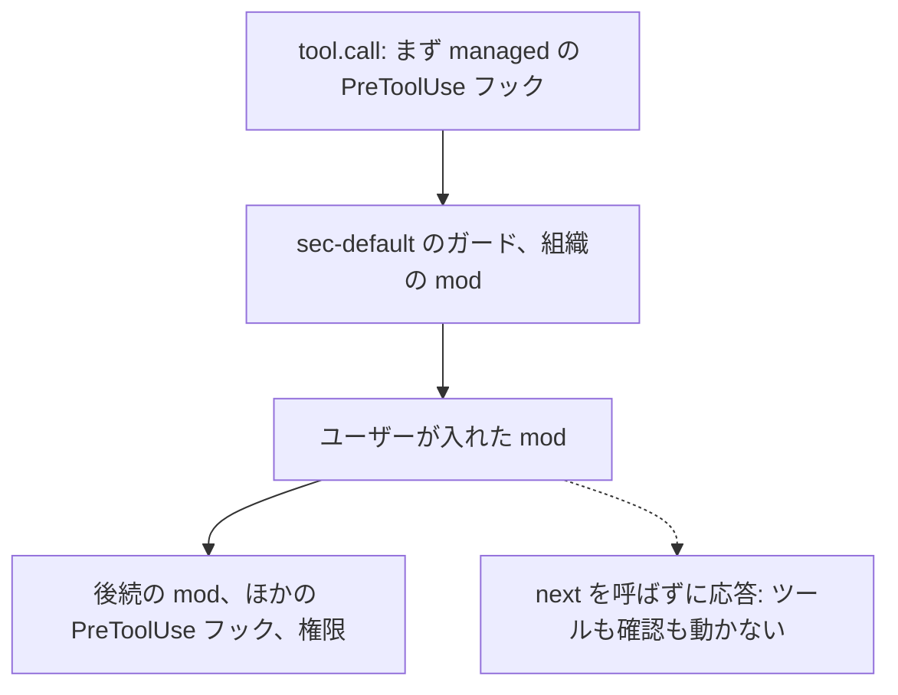
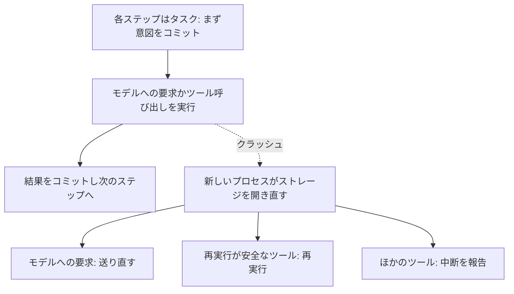
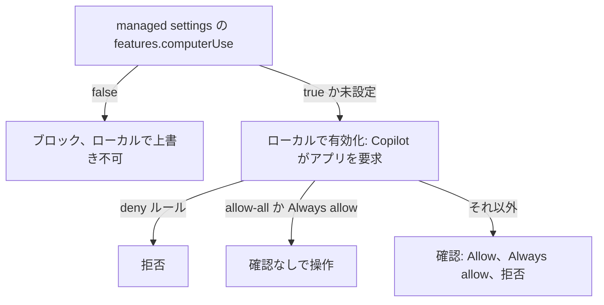
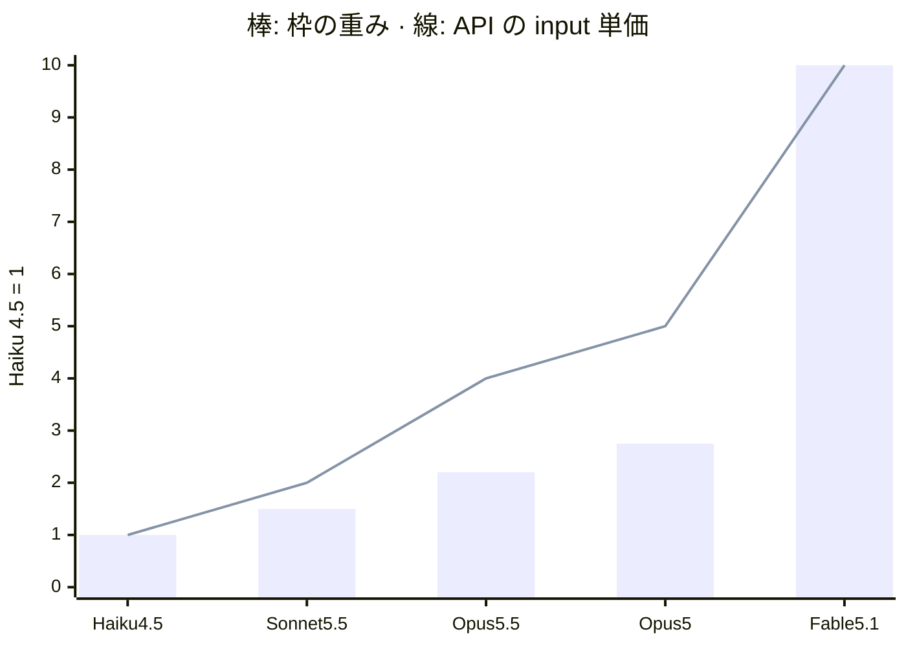
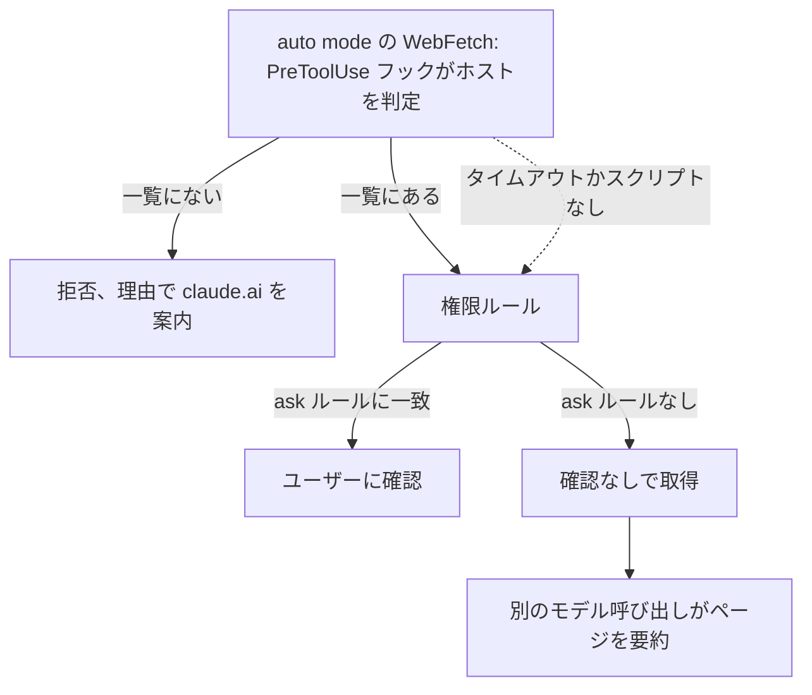
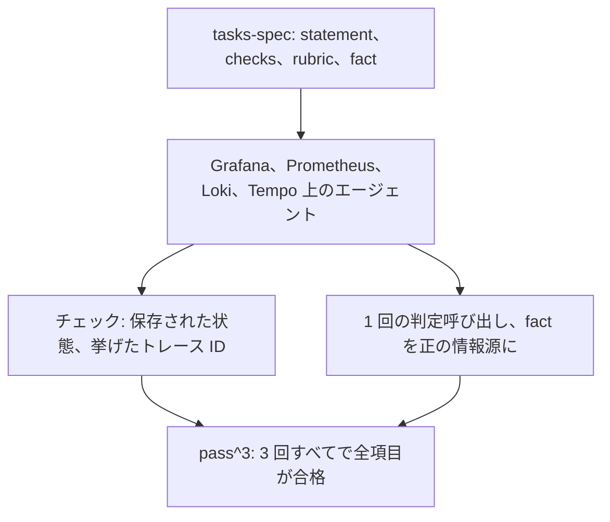

<!-- _class: summary -->

# 🗞️ GenAI Catch-up Report 2026-10-03

2026-10-01 〜 10-03 の 8 トピック (候補 46 件から選定)。詳細は <a href="../research/2026-10-03.md">調査ノート</a>。

<article class="card">
<h3>1️⃣ 🧩 Claude Mods: Claude Code の中で動き、振る舞いと画面を書き換えるフック</h3>

プラグインがツール呼び出しやプロンプトを書き換え、ペインを描き、組み込みの機能を置き換えられる。既定で有効でサンドボックスはなく、ガードが読み込まれるのは Team と Enterprise か managed settings のある環境だけ。

影響 高将来性 高重要度 高リリースコーディングエージェントセキュリティ・安全性

</article>
<article class="card">
<h3>2️⃣ 🥧 Pi 1.0 が安定版に、Pi Durable は全ステップをチェックポイントに</h3>

Pi 1.0 は Codemode のプロンプトを約 40% 削った。別の実験的なパッケージの Pi Durable はクラッシュしたエージェントを再開させ、翌日には Cloudflare の Agents SDK が対応した。

影響 高将来性 高重要度 高リリースエージェント開発コーディングエージェント

</article>
<article class="card">
<h3>3️⃣ 🖱️ Copilot CLI と Copilot アプリのコンピューター操作がパブリックプレビューに</h3>

Copilot がアクセシビリティツリーとスクリーンショットでデスクトップアプリを操作する。承認は権限モードに従うので allow-all のセッションでは省かれ、管理者は機能ごと止められる。

影響 高将来性 中重要度 高リリースコーディングエージェントセキュリティ・安全性

</article>
<article class="card">
<h3>4️⃣ ⚙️ Copilot の dynamic workflows: 複数エージェントの処理をコードで定義</h3>

Copilot の拡張機能のワークフローが手順を固定し、サブエージェントに作業を割り振り、チェックポイントで止まる。AI クレジットの上限は緩く、無効にする managed settings のキーはない。

影響 高将来性 中重要度 高リリースコーディングエージェントエージェント開発

</article>

---

<!-- _class: summary -->

# 🗞️ GenAI Catch-up Report 2026-10-03

<article class="card">
<h3>5️⃣ 🚦 LangChain、ハーネス内のルーターで Open SWE のコストの中央値を 64% 削減</h3>

分類器がスレッドごとに 3 つのモデル階層から 1 つを選ぶ。常に GPT-6 Astra を使う群との 973 スレッドの A/B テストで、コストの中央値は $2.61 から $0.94 に下がり、マージされた PR は横ばいだった (p = 0.49)。

影響 高将来性 中重要度 高検証・実践エージェント開発評価・運用

</article>
<article class="card">
<h3>6️⃣ 🧮 Max 20x で実測した Claude Code の利用上限の計算式</h3>

キャッシュ読み取りは入力トークンの 40 分の 1 と数えられ、ヘッドレス実行は 5 時間枠を 2 倍の速さで減らし、モデルの重みは API 料金の比と違う。20% とされた引き上げは実測で 1.11 倍だった。

影響 中将来性 中重要度 高検証・実践コーディングエージェント評価・運用

</article>
<article class="card">
<h3>7️⃣ 🛡️ auto mode の Claude Code で WebFetch をドメインの許可リストに限る</h3>

auto mode は ask ルールに一致しない限り確認なしで Web ページを取得する。クラスメソッドは PreToolUse フックで信頼できるホストだけを通し、それ以外の調べものは claude.ai に移した。

影響 中将来性 中重要度 高検証・実践コーディングエージェントセキュリティ・安全性

</article>
<article class="card">
<h3>8️⃣ 🔭 Grafana のエージェント評価: シナリオ、グレーダー、オープンな o11y-bench</h3>

グレーダーは回答の文面だけでなく、保存された状態と環境に問い合わせた事実を確かめる。o11y-bench は 63 のタスクと採点コードを公開し、リーダーボードは pass^3 で順位を付ける。

影響 中将来性 中重要度 高検証・実践評価・運用エージェント開発

</article>

---

<!-- _class: topic -->

# 1️⃣ 🧩 Claude Mods: Claude Code の中で動き、振る舞いと画面を書き換えるフック

10-01 の Claude Code 2.1.287 で入った mod は既定で有効で、Claude Code 自身と同じアクセス権でマシン上で動く。

## 要点

- mod はプラグインに入った JavaScript か TypeScript で、フックがセッションの全イベントを見て、書き換えるか代わりに答えられる。
- ペイン描画、`/command` 追加、モデル呼び出しができ、組み込みの You should know はサイドエージェントが見落としそうな点を知らせる。
- サンドボックスはなく、mod は秘密情報を読み、利用枠を使い、`ask` ルールや自分の `PreToolUse` フックなら止まる呼び出しも承認できる。
- `sec-default` のガードは Team・Enterprise か managed settings の下でだけ動き、deny ルールは mod 自身の `$.fs` に及ばない。
- シェル書き込みの安全策も 3 つ加わり、Bedrock・Vertex・Foundry の Opus 4.7 以降と Fable は 1M コンテキストが既定になった。

## 見方と論点

- Anthropic: 従来のフックではイベントの書き換えも UI の描画も機能の置き換えもできず、今後は組み込みの機能を mod に移していく。
- Pluto (リリース前の v2.1.274): mod が認証情報とプロンプトの履歴を確認なしに外へ送り、`plugin details` は Hooks (0) と表示した。
- 現場の報告: mod は 2.1.286 から動き、キャッシュされた展開フラグで一部のゲートウェイ利用者は使えず、npm の `stable` は 2.1.285。

## 技術要素

- フックのモジュールが `register(on, options)` をエクスポートし、各フックは `($, e, next)` の形をとる。
- 管理者向けの設定は `allowManagedModsOnly` と `disableSideloadFlags` で、独自の `prependPlugins` には `sec-default` を含める必要がある。
- 例外を投げるか 10 秒を超えたフックは飛ばされるので、`.catch` で deny を返さないガードはフェイルオープンになる。

出典: <a href="https://claude.com/blog/claude-code-mods">Anthropic</a> · <a href="https://dev.classmethod.jp/articles/20261002-cc-updates-v2-1-287/">クラスメソッド</a> · <a href="https://mixed-news.com/en/claude-code-2-1-287-mods-not-sandboxed-api-key/">MIXED</a> · <a href="https://pluto.security/blog/claude-code-function-hooks-security/">Pluto Security</a>

---

<!-- _class: topic -->

# 2️⃣ 🥧 Pi 1.0 が安定版に、Pi Durable は全ステップをチェックポイントに

Pi が MCP に対応した 2 日後の 10-01 に Earendil が両方を出し、翌日には Cloudflare の Agents SDK が Pi Durable に対応した。

## 要点

- Pi 1.0 はフルスクリーンを既定にし、Codemode を約 40% 軽くして、GPT-5.6 へのリクエストを約 5,300 から 3,300 トークンに縮めた。
- Codemode のスクリプトが画像を生成できるようになり、MCP の OAuth には RFC 9207 の `iss` の検証と段階的なサインインが入った。
- Pi Durable (MIT、実験的) は約 15,000 行の別パッケージで、すべてのステップがチェックポイントを残すタスクになる。
- 1 つのハーネスが多数の会話を同時に動かし、会話の分岐、複数クライアントの接続、実行中の拡張機能の差し替えに対応する。
- Cloudflare の `PiHarness` は Durable Object 上で動き、退避されたオブジェクトを 30 秒ごとのハートビートのアラームで再起動する。

## 見方と論点

- Earendil: コーディングエージェントは 1 人で使うターミナルの道具のままにし、長時間・複数の面にまたがる用途は Pi Durable が担う。
- Hacker News (1,641 ポイント): 約 450,000 行と数えた批判に対し、Mario Zechner は追加した機能はすべて任意だと答えた。
- 制約: 承認の手順もサンドボックスも組み込まれておらず、exactly-once が保証するのは投入で、外部への作用ではない。

## 技術要素

- ストレージはメモリ・SQLite・JSONL で 1 つのプロセスが持ち、クラッシュで失うストリーミング出力は最大 100 ms 分。
- npm の `@earendil-works/pi-durable` 1.0.0 は Node 22.19 以降が必要で、Bun と Durable Objects にはアダプターが要る。
- Cloudflare では会話ごとに 1 つの Durable Object を使い、15 分を超えるモデルのストリーミングは切られうる。

出典: <a href="https://earendil.com/posts/pi-1-0/">Earendil (Pi 1.0)</a> · <a href="https://earendil.com/posts/pi-durable/">Earendil (Pi Durable)</a> · <a href="https://developers.cloudflare.com/changelog/post/2026-10-02-pi-harness/">Cloudflare</a> · 前回: <a href="./2026-10-01.md#20">10-01 #16</a>

---

<!-- _class: topic -->

# 3️⃣ 🖱️ Copilot CLI と Copilot アプリのコンピューター操作がパブリックプレビューに

GitHub は 10-01 に macOS と Windows のローカルのセッションでプレビューを始め、同梱のプラグインは有効にするまでオフのまま。

## 要点

- Copilot はアクセシビリティツリーか、見た目の文脈が要るときはスクリーンショットでアプリを読み取り、クリック、入力、スクロールする。
- API・CLI・MCP の経路がないレガシーや GUI だけのソフトウェアが対象で、CLI のディレクトリの範囲の外でも操作する。
- CLI の `/computer on`・`show`・`off` かアプリの Settings > Computer Use で、専用の MCP サーバーを持つプラグインを切り替える。
- 承認はそのセッション限りか、Always allow なら以後の CLI とアプリの両方に効き、deny ルールは保存した承認より優先される。
- 確認の有無は権限モードに従い、CLI 1.0.64 以降、完全な allow-all のセッションではコンピューター操作の同意が省かれる。

## 見方と論点

- GitHub: API・MCP・CLI・ブラウザのツールが予測しやすく、コンピューター操作ではコントロールの取り違えや手順の繰り返しがありうる。
- The New Stack: 人のインターフェースをエージェントに使わせるという OpenAI の主張より位置付けは控えめで、GitHub は追う側だとみる。
- 制約: 価格・一般提供日・Linux 対応は示されず、managed settings で機能は止められるが、アプリ単位の許可や拒否はできない。

## 技術要素

- `permissions.disableBypassPermissionsMode: "disable"` で `--allow-all`、`/yolo`、アプリの Allow all を塞げる。
- macOS ではヘルパーにアクセシビリティと画面収録の権限が要り、`/plugin` と `/mcp list` で `computer-use` を確かめる。
- 保存したアプリの承認を消しても実行中のセッションのアクセスは残り、プレビュー機能は 10-22 以降もオプトインのまま。

出典: <a href="https://github.blog/changelog/2026-10-01-github-copilot-can-now-interact-with-desktop-apps">GitHub の変更履歴</a> · <a href="https://docs.github.com/en/copilot/concepts/agents/computer-use">GitHub Docs</a> · <a href="https://github.com/github/copilot-cli/blob/main/changelog.md">Copilot CLI の変更履歴</a> · <a href="https://thenewstack.io/github-copilot-computer-use-desktop/">The New Stack</a>

---

<!-- _class: topic -->

# 4️⃣ ⚙️ Copilot の dynamic workflows: 複数エージェントの処理をコードで定義

10-01 からすべてのプランでパブリックプレビューになり、Copilot アプリでは標準で、Copilot CLI では実験的機能として、SDK からも使える。

## 要点

- ワークフローは Copilot の拡張機能の中のプログラムで、ステップ・条件・受け渡しをコードで決め、判断はエージェントに任せる。
- ステップを順番か並列に動かし、構造化した結果を渡し、サブエージェントに互いを検証させ、チェックポイントで止まる。
- 作業の分け方を Copilot が決める `/fleet` や autopilot と違い、ワークフローは毎回同じステップを再利用する。
- `copilot workflow run` はスクリプトや CI 向けのヘッドレスの実行で、確認を出さず、事前に許可していない要求は拒否する。
- 上限は同時と累計のサブエージェント数、実行時間、AI クレジットの 4 つで、クレジットは後払いの緩い天井なので超えうる。

## 見方と論点

- GitHub: 複数エージェントの作業に信頼性と可観測性をもたらし、すぐ答えがほしいときや小さな変更なら通常のプロンプトで足りる。
- Oren Melamed (X): Claude Code はエージェントをスクリプトで組み、Copilot はライフサイクルを制御できるワークフローを拡張機能に書く。
- 統制: Claude Code の `disableWorkflows` にあたる managed settings のキーはなく、拡張機能はユーザーの権限で動く。

## 技術要素

- `@github/copilot-sdk/extension` の `defineWorkflow` を `joinSession({ workflows })` で登録し、API は実験的。
- `ctx.agent(prompt, { schema, model, label })` はテキスト・JSON・`null` を返し、同一の呼び出しは 1 つのサブエージェントにまとまる。
- `ctx.parallel` はバリアで待ち、`ctx.pipeline` は項目を段階に流し、どちらも 4,096 項目まで。
- `ctx.step(key, fn)` が結果を記録し、`ctx.pause(key)` がチェックポイントを残し、再開では最初から記録を再生する。
- CLI は `--args`、`--allow-tool`、`--result-file`、`--output-format json` を取り、既定の上限は `workflows.defaultLimits.*`。
- `extension.mjs` を `.github/extensions/` か `~/.copilot/extensions/` に置いて共有し、旧名は Agent Factories。

出典: <a href="https://github.blog/changelog/2026-10-01-dynamic-workflows-in-copilot-cli-and-the-copilot-app">GitHub の変更履歴</a> · <a href="https://docs.github.com/en/copilot/concepts/agents/dynamic-workflows">GitHub Docs</a> · <a href="https://github.com/github/copilot-sdk/blob/main/nodejs/docs/workflows.md">Copilot SDK のリファレンス</a> · <a href="https://x.com/OrenMe/status/2105902729323327607">Oren Melamed</a>

---

<!-- _class: topic -->

# 5️⃣ 🚦 LangChain、ハーネス内のルーターで Open SWE のコストの中央値を 64% 削減

10-01 の LangChain の記事は Open SWE の各スレッドを 3 つのモデル階層のどれかに送り、ルーターを実際のトラフィックで試した。

## 要点

- 1 週間のトレースでは新機能 22%、バグ修正 17%、テストか何もしない実行 16% で、どれも最上位のモデルが処理していた。
- 階層は Artificial Analysis のコストと知能のフロンティア上の GLM-5.3-Flash (xhigh)、GPT-5.6 Sol (medium)、GPT-6 Astra (low)。
- 分類器が最初の人のメッセージを基本のプロンプトと階層ごとの基準に照らして読み、選んだモデルをスレッドの最後まで使う。
- 常に Astra の群との 973 スレッドの A/B: 中央値 $0.94 対 $2.61、平均 −42%、p90 −37%、マージされた PR は 29.2% 対 27.3%。
- 振り分けは Balanced 56%、Fast 34%、Performance 10% で、常に Fast の群と比べるテストは 1 日で打ち切った。

## 見方と論点

- LangChain: ルーターはゲートウェイにないタスクの文脈を持つハーネスに置くべきで、評価とトレースがその土台になる。
- テストしたのは構造化出力の LLM によるルーターで、約 50 倍速い Jev への置き換えはテストの後の 09-27。
- 限界: 常に Balanced の群はなく、この規模ではマージされた PR が数ポイント下がる可能性を排除できない (p = 0.49)。

## 技術要素

- `ModelSelectionMiddleware` の `abefore_model` が `model_route` を状態に保存し、`awrap_model_call` がモデルを差し替える。
- 判定順はユーザー指定のモデル、ルーティング無効、保存したルート、fast モード、最後に Jev (`jev-1.13.0`、制限 3 秒)。
- Jev の答えは信頼度 0.6 以上で採用し、それ以外は既定のモデル (Auto が有効な間は Fast の階層) で動く。
- 階層ごとのコストの中央値は Fast $0.097、Balanced $1.50、Performance $2.88 で、30 倍の開きがある。
- 公開版は `langchain-typesafe[experimental]` 0.0.1a3 の `ModelRouterMiddleware` で、分類器の失敗で実行が止まる。
- `main` は今も Auto のスレッドの半分を Fast だけの群に送り (`_MODEL_ROUTING_SPLIT = 0.5`)、外す PR #3271 は未マージ。

出典: <a href="https://www.langchain.com/blog/how-to-build-a-model-router-in-the-harness">LangChain</a> · <a href="https://github.com/langchain-ai/open-swe/blob/main/agent/middleware/model_selection.py">Open SWE のルーターのコード</a> · <a href="https://github.com/langchain-ai/open-swe/pull/3036">Open SWE PR #3036</a> · <a href="https://docs.langchain.com/oss/python/integrations/providers/typesafe">TypeSafe のドキュメント</a>

---

<!-- _class: topic -->

# 6️⃣ 🧮 Max 20x で実測した Claude Code の利用上限の計算式

10-01 の Zenn の記事は 09-18〜09-29 に転送プロキシでリクエストを記録し、それぞれの枠を何がどれだけ減らすかを導いた。

## 要点

- 1 リクエストの使用量 = モデルの重み × (input + cache write × 1.25 + output × 5 + cache read × 0.025)、各項はトークン数。
- cache read の重みは input の 40 分の 1 で、9 月中旬に予告なく変わる前は 0、output の重みは 8 だった。
- ヘッドレス (`claude -p`、Agent SDK) は 5 時間枠を 2 倍、平日の日本時間 21:00〜03:00 は 2.86 倍の速さで減らし、週間枠では 1.25 倍。
- Fable 5.1 は API の単価が Opus 5 の 2 倍なのに枠は 3.64 倍の速さで減り、Opus 5.5 は発表どおり Opus 5 の 0.8 倍。
- 09-23 に 20% と発表された 5 時間枠の引き上げは実測で 1.11 倍で、`/usage` が 100% を示してもリクエストは通る。

## 見方と論点

- Anthropic は重み、枠の大きさ、ヘッドレスの倍率を公開しておらず、ヘッドレスを 1.8〜2.0 倍と測った #97074 にスタッフの返信はない。
- shellac (1 月) とクラスメソッド (8 月) の以前の測定でも、cache read は枠にほぼ数えられていなかった。
- 限界: 1 つのプランの 1 アカウントによるある時点の測定で、#97398 は Opus 5.5 の重みでは説明できない週間枠の速い減りを報告する。

## 技術要素

- Max 20x の枠は Haiku 4.5 の input トークン換算で、5 時間枠が 3 億、週間枠が 11.3 億。
- ヘッドレスのリクエストには `cc_entrypoint=sdk-cli` が付く。
- サーバー側の auto mode の判定は数えられず、`CLAUDE_CODE_AUTO_MODE_SERVER=0` にすると数えられる。

出典: <a href="https://zenn.dev/tksfjt1024/articles/25c0ab111c277c">Zenn (tksfjt1024)</a> · <a href="https://github.com/anthropics/claude-code/issues/97074">claude-code #97074</a> · <a href="https://claude.dev/blog/what-a-task-costs-on-opus-5-5/">claude.dev</a> · <a href="https://dev.classmethod.jp/articles/claude-max-20x-weekly-limit-not-4x/">クラスメソッド</a>

---

<!-- _class: topic -->

# 7️⃣ 🛡️ auto mode の Claude Code で WebFetch をドメインの許可リストに限る

10-02 のクラスメソッドの記事は、auto mode を手放さずに、間接プロンプトインジェクションが Web から入る入口を狭めた。

## 要点

- `auto` と `bypassPermissions` では明示的な `ask` ルールに一致しない限り WebFetch は確認を省き、ドキュメントもそう書く。
- 実害には信頼できないテキストの入口、`.env` や認証情報のような資産、出口の 3 つがそろう必要があり、4 つの対策案を比べた。
- 採用したのは入口を絞る案で、`PreToolUse` フックが WebFetch の取得先を社内の情報源とベンダーの公式ドキュメントに限る。
- 以前のサンドボックスが通信を制限していたのは Bash だけで、WebFetch はその外で入口にも出口にもなりえた。
- サフィックスの偽装や `@` のトリックから http や IP の直接指定まで 6 つの URL のテストが通り、ほかの調べものは claude.ai に移す。

## 見方と論点

- クラスメソッド: Claude Code が読むのは社内の人か公式が書いたものだけという基準で、新しい MCP サーバーの採否も判断できる。
- url-allowlist プラグインは WebSearch の結果の URL を 30 分だけ信頼し、付け足したパラメーターを防ぐため完全一致で照合する。
- 隙: タイムアウトしたか起動できないフックはフェイルオープンで、WebSearch のタイトルとクエリは小さな入口と出口として残る。

## 技術要素

- マッチャー `WebFetch`、`"timeout": 5` の Python スクリプトで、完全一致か `host.endswith("." + d)` でホストを判定。
- 例外でも `deny` を出して 0 で終わり、スクリプトは非公開。
- ルールは deny、ask、allow の順に評価され、allow で deny の例外は作れないので、デフォルト deny にはフックが要る。

出典: <a href="https://dev.classmethod.jp/articles/claude-code-prompt-injection-webfetch-domain-allowlist/">クラスメソッド</a> · <a href="https://code.claude.com/docs/en/tools-reference">WebFetch のドキュメント</a> · <a href="https://code.claude.com/docs/en/hooks">フックのリファレンス</a> · <a href="https://github.com/danielbodart/claude-code-plugins">url-allowlist</a>

---

<!-- _class: topic -->

# 8️⃣ 🔭 Grafana のエージェント評価: シナリオ、グレーダー、オープンな o11y-bench

Grafana のデベロッパーアドボケイトによる 10-01 の Zenn の記事が、Grafana の 4 月の投稿とベンチマークの採点コードを読み解いた。

## 要点

- よく書けた回答が誤ったクエリに基づくこともあるので、グレーダーは保存された状態、クエリの形、環境から得た事実を確かめる。
- 構造化された出力は決定的なチェックで、結論はルーブリック付きの LLM の判定で採点し、各シナリオは複数回動かす。
- Grafana のプロンプト改修 (175 シナリオ) では discover と safety が上がり、observe は 93.6% → 79.5%、dashboard は 100% → 83.3%。
- o11y-bench (AGPL-3.0、Harbor 上) は Prometheus・Loki・Tempo で 63 タスクを動かし、チェック 39、基準 247、うち fact 付き 63。
- リーダーボードは pass^3 (3 回すべて合格) で順位を付け、claude-opus-4-8 (high) と claude-opus-4-7 (off) が 79.4% で並ぶ首位。

## 見方と論点

- Grafana: AI が提案しベンチマークが検証して人間が決めるループで、文脈のない 78% よりベースラインからの 3 ポイントの低下に意味がある。
- Grafana の Dumont による実インシデントのアリーナは品質だけを採点し、モデルよりツールとプロンプトのほうが効くと分かった。
- 限界: 著者は Grafana の社員で、Claude が上位を占める表を Claude Haiku 4.5 が判定し、上位 5 件の区間は重なる。

## 技術要素

- `mise run bench:job` で動かし、Docker、Python 3.14 以降、判定用の Anthropic のキーが要る。
- fact は採点時に実行する Prometheus・Loki・Tempo のクエリで、`regrade` は保存したトランスクリプトを再採点する。
- `tool_trace_id` は Tempo のツールの結果に現れたトレース ID を回答が挙げたときだけ合格にする。

出典: <a href="https://zenn.dev/ymotongpoo/articles/20261001-agent-eval-loop">Zenn (ymotongpoo)</a> · <a href="https://medium.com/grafana-labs/building-an-evaluation-loop-for-grafana-assistant-9a8690d8662d">Grafana Labs</a> · <a href="https://github.com/grafana/o11y-bench">o11y-bench</a> · <a href="https://ganhua.wang/grafana-o11y-bench-ai-on-call">MicroFIRE</a>

