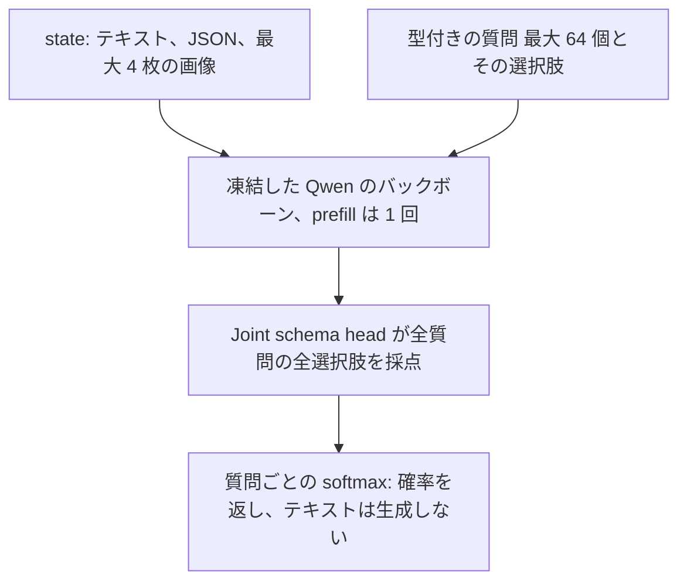
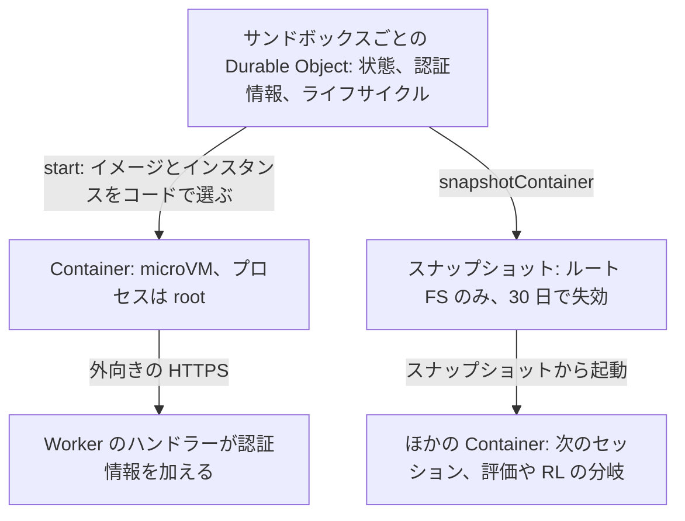
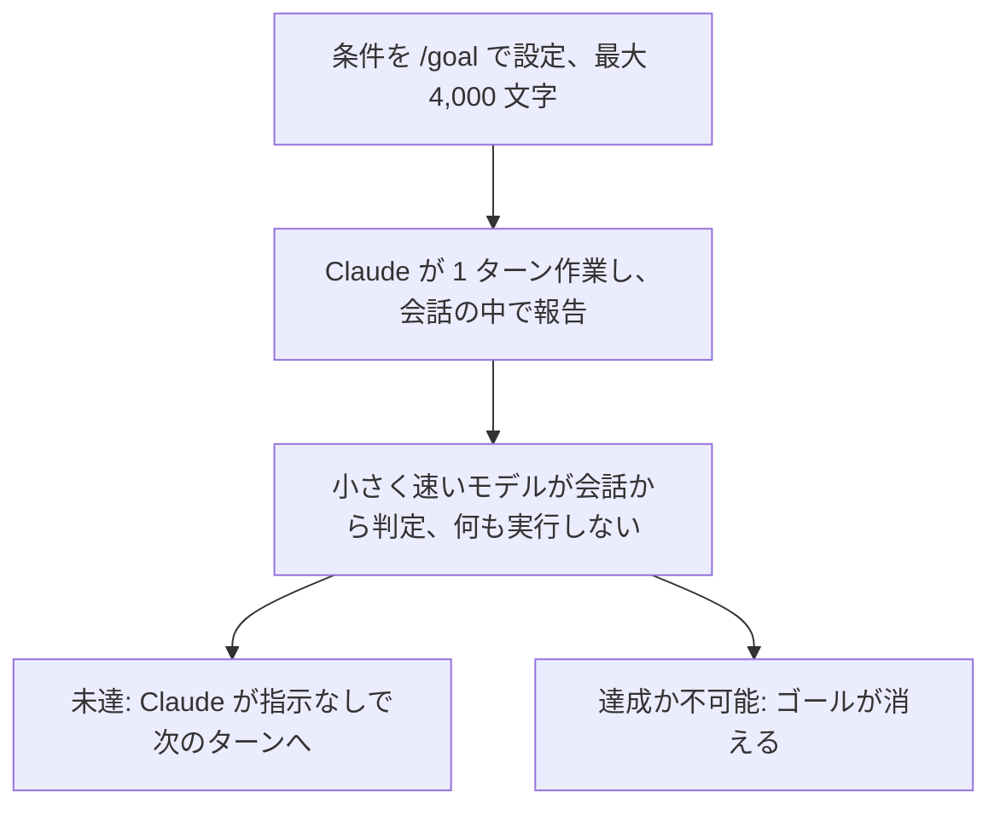

<!-- _class: summary -->

# 🗞️ GenAI Catch-up Report <span class="date">2026-10-06</span>

<p class="lead">2026-10-03 〜 10-06 の 6 トピック (候補 47 件から選定)。詳細は <a href="../research/2026-10-06.md">調査ノート</a>。</p>

<div class="grid">
<article class="card">
<h3>1️⃣ 💧 OpenAI のテキストの透かし: API はオプトイン、ChatGPT と Codex は EU だけ</h3>
<p>10-05 から世界中の API 顧客がモデルごとに有効にでき、EU の ChatGPT と Codex のテキストには数週間のうちに入る。検出器を使えるのは承認された研究者だけで、語の 25% を類義語に替えると検出率は 17% に落ちた。</p>
<p class="tags"><span class="tag high">影響 高</span><span class="tag high">将来性 高</span><span class="tag high">重要度 高</span><span class="tag">仕様変更</span><span class="tag">API・クラウド</span><span class="tag">セキュリティ・安全性</span></p>
</article>
<article class="card">
<h3>2️⃣ 🎼 Cloudflare の Clef: 画像も読めるオープンな決定モデルを Workers AI で</h3>
<p>Apache 2.0 の 2 つのモデル (27B と 9B) が Jev の API で選択肢ごとの確率を返し、画像も読める。Cloudflare 自身の実行では Decision Index の首位だが、トークン単価は Jev のほうが安い。</p>
<p class="tags"><span class="tag high">影響 高</span><span class="tag high">将来性 高</span><span class="tag high">重要度 高</span><span class="tag">リリース</span><span class="tag">モデル</span><span class="tag">エージェント開発</span></p>
</article>
<article class="card">
<h3>3️⃣ 📦 Cloudflare Containers、Durable Object が動かすエージェント用サンドボックスに</h3>
<p>サンドボックスごとの Durable Object が起動時にイメージとサイズを選び、ファイルシステムのスナップショットもベータで加わった。ベンチマークの 1 回の実行では、起動の中央値が約 4 秒から 648 ms に縮んだ。</p>
<p class="tags"><span class="tag high">影響 高</span><span class="tag high">将来性 高</span><span class="tag high">重要度 高</span><span class="tag">リリース</span><span class="tag">エージェント開発</span><span class="tag">セキュリティ・安全性</span></p>
</article>
</div>

---

<!-- _class: summary -->

# 🗞️ GenAI Catch-up Report <span class="date">2026-10-06</span>

<div class="grid">
<article class="card">
<h3>4️⃣ 🔒 Claude Code 2.1.289 と 2.1.290、deny ルールと読み取りのブロックの穴をふさぐ</h3>
<p>環境変数の接頭辞、フックが書き換えた入力、読み取り中に差し替えたリンク、ユーザーの mod で、コマンドや読み取りがルールをすり抜けられた。npm の <code>stable</code> は修正を含まない 2.1.285 のままだった。</p>
<p class="tags"><span class="tag mid">影響 中</span><span class="tag mid">将来性 中</span><span class="tag high">重要度 高</span><span class="tag">仕様変更</span><span class="tag">コーディングエージェント</span><span class="tag">セキュリティ・安全性</span></p>
</article>
<article class="card">
<h3>5️⃣ 🔁 mizchi の AI プログラミング手法: 指標のループ、解説スキル、形式手法のオラクル</h3>
<p><code>/goal</code> のループで、メモリ使用量、lint の警告数、ミューテーションテストの Kill 率のような決定的な数値を追う。読む時間のないコードはスキルに解説させ、TLA+、Z3、Alloy をテストオラクルにする。</p>
<p class="tags"><span class="tag mid">影響 中</span><span class="tag mid">将来性 中</span><span class="tag high">重要度 高</span><span class="tag">検証・実践</span><span class="tag">コーディングエージェント</span><span class="tag">評価・運用</span></p>
</article>
<article class="card">
<h3>6️⃣ 🎮 kev-4b と laya-ml をリアルタイムのゲームで: 答えは速いが穴は越えられず</h3>
<p>1 回の判断は 15〜252 ms で返ったが、600 回の試行のどれも最初の穴を越えられなかった。右を優先する 1 行のルールが kev-4b を上回ったのも、kev-4b と同じ 144 ms の遅れを足すまでだった。</p>
<p class="tags"><span class="tag mid">影響 中</span><span class="tag mid">将来性 中</span><span class="tag high">重要度 高</span><span class="tag">検証・実践</span><span class="tag">モデル</span><span class="tag">評価・運用</span></p>
</article>
</div>

---

<!-- _class: topic -->

# 1️⃣ 💧 OpenAI のテキストの透かし: API はオプトイン、ChatGPT と Codex は EU だけ

<p class="lede">10-05 の OpenAI の投稿は EU AI Act 第 50 条 2 項への対応で、この義務は出力が EU で使われる EU 外の提供者にも及ぶ。</p>

<div class="cols">
<div>

## 要点

- API: 10-05 から世界中の顧客がプロジェクトか組織の単位で、モデルを選んでオプトインでき、既定はオフのまま。
- ChatGPT と Codex: EU の全プランのユーザー向けに、対象となるテキスト出力へ今後数週間で入れ、世界共通の既定にはしない。
- 検出器: 申し込んで承認された研究者と専門機関だけが使え、透かしをオプトインしても使えるようにはならない。
- 偽陽性率 1% での検出率は、心理学のような文章なら 200 トークンで約 80%、400 トークンで約 95% だが、数学ではずっと低い。
- 語の 10% を類義語に替えると検出率は約 92% から 66%、25% なら 17% に下がり、透かしを入れても Astra の 8 ベンチマークは同等。

## 見方と論点

- OpenAI は見逃しと誤検出のリスクを理由に検出器を絞り、EU の行動規範もこの制限を期間限定で認めている。
- コード: The New Stack によれば Codex のコードに入るかは未説明で、arXiv の試験では SynthID-Text はコードで偶然に近かった。
- Gizmodo Japan: 日本の ChatGPT と Codex は対象外で検出も試せないとし、「長さよりも扱う分野のほうが検出率に影響している」と読む。

</div>
<div>

## 技術要素

- 設定: 組織 (Data controls) かプロジェクトの Text provenance で Allow text watermarking をオンにし、モデルを選ぶ。
- textGrain は秘密鍵で語の選び方に偏りを加え、検出に要るのはテキストと鍵だけで、配備したパラメーターは非公開。
- Content Provenance API (`POST /v1/content_provenance_checks`) は画像と音声だけを確かめ、テキストには承認が要る。
- 第 50 条 2 項は 2026-08-02 から、それ以前に出たシステムには 2026-12-02 から適用され、罰金は最大 1,500 万ユーロか売上高の 3%。
- ガイドライン: 検出手段のないマーキングは不適合 (point 70) だが、API のオプトインに検出器はなく、コードは対象外 (68)。
- Anthropic は対応モデルのテキストにモデルの段階で世界中で透かしを入れ、Claude Code やクラウドパートナー経由も対象。

</div>
</div>

<p class="sources">出典: <a href="https://openai.com/index/eu-text-provenance/">OpenAI</a> · <a href="https://thenewstack.io/openai-api-text-watermarking/">The New Stack</a> · <a href="https://www.gizmodo.jp/article/2610-openai-textgrain-watermark/">Gizmodo Japan</a> · <a href="https://digital-strategy.ec.europa.eu/en/faqs/transparency-obligations-under-article-50-ai-act">欧州委員会</a></p>

---

<!-- _class: topic -->

# 2️⃣ 🎼 Cloudflare の Clef: 画像も読めるオープンな決定モデルを Workers AI で

<p class="lede">期間前の 10-01 に Birthday Week で公開され、重みは Apache 2.0、強化学習によるファインチューニングの提供も打ち出した。</p>

<div class="cols">
<div>

## 要点

- Clef (27B、Qwen3.8-27B ベース) と Clef-flash (9B、Qwen3.5-9B ベース) は全質問の全選択肢を 1 回で採点し、出力は 0 トークン。
- Jev 互換で、エンドポイントとモデルを変えれば切り替わり、1 リクエストに質問は最大 64、Jev にない画像も最大 4 枚。
- Cloudflare 自身の実行で Decision Index 0.2.1 の首位 (Clef 61.21、Jev 57.91) だが、GPQA Diamond は Jev が 78.3 対 48.0 で上。
- 中央値は Cloudflare の値で 209.3 ms と 38.8 ms、Jev は HTTPS 込みで 524.1 ms、日本からの Zenn の実測では 406 ms と 166 ms。
- 入力 100 万トークンあたり $0.24 と $0.09 で Jev の 5.7 倍と 2.1 倍、RL のファインチューニングは価格未公表でパートナー募集から。

## 見方と論点

- Cloudflare: 速く用途の狭い分類器を RL のプラットフォームの最初の対象に選び、エージェントのホットパスで行動役の LLM と組ませる。
- 懐疑論: Jev の作者はベンチマークに最適化したモデルを警戒し、@mervenoyann と Armin Ronacher は分類器の呼び替えとみる。
- 実地の試験: ローンチ当日の画像のリクエストは 13〜30 秒かかり (Flavio Copes)、日本語の振り分けは 30 回中 30 回正しかった (Zenn)。

</div>
<div>



## 技術要素

- `@cf/cloudflare/clef` と `clef-flash` は Workers AI と AI Gateway で使え、手元では Ollama 0.35.1 以降か llama.cpp。
- 凍結したバックボーンにルーティングのヘッドと rank-256 の LoRA を足して Brier 損失と RLCD で学習、ECE は未報告。
- 1 リクエストの質問はまとめて採点され (Kev は独立)、`other` がないと範囲外の入力もどれかの担当に振られる。

</div>
</div>

<p class="sources">出典: <a href="https://blog.cloudflare.com/clef-decision-models/">Cloudflare</a> · <a href="https://flaviocopes.com/clef/">Flavio Copes</a> · <a href="https://zenn.dev/akari1106/articles/b6d3180cc50dfe">Zenn (akari1106)</a> · <a href="https://gigazine.net/news/20261005-clef-cloudflare-decision-model/">GIGAZINE</a></p>

---

<!-- _class: topic -->

# 3️⃣ 📦 Cloudflare Containers、Durable Object が動かすエージェント用サンドボックスに

<p class="lede">09-30 の Birthday Week で Sandbox SDK 1.0 とともに発表され、新しいスケジューリングポリシーとスナップショットはパブリックベータ。</p>

<div class="cols">
<div>

## 要点

- サンドボックスごとの Durable Object が `start()` でイメージとインスタンスタイプを選び、以前は組み合わせごとに別のアプリだった。
- 展開の設定はなく、動いている Container はコードが止めるまで同じイメージのままで、カナリア、固定、ロールバックはコードで書く。
- ComputeSDK の 100 サンドボックスの同時起動で、中央値は 4.049 s から 648 ms、p99 は 6.717 s から 1.129 s に縮んだ。
- スナップショットはルートファイルシステムだけで (メモリとプロセスは含まない)、別の Container も起動でき、最大 20 GB、30 日で失効。
- Sandbox SDK 1.0 はファイルとバケットのヘルパーに縮み、`Container` と 0.x の `Sandbox` クラスの更新は 2026-12-31 まで。

## 見方と論点

- Cloudflare はタスクごとに即座に起動するサンドボックスを狙い、Publickey は「急速にAIエージェント向けに最適化している」と見る。
- 6 倍は 11 週間離れた 1 回ずつの比較で、7〜9 月の中央値 (3.5〜5.7 s) となら約 7 倍、春 (約 2 s) となら約 3 倍。
- 制約: 移行は新しい名前空間への一方向で、プロセスは root と同じ権限で動き、ディスクに残ったトークンはスナップショットに残る。

</div>
<div>



## 技術要素

- アプリ単位で `durable_object` のポリシーにオプトインし、`images` のマップにダイジェスト固定のイメージを最大 100 個。
- `cloudflare/debian-trixie` (Node.js 24.20.0) には Git も Python も curl もなく、既定のコマンドはすぐ終了する。
- 動作中の 10 ms 単位で課金され、中の処理は活動に数えず、作業中でも非アクティブのタイムアウト (最大 6 時間) で止まる。

</div>
</div>

<p class="sources">出典: <a href="https://blog.cloudflare.com/faster-agent-sandboxes/">Cloudflare</a> · <a href="https://developers.cloudflare.com/containers/api/durable-object-container/">Cloudflare Docs</a> · <a href="https://github.com/computesdk/benchmarks/tree/master/results/burst_tti">ComputeSDK の結果</a> · <a href="https://www.publickey1.jp/blog/26/cloudflare_containersai6.html">Publickey</a></p>

---

<!-- _class: topic -->

# 4️⃣ 🔒 Claude Code 2.1.289 と 2.1.290、deny ルールと読み取りのブロックの穴をふさぐ

<p class="lede">前回扱った mod のリリースに続き 10-03 と 10-05 に出たが、10-06 の時点でも npm の <code>stable</code> は 2.1.285 のままだった。</p>

<div class="cols">
<div>

## 要点

- サンドボックスの自動許可では、`TZ="$HOME"` のような環境変数の接頭辞の後ろのコマンドを deny と ask が見逃しており、2.1.289 で直った。
- 2.1.290 は `declare` や `export` の接頭辞、PreToolUse のフックが書き換えた入力にもルールを当て、グロブ付きの `rg` は確認を求める。
- 読み取りのブロックと Read の deny が、リンクで外を指す `CLAUDE.md` や `AGENTS.md`、読み取り中に差し替えたリンク、貼った画像にも効く。
- ユーザーの mod は組織のガードの確認を省かせることも組織のプラグインを外すこともできず、MCP のサインイン用ツールも守られた。
- 2.1.289 は 27 項目でうちセキュリティの修正が 5 つ、2.1.290 は 190 項目で、調査ノートの数えではセキュリティ関連が約 56。

## 見方と論点

- MIXED は rm のガードをすり抜ける 2 つ目の経路と呼ぶが、Anthropic はどちらのサンドボックスの修正も脆弱性とせず、CVE もない。
- クラスメソッドは接頭辞の修正を対照付きで再現し、読み取りのブロックの検証で確実にディレクトリを加えられたのはユーザー設定だけだった。
- ドキュメントは Bash のルールを境界とみなさず強制はサンドボックスに任せるので、今回の修正が狭めたのはテキストの一致の隙間。

</div>
<div>

## 技術要素

- 10-06 の npm は `latest` と `next` が 2.1.290、`stable` は 09-29 の 2.1.285 で、Homebrew の `claude-code` cask は `stable` を追う。
- 管理設定の `requiredMinimumVersion` は古い版を起動時に終了させ、`autoUpdatesChannel` で `stable` か `latest` を選ぶ。
- `blockReadsOutsideWorkingDirectories` (2.1.257+) は全モードでファイルツールの外の読み取りを拒み、サンドボックス外の Bash は確認。
- `autoAllowBashIfSandboxed` の既定は true で、deny ルールと `Bash(git push *)` のような内容指定の ask ルールは有効なまま。
- `claude plugin validate` がゲートのフックと `.catch` の有無を示し、mod の `tool.check` に `ceiling` と `agentId` が加わった。
- リポジトリの設定では Claude in Chrome をオンにできず、`CLAUDE_CODE_DISABLE_ATTACHMENTS` も設定できなくなった。

</div>
</div>

<p class="sources">出典: <a href="https://code.claude.com/docs/en/changelog">Claude Code の変更履歴</a> · <a href="https://mixed-news.com/en/claude-code-2-1-289-second-route-past-rm-guard-stable-four-builds-behind/">MIXED</a> · <a href="https://dev.classmethod.jp/articles/20261005-cc-updates-v2-1-289/">クラスメソッド</a> · 前回: <a href="./2026-10-03.md#3">10-03 #1</a></p>

---

<!-- _class: topic -->

# 5️⃣ 🔁 mizchi の AI プログラミング手法: 指標のループ、解説スキル、形式手法のオラクル

<p class="lede">10-05 の Zenn の棚卸しの記事は 1 日で 379 いいねと はてなの 425 ブックマークを集め、筆者は「またすぐ変わると思います」と結ぶ。</p>

<div class="cols">
<div>

## 要点

- 人の役割は 5 つ: モデルにできることの見極め、ループの構築、指標とトレードオフの設定、ループのログの評価、テストと CI の優先づけ。
- 最初の試行が失敗したら原因を分け、文脈やテストを足すか、権限を与えるか、性能の不足なら「半年寝て待つ」。
- `/goal` のループで決定的な数値を追う: RSS、厳しい lint の警告数 (cccc、similarity)、ミューテーションの Kill 率、VRT の一致率。
- 読むのは E2E のケース名、テスト、シグネチャで、残りはスキル (mizchi/explainer、DreambigOu/ELI5) に解説させる。
- 形式手法のオラクル: マイクロサービスやキャッシュ制御に TLA+ か Quint、述語に Z3、権限に Alloy、アルゴリズムに Lean。

## 見方と論点

- はてな: kiririmode は人の仕事を評価の設計とみて、pochi-taro00 は `/goal` は条件が 1 つで判定役も嘘をつくと指摘する。
- Huntley はコードに読みやすさより説明可能性を求め、Litt と、Fowler が引く Joshi は、レビューを超えて参加するための理解を重んじる。
- 注意: LLM が書いた TLA+ の実システムへの適合は平均約 46% (SIGOPS) で、記事のプロンプトは適合を確かめていない。

</div>
<div>



## 技術要素

- ゴールはセッションに 1 つで、評価役は小さく速いモデルで動き、`disableAllHooks` のもとでは使えない。
- formal-methods-reconciler: LLM がモデルを下書きし、判定はソルバーが下し、反例はそれぞれテストにする。
- `cccc --max-cognitive 15` は上限を超えると CI を落とし、`similarity-ts` は木の編集距離で重複コードを見つける。

</div>
</div>

<p class="sources">出典: <a href="https://zenn.dev/mizchi/articles/ai-coding-loop-formal">Zenn (mizchi)</a> · <a href="https://code.claude.com/docs/en/goal">Claude Code のドキュメント</a> · <a href="https://sigops.org/2026/can-llms-model-real-world-systems-in-tla">ACM SIGOPS</a> · <a href="https://b.hatena.ne.jp/entry/s/zenn.dev/mizchi/articles/ai-coding-loop-formal">はてなブックマーク</a></p>

---

<!-- _class: topic -->

# 6️⃣ 🎮 kev-4b と laya-ml をリアルタイムのゲームで: 答えは速いが穴は越えられず

<p class="lede">アクセンチュア・ジャパンのエンジニア Shinya Koike が 10-05 に Zenn で公開した個人の検証で、コードと試走のログは GitHub にある。</p>

<div class="cols">
<div>

## 要点

- 判断の前に画面を文章にする目 (55 ms) が入るため、60 fps で laya-ml は 6 コマ、kev-4b は 16〜17 コマ遅れて動いた。
- 事前登録した最終比較 (英語、各モデル 100 回 × 3 本) では、600 回のどれも最初の穴を越えず、どちらが上とも言えなかった。
- モデルだけだと kev-4b は 30 回とも死に、laya-ml は攻撃しかせず、記憶ありでもモデルの 1 位がそのまま実行されたのは 43〜64% の手。
- 第 3 部は物理と探索をコードに移し、kev-4b は SAFE の付いた選択肢を常に選んだが、20 回で向こう岸は 0 回。
- 右を優先するルールは 20 回中 12 回渡ったが、kev-4b の応答時間の中央値 144 ms ぶん遅らせると 0 回になった。

## 見方と論点

- 筆者は、速さが効くのは「規則で書き切れない曖昧さがあり、数十〜数百 ms の遅れが許され、間違えたときの損が小さい判断」とみる。
- kanta13jp1 のマリオの試験も同じ結論で、クラウドの Jev の 210 判断のうち 187 を探索が差し替え、どのモデルも単体では失敗した。
- 限界: 筆者 1 人、穴 1 つ、各モデル 3 本、手元の git だけの事前登録で、Jev は未検証、kev-4b は英語のみのモデル。

</div>
<div>

```mermaid
xychart-beta
    title "p50 (ms): Mac、Vertex AI の L4 (米国)、Gemini 2.5 Flash (東京)"
    x-axis [laya-ml MPS, laya-ml CPU, 画面の読み取り, kev-4b MLX, kev-4b L4, Gemini 2.5]
    y-axis "ms" 0 --> 450
    bar [14.6, 53.7, 55.3, 200, 252, 440]
```

## 技術要素

- kev-4b は Qwen3.5-4B-Base に LoRA と採点ヘッド (MLX)、laya-ml は約 3 億パラメーターの mmBERT-base (MPS)。
- laya-ml は選択肢の説明を 48 トークン、入力を 512 で切る (筆者による) ため、当初は渡した判定が届かなかった。
- Vertex AI の g2-standard-8 (L4 1 枚) は 1 時間約 0.98 ドル、常時稼働で月約 720 ドル、ヘルス経路は `/v1/models`。

</div>
</div>

<p class="sources">出典: <a href="https://zenn.dev/acntechjp/articles/zenn-system1-owata2-realtime">Zenn (Shinya Koike)</a> · <a href="https://github.com/ccie26302/zenn-code/tree/main/owata2-system1-realtime">zenn-code リポジトリ</a> · <a href="https://huggingface.co/jaredpalmer/kev-4b">Kev-4B のカード</a> · <a href="https://zenn.dev/kanta13jp1/articles/jev-realtime-use-cases-deep-dive">Zenn (kanta13jp1)</a></p>
