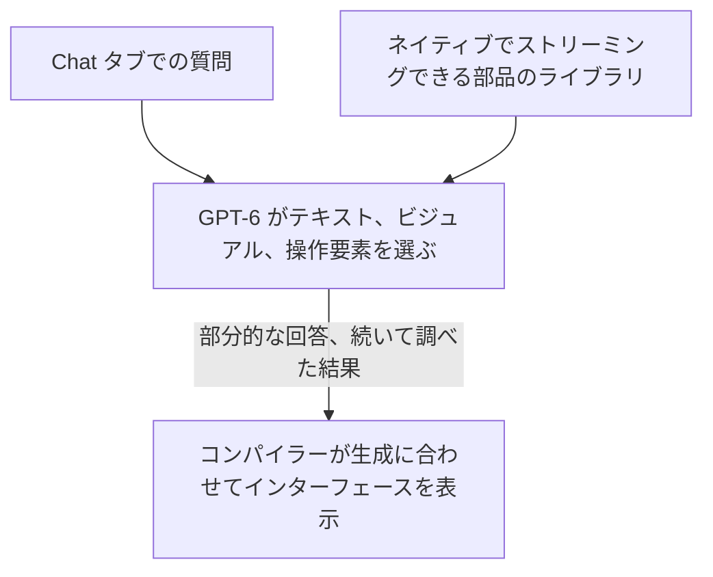
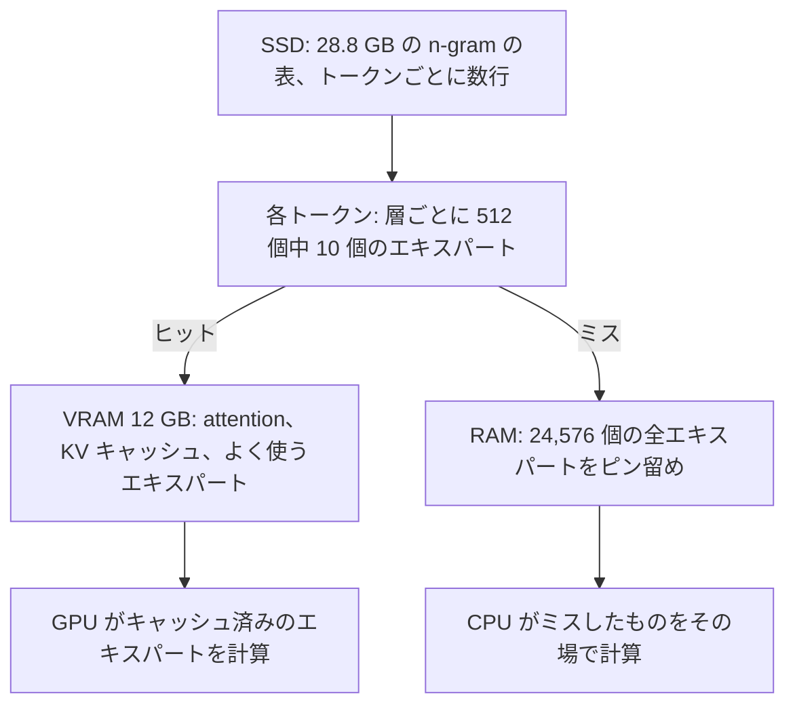
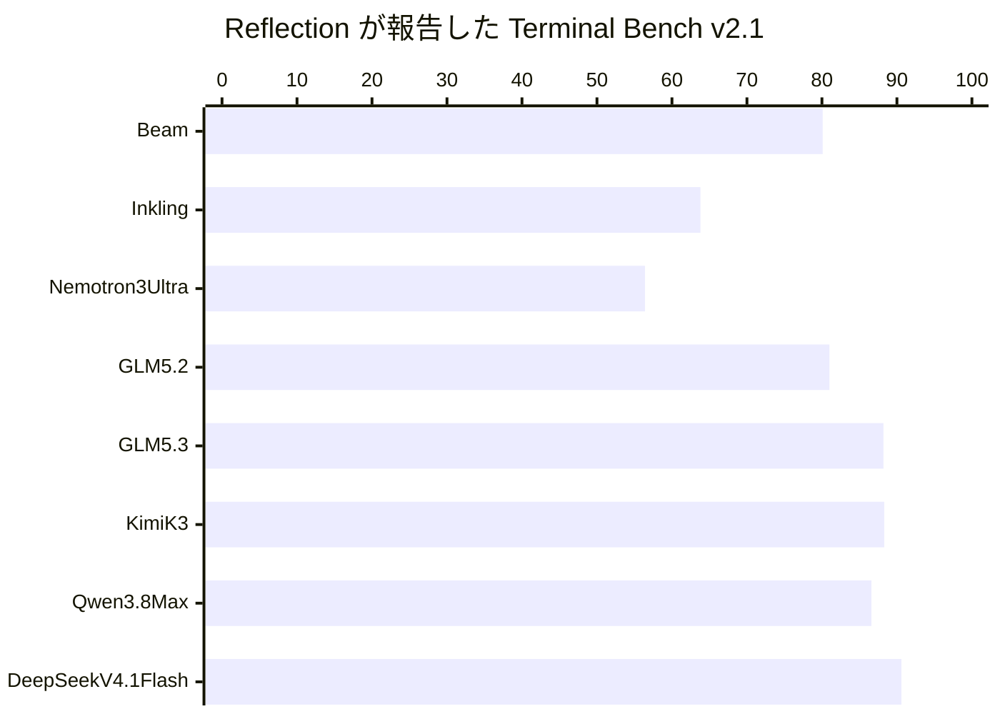
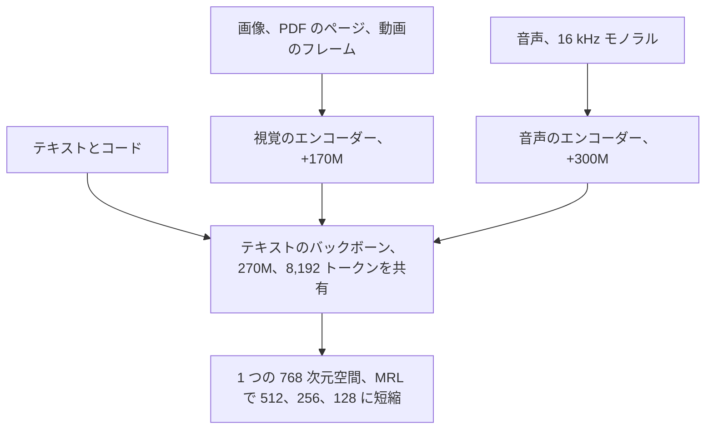
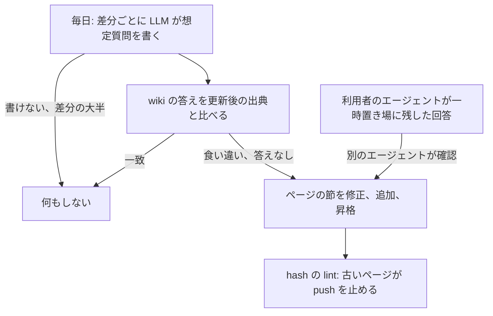

<!-- _class: summary -->

# 🗞️ GenAI Catch-up Report 2026-10-08

2026-10-06 〜 10-08 の 6 トピック (候補 80 件から選定)。詳細は <a href="../research/2026-10-08.md">調査ノート</a>。

<article class="card">
<h3>1️⃣ 🪶 Claude Haiku 5.5: 100K トークンまでは Haiku 4.5 の 10 分の 1 の単価</h3>

100 万トークンあたり $0.10/$0.50 は 100K までなら GPT-6 Luna と同額で、1M のウィンドウ、effort の段階、API の破壊的変更を伴う。Sonnet 5.5 のキャッシュ読み取りは $0.10 に下がり、Max には月 $100 か $200、Team には最大 $500 の API クレジットが付く。

影響 高将来性 高注目度 高リリースモデルAPI・クラウド

</article>
<article class="card">
<h3>2️⃣ 🧩 ChatGPT の GPT-6: Intelligent UI がストリーミングする部品で回答を組み立てる</h3>

Chat タブの GPT-6 は、ストリーミングできる部品のライブラリから回答を組み立て、考えている途中から答え始める。API で変わったのは <code>chat-latest</code> だけで、Work と Codex は 9 月のモデルのまま。

影響 中将来性 中注目度 高リリースモデル

</article>
<article class="card">
<h3>3️⃣ 🪨 Strata、125B の Qwen3.8-Flash-Next を 12 GB の GPU と RAM、SSD で動かす</h3>

MIT ライセンスのエンジンで、よく使うエキスパートを VRAM に、全エキスパートを RAM に、28.8 GB の表を SSD に置き、OpenAI、Anthropic、Responses の API を提供する。PC Watch は RTX 3060 で 34〜44 tok/s を測ったが、プロンプトの読み込みは遅く、品質にも疑問が残る。

影響 中将来性 中注目度 高リリースモデルコーディングエージェント

</article>

---

<!-- _class: summary -->

# 🗞️ GenAI Catch-up Report 2026-10-08

<article class="card">
<h3>4️⃣ 🔦 Reflection の Beam: 501B-A23B のオープンモデル、重みは 10 月中</h3>

テキストのみのコーディング向けモデルで、GLM 5.2 並みのスコアを 3 分の 1 から 4 分の 1 の計算量で出すと主張するが、自社の表でもほとんどの行で GLM 5.3、Kimi K3、DeepSeek V4.1 Flash に及ばない。Apache 2.0 の重みはまだ出ていない。

影響 中将来性 中注目度 高リリースモデル

</article>
<article class="card">
<h3>5️⃣ 🔎 EmbeddingGemma 2: 端末で動く 740M のオープンなマルチモーダル埋め込みモデル</h3>

270M のテキストの中核に任意の視覚と音声のエンコーダーを足して、どの入力も 1 つの 768 次元の空間に写し、Pixel 11 Pro ではテキストだけなら RAM は約 191 MB。MTEB Code は初代より 9.92 ポイント上がったが、多言語のテキストはほぼ横ばい。

影響 中将来性 中注目度 高リリースモデルエージェント開発

</article>
<article class="card">
<h3>6️⃣ 📚 LayerX の LLM Wiki: 想定質問での選別、hash の lint、回答の一時置き場</h3>

毎日の差分は利用者の想定質問への答えが変わるときだけ反映し、出典の hash が古いページの push を止め、エージェントの回答は一時置き場で別のエージェントの確認を待つ。記事に測定の数字はない。

影響 中将来性 中注目度 高検証・実践エージェント開発評価・運用

</article>

---

<!-- _class: topic -->

# 1️⃣ 🪶 Claude Haiku 5.5: 100K トークンまでは Haiku 4.5 の 10 分の 1 の単価

10-07 に全プラットフォームで公開され、同じ記事で Sonnet 5.5 のキャッシュ読み取りの値下げと、Max と Team への API クレジットも打ち出した。

## 要点

- 100 万トークンあたり 100K までは入力 $0.10、出力 $0.50 (Haiku 4.5 は $1/$5)、超えると $0.50/$2.50、キャッシュ読み取り $0.01。
- 平均約 75% 減という Anthropic の試算は、新トークナイザー (約 30% 増) と、9 割が 100K 以下だった Haiku 4.5 の構成を織り込む。
- コンテキスト 1M、出力 128K (従来は 200K と 64K)、thinking は既定でオン、effort は `low`〜`max` (既定 `medium`)、出力はテキスト。
- effort max で Terminal-Bench 4.0 39.2% (Sonnet 5.5 70.6%、Haiku 4.5 0%)、OSWorld 2.1 オフライン版 72.4% (Luna 48.9%)。
- Sonnet 5.5 のキャッシュ読み取りも $0.10 に半減 (エージェント作業の大半で約 20% 減)、SDK にブラウザとコンピュータの操作を追加。

## 見方と論点

- Simon Willison: 100K までは Luna と同額、超えると 5 倍 (Luna の値上がりは 272K から)、トークン約 1.25 倍は隠れた値上げ。
- Artificial Analysis: max で指数 43 (Luna 38) だがタスクあたりのコストは 3 倍、`low` で答え始めまで 9.93 秒 (Luna 3.05 秒)。
- システムカード: プロンプトインジェクション成功率は 83.2% から 7.1% に減ったが、漏れた答えを黙って使う率は 17% (Haiku 4.5 は 2%)。

## 技術要素

- `claude-haiku-5-5` は日付の接尾辞も別名もない ID で、Bedrock は `anthropic.claude-haiku-5-5` と東京・大阪の `jp.` プロファイル。
- エラーになるもの: `budget_tokens`、1 以外の `temperature`、0.99 以外の `top_p`、`top_k` の指定、アシスタントのプリフィル。
- 応答は `thinking` ブロックから始まることがあり、これは `max_tokens` に数えられ、前のターンを変えた後に送り返すと拒否される。
- 新たな拒否 (`stop_reason: "refusal"`) にフォールバックはなく、thinking は `high` 以下なら切れるが Claude Code では切れない。
- Claude Code 2.1.293 の `haiku` が Haiku 5.5 を指すのは Anthropic API だけで、Bedrock、Google Cloud、Foundry は 4.5 のまま。
- 毎月のクレジット: Max は $100 か $200、Team は最大 $500 で Claude Platform 専用、対話型 Claude Code やほかのクラウドは対象外。

出典: <a href="https://www.anthropic.com/claude-haiku-5-5">Anthropic</a> · <a href="https://platform.claude.com/docs/en/models/haiku-5-5/migration-guide">移行ガイド</a> · <a href="https://simonwillison.net/2026/Oct/7/claude-haiku-5-5/">Simon Willison</a> · 前回: <a href="./2026-09-29.md#5">09-29 #2</a>

---

<!-- _class: topic -->

# 2️⃣ 🧩 ChatGPT の GPT-6: Intelligent UI がストリーミングする部品で回答を組み立てる

10-07 から ChatGPT の Chat タブだけに展開され、Work と Codex は 9 月のモデルのままで、開発者向けの提供は見当たらない。

## 要点

- GPT-6 はテキスト、ビジュアル、フォームやチャート、地図、計算機のような操作要素を組み合わせて答え、素のテキストで返すこともある。
- ネイティブでストリーミングできる部品のライブラリとコンパイラーにより、インターフェースはモデルの生成に合わせて少しずつ表示される。
- 考えたりツールを使ったりしながら回答を始め、Web 検索の要る質問では GPT-6 Instant は GPT-5.6 Instant より平均 44% 早く答え始める。
- Plus 以上は 10-07 から GPT-6 Sol、Free と Go は 10-08 から GPT-6 Luna で、Pro の推論は Astra のまま Intelligent UI 非対応。
- システムカード: Sol は自傷で、Luna は自傷、ゴア、性的な内容で後退したが、レビューした違反はきわどいがおおむね安全とする。

## 見方と論点

- SiliconANGLE は Google の Generative Interface になぞらえ、Search Engine Journal は計算機のサイトが訪問を奪われるとみる。
- HN はラムの献立にターキーの写真を見つけ、MY TECH BLOG のサブネット計算ツールはブロードキャストアドレスを整数のまま表示した。
- OpenAI のヘルプ記事は Free と Go に GPT-5.6 Luna しか挙げず、44% は答え始めるまでの時間で完了までの時間ではない。

## 技術要素

- メニューで GPT-6 が Latest に代わり、Instant〜Extra High は GPT-6.1 Sol でなく GPT-6 Sol (October)、GPT-5.6 Sol は残る。
- Web と更新済みのアプリだけで別の利用枠はなく、Layout and visuals をオフにしてもテキストだけの回答にはならない。
- API: 10-07 の変更は `chat-latest` だけ (100 万トークンあたり $5/$30、テキスト出力)、Sol と Luna に October 版はない。

出典: <a href="https://openai.com/index/gpt-6-for-everyone/">OpenAI</a> · <a href="https://help.openai.com/en/articles/20001354-gpt-6-and-other-models-in-chatgpt">OpenAI ヘルプセンター</a> · <a href="https://siliconangle.com/2026/10/07/with-gpt-6-chatgpts-responses-are-much-more-visually-appealing-and-interactive/">SiliconANGLE</a> · 前回: <a href="./2026-09-27.md#2">09-27 #1</a>

---

<!-- _class: topic -->

# 3️⃣ 🪨 Strata、125B の Qwen3.8-Flash-Next を 12 GB の GPU と RAM、SSD で動かす

GitHub の利用者 Niko1221 が 09-24 に最初のリリースを出した MIT ライセンスのエンジンで、今回は 10-06 の PC Watch のコラムでフィードに現れた。

## 要点

- Qwen3.8-Flash-Next は 125B パラメータでアクティブ 6B、RAM と VRAM の合計で Q2_0 は 37.6 GB、IQ3_S は 54.8 GB を要する。
- VRAM 12 GB 以上 (RTX 20〜50 か対応する AMD)、RAM は Coder なら 32 GB、全サイズなら 64 GB、ディスクは約 80 GB が要る。
- 作者の RTX 5070 と 64 GB では、Q2_0 は出力 94 tok/s、32K のプロンプトの読み込み 2,650 tok/s、IQ3_S は 53 と 1,620 tok/s。
- PC Watch: RTX 3060 と DDR4 で IQ2_XS は 34〜44 tok/s、23K の読み込みに約 25 秒、48 GB 改造の RTX 4090 で IQ3_S は 87〜129。
- 09-24 からの 44 リリースで Claude Code (0.1.17)、DNS リバインディング対策 (0.1.38)、Codex の Responses API (0.1.39) を追加。

## 見方と論点

- Hackaday は VRAM をキャッシュに使う点を挙げ、PC Watch は「デコードは実用的だが、プリフィルが遅い」とエージェントの待ちを指摘。
- HN では 4 bit 未満の量子化を疑う声があり、視覚のテストで誤差は llama.cpp の約 3 倍、Coder は CJK のテキストに弱い (#438)。
- ライセンス: Model as a Service か AI Work Assistant の事業者が商用で使うには、Qwen から別のライセンスを得る必要がある。

## 技術要素

- 127.0.0.1:8080 で OpenAI、Anthropic、ステートレスな Responses の API を提供し、既定では 1 件ずつ処理する。
- Claude Code は `ANTHROPIC_BASE_URL` でつなぎ、Codex のツールのループでは各ターンでプロンプトの約 96% をキャッシュから再利用した。
- MTP が最大 3 トークンを下書きして 1.6〜1.8 倍に速め、出力は貪欲デコードと同一、`/metrics` は vLLM の指標名を使う。

出典: <a href="https://github.com/Niko1221/Strata">Strata の GitHub</a> · <a href="https://pc.watch.impress.co.jp/docs/column/nishikawa/2145673.html">PC Watch</a> · <a href="https://hackaday.com/2026/10/04/ai-on-your-gaming-pc/">Hackaday</a> · <a href="https://news.ycombinator.com/item?id=49953495">Hacker News</a>

---

<!-- _class: topic -->

# 4️⃣ 🔦 Reflection の Beam: 501B-A23B のオープンモデル、重みは 10 月中

10-05 に Reflection 初のオープンウェイトモデルとして発表され、早期アクセスはウェイトリスト制で、重みもモデルカードも技術報告もまだない。

## 要点

- テキストのみの疎な MoE で総 501B、アクティブ 23B、52 層、コーディング、推論、エージェントの作業に向けて訓練した。
- 事前学習は 6,144 基の GB300 で 23.8T トークン、RL は 10.5K 基で 4 週間、約 13 億のサンドボックスで 1 億超のロールアウト。
- Reflection の表: SWE-bench Verified 80.9、SWE Bench Pro v1 65.5、DeepSWE v1.1 44.4、MCP Atlas 78.7。
- 主張: 推論の計算量 3〜4 分の 1 で GLM-5.2 並みとするが、生成トークン数からの見積もりで、プリフィルと attention を除く。
- 10-08 の時点で Hugging Face には何もなく、Apache 2.0 の重み、モデルカード、技術報告は 10 月後半の予定。

## 見方と論点

- Reflection は欧米のオープンウェイトのフロンティアを押し上げると打ち出し、TechCrunch は主張が独立に検証されていないと指摘する。
- AINews は最先端の中国のモデルが概して先を行くとし、早期アクセスを得た Artificial Analysis はトークン効率の高さを見込む。
- HN の最上位のコメントは DeepSeek V4.1 Flash より大きく全指標で劣るとするが、成り立つのは両者がそろう 9 行中 7 行。

## 技術要素

- 局所と大域の attention を交互に置き、細かいルーティングのエキスパート、補助損失なしの負荷分散、実効 1M のコンテキスト。
- reasoning effort のパラメータで応答の長さと精度を引き換え、RL のロールアウトは最大 256K トークン。
- 早期アクセスは platform.reflection.ai で、価格、制限、サービングのハードウェア、配布のパートナーはまだわからない。

出典: <a href="https://reflection.ai/blog/introducing-beam">Reflection</a> · <a href="https://techcrunch.com/2026/10/05/reflection-debuts-beam-a-open-weight-ai-model-to-rival-chinese-models-at-lower-compute-cost/">TechCrunch</a> · <a href="https://www.latent.space/p/ainews-reflection-beam-501b-a23b">AINews</a> · <a href="https://news.ycombinator.com/item?id=49969183">Hacker News</a>

---

<!-- _class: topic -->

# 5️⃣ 🔎 EmbeddingGemma 2: 端末で動く 740M のオープンなマルチモーダル埋め込みモデル

Google DeepMind が 10-06 に Apache 2.0 で公開し、初日から llama.cpp、vLLM、Ollama が対応、Model Garden と ML Kit は後に続く。

## 要点

- Gemma 4 ベースで、270M のテキストとコードの中核に視覚 (170M) と音声 (300M) のエンコーダーを任意で足し、768 次元の空間を共有。
- EmbeddingGemma 1 と比べて MTEB Code は 68.76 から 78.68 に上がったが、MTEB の多言語は 61.15 から 61.36 にとどまる。
- Pixel 11 Pro のアクティブ RAM はテキストのみ約 191 MB、全モダリティ約 567 MB、LiteRT は TPU でテキストを 8.3 ms で埋め込む。
- ウィンドウは初代の 4 倍の 8,192 トークンで、1 入力に画像なら約 29 枚、動画なら約 58 フレーム、音声なら約 5.5 分が入る。
- Qdrant (パートナー): 768 次元の 1 ビット化で RAM は 30 分の 1、nDCG@10 は 99% を保ち、次元よりビットを削るほうがよかった。

## 見方と論点

- Google: キャプション生成、書き起こし、テキスト埋め込みの連結を 1 モデルで置き換え、端末内のゼロショットのルーティングにも使える。
- HN: simonw はホスト型のモデルが引退しても動かせるオープンな重みを評価し、2 人はテキストの検索は v1 と変わらないとする。
- クラスメソッド: transformers 5.18.0 はモデルを認識せず、日本語のクエリでも 3 枚の試験画像を正しい順に並べた。

## 技術要素

- `google/embeddinggemma-2` には sentence-transformers 6.1.0 以降と `[image,audio,video]` が要り、テキストはタスクの接頭辞付き。
- `float16` では NaN か黙って劣化したベクトルが返り、切り詰めたら正規化し直し、クエリと文書の次元をそろえる。
- 安全性の調整もアライメントもなく、Ollama のタグは 256K のコンテキストを表示、Unsloth の llama.cpp 手順はテキストのみ。

出典: <a href="https://blog.google/innovation-and-ai/technology/developers-tools/embeddinggemma-2/">Google DeepMind</a> · <a href="https://ai.google.dev/gemma/docs/embeddinggemma/model_card_2">モデルカード</a> · <a href="https://qdrant.tech/blog/embeddinggemma-2/">Qdrant</a> · <a href="https://dev.classmethod.jp/articles/embeddinggemma-2-image-embedding/">クラスメソッド</a>

---

<!-- _class: topic -->

# 6️⃣ 📚 LayerX の LLM Wiki: 想定質問での選別、hash の lint、回答の一時置き場

LayerX バクラク事業部の Platform Engineering 部が 10-05 に公開した記事で、wiki は 1,000 ページ超の見込みだが、測定の数字は示していない。

## 要点

- QA と CS 向けに、機能ごとの 1 ページに Notion の設計仕様書、Zendesk のヘルプ記事、GitHub のコードの記述を並べる。
- 毎日、まとめた差分ごとに利用者の想定質問を LLM に 1 つ書かせ、質問の書けない差分 (大半を占める) は何もしない。
- その質問に現在の wiki で答えさせ、更新後の出典と合えば何もせず、食い違えば節を直し、答えられなければ節かページを足す。
- 各ページが出典ごとの hash を記録し、一致しなければ古いと判定し、古いページが 1 件でも残ると lint が失敗して push できない。
- エージェントは回答を一時置き場にだけ残し、毎日の定期更新が規約に沿って、別のエージェントの確認を経て昇格させるか削除する。

## 見方と論点

- Karpathy のパターンはよい答えをそのまま書き戻し、出典が不変の Astro-Han のスキルは出典の hash をわざと持たない。
- クラスメソッド: 書き戻しは「論文が劣化を測った『複数ラウンド編集』そのもの」で、論文では最先端モデルでも文書の 25% が壊れた。
- 未解決: どのページも引いていない変更は質問の選別だけが頼りで、Slack や問い合わせを取り込むには人ごとの閲覧権限が要る。

## 技術要素

- 古さは LLM の判断を挟まず hash だけで決まり、ページ A を直すと、A を根拠に書いたページ B も古いと判定される。
- コードはヘルプ記事が説明する本番のリリースの版に固定して引用し、一時置き場の回答は次の回答の根拠に使わない。
- 書かれていないもの: モデル、ハーネス、コスト、hash の関数、昇格の規約、検索で、直近のリリースだけで PR は 2,000 件超。

出典: <a href="https://tech.layerx.co.jp/entry/enterprise-llm-wiki-ops">LayerX</a> · <a href="https://gist.github.com/karpathy/442a6bf555914893e9891c11519de94f">Karpathy の gist</a> · <a href="https://dev.classmethod.jp/articles/llm-knowledge-base-document-corruption-revisit/">クラスメソッド</a> · <a href="https://github.com/Astro-Han/karpathy-llm-wiki">Astro-Han</a>

