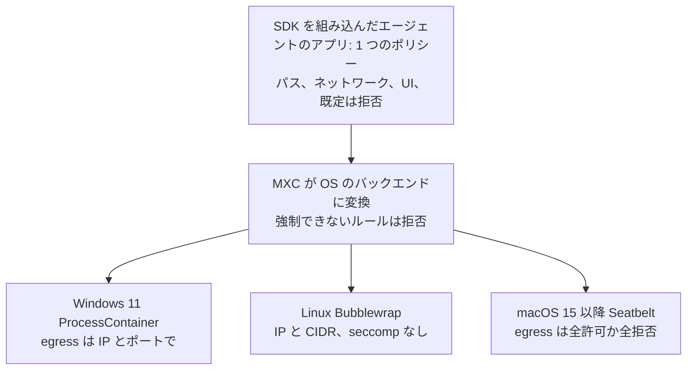
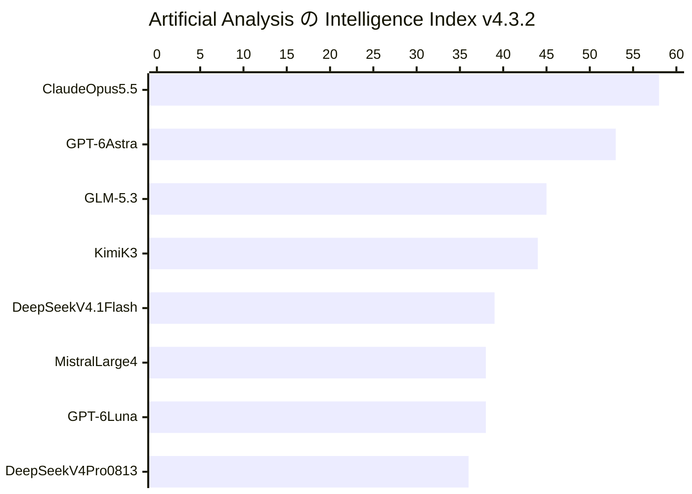

<!-- _class: summary -->

# 🗞️ GenAI Catch-up Report 2026-10-10

2026-10-08 〜 10-10 の 4 トピック (候補 56 件から選定)。詳細は <a href="../research/2026-10-10.md">調査ノート</a>。

<article class="card">
<h3>1️⃣ 📦 MXC が Windows 11 で一般提供、SDK 1.0 は 3 つの OS に対応</h3>

既定で拒否する 1 つのポリシーが ProcessContainer、Bubblewrap、Seatbelt のどれでも動き、一般提供になった Copilot のローカルのサンドボックスもこれを土台にする。ネットワークのルールは OS ごとに違い、Codex、Unsloth、OpenClaw は 1.0 より前の版に固定している。

影響 高将来性 高注目度 高リリースセキュリティ・安全性コーディングエージェント

</article>
<article class="card">
<h3>2️⃣ 🐘 Mistral Large 4: 1T の MoE が API でプレビュー、重みは 10 月中</h3>

総 1.05T、アクティブ 52B のパラメータで、100 万トークンあたり $1.36/$4.18、発売から 2 週間は 50% 引き。Artificial Analysis の指数は GPT-6 Luna と並ぶ 38 で、CyberGym-E2E-AA では首位に立つが、ライセンスはまだ公開されていない。

影響 中将来性 中注目度 高リリースモデル

</article>
<article class="card">
<h3>3️⃣ 📜 Anthropic の 2026 年版 Usage Policy、11 月 12 日に発効</h3>

高リスクの規定は消費者向けの用途の外にも広がって 11 の分野に及び、有資格者によるレビューと影響を受ける本人への開示を求める。モデルの出力で動くハードウェア、サブスクリプションを通じた中継、Claude への虐待についての条項が新たに加わった。

影響 中将来性 中注目度 高仕様変更セキュリティ・安全性API・クラウド

</article>
<article class="card">
<h3>4️⃣ 🌸 さくらのAI Engine プライベートエディション: 顧客のモデルを専有 GPU で</h3>

独自開発、ファインチューニング済み、オープンウェイトのモデルを国内のデータセンターの専有 GPU で動かし、GPU 単位の月額定額で課金する。価格、GPU の型番、API の形式は公開されていない。

影響 中将来性 中注目度 高リリースAPI・クラウド

</article>

---

<!-- _class: topic -->

# 1️⃣ 📦 MXC が Windows 11 で一般提供、SDK 1.0 は 3 つの OS に対応

SDK v1.0.0 が出た 10-07 に Microsoft が MXC の一般提供を宣言し、GitHub も MXC を使う Copilot のローカルサンドボックスを一般提供にした。

## 要点

- 10-07 に Windows 11 と Windows 365 で一般提供 (Windows Update で順次展開、PC Watch は 10 月 15 日開始と報道)。
- SDK 1.0 は Rust の `mxc-sdk`、.NET の `Microsoft.Mxc.Sdk`、Node 24 以降の `@microsoft/mxc-sdk` で、V1 の API は 1.x で安定。
- パス、egress、ingress、UI を 1 つのポリシーで定めて既定は拒否とし、バックエンドは強制できないルールを起動前に拒む。
- Copilot のサンドボックス (既定でオフ) はシェルコマンドとローカルの MCP サーバーを MXC で動かし、組み込みのファイルツールは対象外。
- Microsoft が対応済みとする Codex、Unsloth、OpenClaw は、それぞれ 08-31 のリビジョン、0.8.0、0.9.0 に固定。

## 見方と論点

- Microsoft は MXC をエージェント向けの Windows の封じ込めの層と位置づけ、Intune、Entra、Agent 365 の管理機能はこれから出す。
- eSecurityPlanet は対応一覧に載っても完全な封じ込めとは限らず、許可した宛先への漏えいも防げないとし、HN はカーネルの共有を指摘。
- 1.0 の前日、プロファイルをセキュリティ境界とみなすべきでないという README の警告が消え、GitHub の文書は VM ではないと明記する。

## 技術要素

- プロセスの分離にはビルド 26100.9278 か 26200.9278 が要り、BaseContainer か、ホストの DACL を変えうる AppContainer で動く。
- ホスト名のルールはどのバックエンドも受け付けず、呼び出し側のプロキシが要り、Copilot のホストのルールもこの経路を通る。
- 未トリアージの issue #1455: PowerShell 7 が `PATH` にあると V1 のツールのヘルパーが `.ssh` を含む `C:\` 全体の読み取りを許す。

出典: <a href="https://blogs.windows.com/windowsdeveloper/2026/10/07/microsoft-execution-containers-policy-driven-containment-for-ai-agents/">Microsoft</a> · <a href="https://github.com/microsoft/mxc">microsoft/mxc</a> · <a href="https://docs.github.com/copilot/concepts/security-governance-and-network-settings/about-cloud-and-local-sandboxes">GitHub Docs</a> · <a href="https://news.ycombinator.com/item?id=50016489">Hacker News</a>

---

<!-- _class: topic -->

# 2️⃣ 🐘 Mistral Large 4: 1T の MoE が API でプレビュー、重みは 10 月中

10-06 に自社の欧州のデータセンターから API のパブリックプレビューとして公開され、発表は Hacker News で 2,036 ポイントを集めた。

## 要点

- 総 1.05T、アクティブ 52B (発表当日の情報源はどれも 49B) に 1.6B のビジョンエンコーダー、入力は画像とテキスト、出力はテキスト。
- Mistral 自身のデータセンターの 3,800 基の Grace Blackwell でゼロから学習し、RL の実行はプレビューの間も続く。
- 100 万トークンあたり入力 $1.36、キャッシュ $0.14、出力 $4.18 (Mistral 上の GLM 5.3 は $1.4/$4.4) で、2 週間は 50% 引き。
- 自己申告の値: DeepSWE v1.1 61.7%、Terminal-Bench 4 28.3%、SWE-Atlas-QnA 59.4%、Cybench は 40 の課題の 93%。
- AA の CyberGym-E2E-AA で 81.7% の首位、Cyber Index は 50、Vals の指数は 45 モデル中 33 位、Harvey の法務のテストは 76 中 6 位。

## 見方と論点

- Mistral は提供者の拒否が防御側を妨げるとし、レッドチームのパートナーや政府にはモデレーションを減らしサイバーの能力を広げた版を渡す。
- AA は米国と中国の外で最も賢いモデルと呼び、Simon Willison はフロンティアから 6 か月ほど遅れた位置とみる。
- XenoSpectrum: DeepSWE の競合は別々のハーネスで測られ、AA は拒否を 0 点とするので CyberGym の差には拒否の方針も表れる。

## 技術要素

- ID はカードと推論の文書が `mistral-large-4-0`、変更履歴が `mistral-large-4`、`reasoning_effort` は `"none"` か `"high"`。
- コンテキストは 1M (カード、OpenRouter) か 512k (AA、Vals) で、structured outputs、function calling、バッチに対応。
- 重みは 10 月末まで (TNW と VentureBeat は 10 月 27 日) で、VentureBeat は Mistral 独自のライセンスになるとみる。

出典: <a href="https://mistral.ai/news/mistral-large-4/">Mistral</a> · <a href="https://docs.mistral.ai/models/mistral-large-4-0">Mistral のドキュメント</a> · <a href="https://artificialanalysis.ai/articles/mistral-large-4-france-ai">Artificial Analysis</a> · <a href="https://venturebeat.com/technology/mistral-debuts-large-4-le-chonk-a-1-trillion-parameter-text-output-model-with-high-benchmarks-planned-for-open-weights-release">VentureBeat</a>

---

<!-- _class: topic -->

# 3️⃣ 📜 Anthropic の 2026 年版 Usage Policy、11 月 12 日に発効

2025 年 9 月 15 日からの本文を置き換える毎年の改定で 10-08 に公開され、アプリ、API、クラウドの事業者や再販業者を通じた利用にも及ぶ。

## 要点

- 高リスクの規定は消費者向けという限定を外し、医療、信用、雇用、移民を含む 11 の分野を対象にする。
- 推奨は変更する権限を持つ有資格者がレビューしなければならず、影響を受ける本人には AI を使ったことを伝える。
- モデルの出力で動くハードウェアには、止められる有資格者、接続が切れたときの安全な状態、モデルから独立した限界が要る。
- 新たな禁止: 消費者向けのサブスクリプションを通じた中継、出どころを偽った内容を AI の回答の情報源に仕込むこと、モデルへの執拗な虐待。
- Supported Regions (185 の国と地域は変わらず) は、対象外の地域にいる人と、そこに本拠を置くか支配される企業による利用を禁じる。

## 見方と論点

- Anthropic は大半を明確化と説明するが、発表はサブスクリプションを通じた中継の禁止など、本文のいくつかの条項に触れていない。
- The Register は Claude が人ではなくソフトウェアだと念を押し、はてなでは虐待を学習データから締め出すためという読みが目立つ。
- 未解決: B2B の候補者の選別がいまは対象になるのか、虐待の条項を API でどう適用するのか、操作者は人間でなければならないのか。

## 技術要素

- 対象外: 一般的な情報、ウェルネス、社内の下書き、決まったルールの実行で、全面的に有利な判断は法が許せばレビュー不要。
- 対象のハードウェア: 共有空間の移動、人を傷つけうる力、危険なエネルギーや物質、人体、安全のシステム、工業のプロセス。
- チャットボットは会話の初めかインターフェイスで AI と明かし、作り手はエージェントのツールやブラウザの操作に責任を負う。
- API では、セーフガードのブロックは `stop_reason: "refusal"` と `stop_details.category` を返し、それだけでは違反を意味しない。
- 虐待の条項は苛立ち、暗い題材、モデルのテストには当てはまらず、会話を終える仕組みが引き続き主な執行の手段。
- サイバー: 所有するか試験を許されたシステムや、バグバウンティの範囲での調査と試験は禁止されないと明記。

出典: <a href="https://www.anthropic.com/news/2026-usage-policy-update">Anthropic</a> · <a href="https://www.anthropic.com/legal/aup">Usage Policy</a> · <a href="https://www.theverge.com/ai-artificial-intelligence/1008100/anthropic-new-usage-policy-abuse-claude">The Verge</a> · <a href="https://www.theregister.com/ai-and-ml/2026/10/09/anthropic-asks-users-to-stop-being-mean-to-claude/5302218">The Register</a>

---

<!-- _class: topic -->

# 4️⃣ 🌸 さくらのAI Engine プライベートエディション: 顧客のモデルを専有 GPU で

さくらインターネットが 10-08 に提供を始め、10-09 の Publickey の記事は、はてなブックマークで 178 users、コメント 39 件を集めた。

## 要点

- 顧客の独自モデル、ファインチューニング済みモデル、オープンウェイトモデル (例: Kimi、Gemma) をさくらの GPU に載せ API で提供する。
- 既存のさくらのAI Engine (共有版) の技術基盤と運用設計を使い、推論基盤の構築、運用、監視、障害対応はさくらインターネットが担う。
- 課金は GPU 単位の月額定額でトークンの利用量では変わらず、構成ごとの見積もりを問い合わせのフォームで受ける。
- 国内のデータセンターで動き、閉域の接続に対応し、ゼロデータリテンションで入力と生成結果は保存も学習への利用もされない。
- 想定する用途は、社内に限った生成 AI、自社のモデルの API での提供、見通せるコスト、モデルのバージョンの固定。

## 見方と論点

- さくらは、企業の AI が PoC から本番に移り、金融など高いセキュリティが要る分野でデータを国内に留めたい需要が高まっているとする。
- はてなのコメント: 価格が問い合わせでは予算を取れず、専有 GPU が安い API に勝つのは高稼働か国内運用が必須のときだけ。
- 報道 5 本はリリースをまとめ直すだけで試用はなく、はてなでは 3 人が 8 月のレンタルサーバの不正アクセスを受けて信頼を疑う。

## 技術要素

- 非公開: GPU の型番、単位あたりの GPU の数、最低の契約期間、初期費用、SLA、データセンターの場所、閉域の接続の方式。
- プライベートエディションのページは API での提供を約束するが形式は書かず、複雑な API の仕様は相談とする。
- 共有版の API は OpenAI 互換の Chat Completions と Responses、Anthropic 互換の Messages (`preview/Kimi-K2.6` のみ)。
- 共有版の価格: gpt-oss-120b は 100 万トークンあたり入力 15 円、出力 75 円で、チャットの無償枠は月 3,000 リクエスト。
- 共有版のサンプルの応答には `kv_transfer_params` など vLLM 独自のフィールドがあるが、さくらはエンジンを明かさない。
- 共有版は Qwen3-Coder を 07-21 に終え、`plamo-2.0-31b` も 10-12 に終えるが、固定したバージョンをいつまで支えるかは不明。

出典: <a href="https://www.sakura.ad.jp/corporate/information/newsreleases/2026/10/08/1968225874/">さくらインターネット</a> · <a href="https://ai.sakura.ad.jp/sakura-ai/ai-engine-private/">プライベートエディションのページ</a> · <a href="https://ai.sakura.ad.jp/sakura-ai/ai-engine/">さくらのAI Engine</a> · <a href="https://b.hatena.ne.jp/entry/s/www.publickey1.jp/blog/26/gpuai_engine.html">はてなブックマーク</a>

