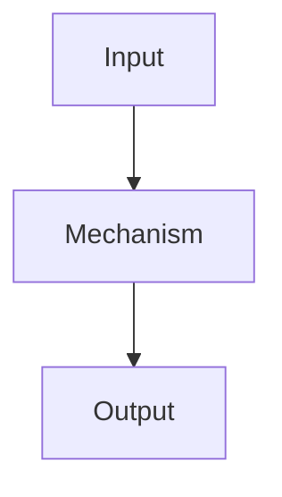

<!-- _class: summary -->

# 🗞️ GenAI Catch-up Report YYYY-MM-DD

K themes from YYYY-MM-DD to MM-DD (selected from N candidates). Details: <a href="../research/YYYY-MM-DD.md">research note</a>.

<article class="card">
<h3>1️⃣ 🧭 Theme 1 heading</h3>

One-line takeaway.

Impact highPotential highGenAI engineering

</article>
<article class="card">
<h3>2️⃣ 🛠️ Theme 2 heading</h3>

One-line takeaway.

Impact highPotential midCoding AI

</article>

---

<!-- _class: theme -->

# 1️⃣ 🧭 Theme 1 heading

One-line takeaway.

## Key points

- Key point 1.
- Key point 2.

## Perspectives and debates

- Primary source's framing: what the publisher is after.
- Analysis: how practitioners assess it and where they differ.
- Constraints: unverified points or preview limits.

## Technical details

- Identifiers: ...
- Platform or service: ...
- Specs or protocols: ...

Sources: <a href="URL">Publisher A</a> · <a href="URL">Publisher B</a> · Previous: <a href="./YYYY-MM-DD.md#3">MM-DD #3</a>

