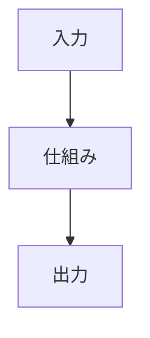

<!-- _class: summary -->

# 🗞️ GenAI Catch-up Report YYYY-MM-DD

YYYY-MM-DD 〜 MM-DD の K トピック (候補 N 件から選定)。詳細は <a href="../research/YYYY-MM-DD.md">調査ノート</a>。

<article class="card">
<h3>1️⃣ 🧭 トピック 1 の見出し</h3>

1 行の要約。

影響 高将来性 高重要度 高リリースモデル

</article>
<article class="card">
<h3>2️⃣ 🛠️ トピック 2 の見出し</h3>

1 行の要約。

影響 中将来性 高重要度 高検証・実践コーディングエージェント

</article>

---

<!-- _class: topic -->

# 1️⃣ 🧭 トピック 1 の見出し

1 行の要約。

## 要点

- 要点 1。
- 要点 2。

## 見方と論点

- 一次情報の枠組み: 発行元の狙い。
- 分析: 実務家の評価と差分。
- 制約: 未確認の点や preview の制限。

## 技術要素

- 識別子: ...
- プラットフォーム・サービス: ...
- 仕様・プロトコル: ...

出典: <a href="URL">発行元 A</a> · <a href="URL">発行元 B</a> · 前回: <a href="./YYYY-MM-DD.md#3">MM-DD #3</a>

